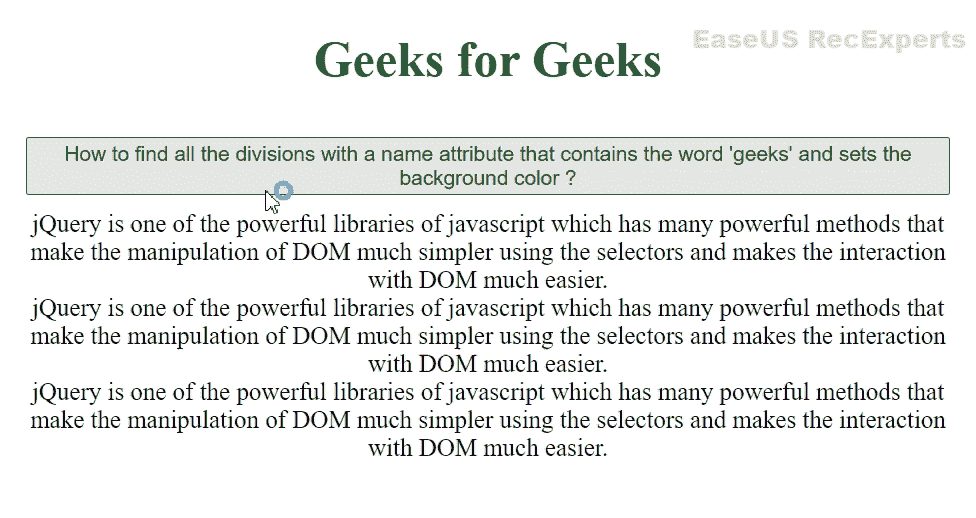

# 如何找到所有名称属性包含单词‘geeks’的 div 并设置背景颜色？

> 原文:[https://www . geesforgeks . org/how-to-find-all-div-a-name-attribute-in-word-geeks-and-set-the-background-color/](https://www.geeksforgeeks.org/how-to-find-all-divs-with-a-name-attribute-that-contains-word-geeks-and-sets-the-background-color/)

jQuery 包含[属性选择器](https://www.geeksforgeeks.org/jquery-attribute-selector/)，借助它我们可以选择名称属性为特定字符串的元素，或者选择包含特定字符串或以特定字符串开头或以特定字符串结尾或不包含特定字符串的元素作为名称属性。

在本文中，我们将学习查找所有名称属性包含单词“极客”的分部，并使用 jQuery 属性选择器设置背景颜色*绿色*。

**Approach1:** 要找到包含特定字符串的 name 属性，我们可以使用带有~的属性选择器，选择包含带有 name 属性的单词的所有元素作为极客。

**语法:**

```htmlhtml
$("[attribute~='word']");
```

**HTML 代码:**

## 超文本标记语言

```htmlhtml
<!DOCTYPE html>
<html lang="en">

<head>
    <meta charset="UTF-8">
    <meta http-equiv="X-UA-Compatible" content="IE=edge">
    <meta name="viewport" 
          content="width=device-width, initial-scale=1.0">

    <!-- Including jQuery  -->
    <script src="https://code.jquery.com/jquery-3.6.0.min.js"
            integrity=
    "sha256-/xUj+3OJU5yExlq6GSYGSHk7tPXikynS7ogEvDej/m4=" 
            crossorigin="anonymous">
    </script>
    <style>
        h1 {
            color: #006600;
            text-align: center;
        }

        .bg-green {
            background-color: #006600;
            color: white; 
            margin: 2px;
            border: 2px solid black; 
        }
        #btn {
            color: #006600;
            text-align: center;
            margin: 10px;
        }
        body {
            text-align : center;
        }
    </style>
</head>

<body>
    <h1> Geeks for Geeks</h1>
    <button id= "btn">
        How to find all the divisions with a name 
        attribute that contains the word 'geeks'
        and sets the background color?
    </button>

    <div name = "geeks for geeks">
        jQuery is one of the powerful libraries 
        of javascript which has many powerful 
        methods that make the manipulation of 
        DOM much simpler using the selectors and
        makes the interaction with DOM much easier.
    </div>

    <div name = "gfg">
        jQuery is one of the powerful libraries of 
        javascript which has many powerful methods 
        that make the manipulation of DOM much simpler
        using the selectors and makes the interaction 
        with DOM much easier.
    </div>

    <div name = "geeks">
        jQuery is one of the powerful libraries of 
        javascript which has many powerful methods 
        that make the manipulation of DOM much simpler
        using the selectors and makes the interaction 
        with DOM much easier.
  </div>

    <script>
        $(document).ready(function () {
            $('#btn').click(function(){
           $("div[name~='geeks']").addClass('bg-green');
            });
        });    
    </script>
</body>

</html>
```

**输出:**



**方法 2:** 使用*选择所有包含单词“极客”的*div*，但是~和*之间的区别在于~选择用空格分隔的单词。因为*不需要任何空格，它甚至可以选择一个子字符串。

**语法:**

```htmlhtml
$("[attribute*='word']");
```

**HTML 代码:**

## 超文本标记语言

```htmlhtml
<!DOCTYPE html>
<html lang="en">

<head>
    <meta charset="UTF-8">
    <meta http-equiv="X-UA-Compatible" content="IE=edge">
    <meta name="viewport" 
          content="width=device-width, initial-scale=1.0">

    <!-- Including jQuery  -->
    <script src="https://code.jquery.com/jquery-3.6.0.min.js"
        integrity=
    "sha256-/xUj+3OJU5yExlq6GSYGSHk7tPXikynS7ogEvDej/m4=" 
        crossorigin="anonymous">
    </script>

    <style>
        h1 {
            color: #006600;
            text-align: center;
        }

        .bg-green {
            background-color: #006600;
            color: white; 
            margin: 2px;
            border: 2px solid black; 
        }
        #btn {
            color: #006600;
            text-align: center;
            margin: 10px;
        }
        body {
            text-align : center;
        }
    </style>
</head>

<body>
    <h1> Geeks for Geeks</h1>
    <button id= "btn"> 
       How to find all the divisions with a name 
       attribute that contains the word 'geeks'
       and sets the background color?
   </button>

    <div name = "geeks for geeks">
        jQuery is one of the powerful libraries of 
        javascript which has many powerful methods 
        that make the manipulation of DOM much simpler
        using the selectors and makes the interaction 
        with DOM much easier.
    </div>

    <div name = "gfg">
        jQuery is one of the powerful libraries of 
        javascript which has many powerful methods 
        that make the manipulation of DOM much simpler
        using the selectors and makes the interaction 
        with DOM much easier.
    </div>

    <div name = "geeks">
        jQuery is one of the powerful libraries of 
        javascript which has many powerful methods 
        that make the manipulation of DOM much simpler
        using the selectors and makes the interaction 
        with DOM much easier.
    </div>

    <script>
        $(document).ready(function () {
            $('#btn').click(function(){
           $("div[name*='geeks']").addClass('bg-green');
            });
        });    
    </script>
</body>

</html>
```

**输出:**

