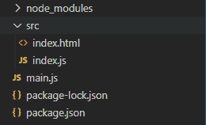
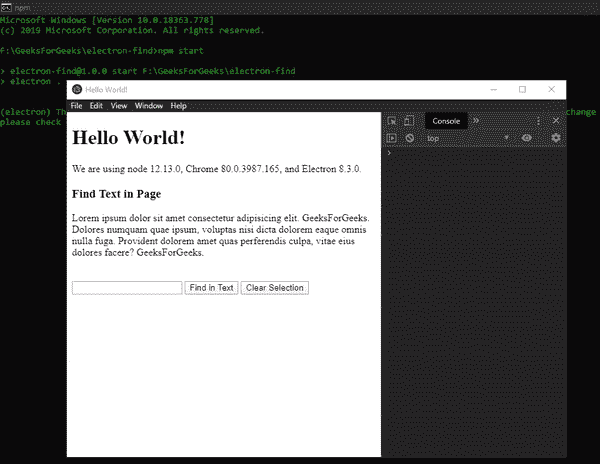

# 如何在电子表格中找到页面上的文本？

> 原文:[https://www . geesforgeks . org/how-to-find-text-on-page-in-electronijs/](https://www.geeksforgeeks.org/how-to-find-text-on-page-in-electronjs/)

**[electronijs](https://www.geeksforgeeks.org/introduction-to-electronjs/)**是一个开源框架，用于使用能够在 Windows、macOS 和 Linux 操作系统上运行的 HTML、CSS 和 JavaScript 等网络技术构建跨平台的本机桌面应用程序。它将铬引擎和**T5 节点 T7】结合成一个单一的运行时。**

在某些桌面应用程序中，开发人员希望提供一种功能，其中用户可以在网页内容中找到自定义文本选择。就像 Chromium 浏览器中 **Ctrl+F** 触发的搜索功能一样。电子提供了一种方法，通过这种方法，我们可以使用内置的**浏览器窗口**对象和**网络内容**属性的实例方法和事件，在页面内容中成功找到自定义文本。本教程将演示如何在电子版页面内容中查找文本。

我们假设您熟悉上述链接中介绍的先决条件。电子要工作， **[节点](https://www.geeksforgeeks.org/introduction-to-nodejs/)** 和 **[npm](https://www.geeksforgeeks.org/node-js-npm-node-package-manager/)** 需要预装在系统中。

*   **项目结构:**
    

**示例:**我们将按照给定的步骤开始构建基本的电子应用程序。

*   **Step 1:** Navigate to an Empty Directory to setup the project, and run the following command,

    ```html
    npm init
    ```

    生成**包. json** 文件。安装 **[电子](https://www.geeksforgeeks.org/introduction-to-electronjs/)** 如果没有安装，使用 npm。

    ```html
    npm install electron --save
    ```

    该命令还将创建**包-lock.json** 文件，并安装所需的**节点 _ 模块**依赖项。一旦电子安装成功，打开**包. json** 文件，并在**脚本**键下执行必要的更改。
    **package.json:**

    ```html
    {
      "name": "electron-find",
      "version": "1.0.0",
      "description": "Find Text in Electron",
      "main": "main.js",
      "scripts": {
        "start": "electron ."
      },
      "keywords": [
        "electron"
      ],
      "author": "Radhesh Khanna",
      "license": "ISC",
      "dependencies": {
        "electron": "^8.3.0"
      }
    }

    ```

*   **Step 2:** Create a **main.js** file according to the project structure. This file is the **Main Process** and acts as an entry point into the application. Copy the Boilerplate code for the **main.js** file as given in the following [link](https://www.electronjs.org/docs/tutorial/first-app#electron-development-in-a-nutshell). We have modified the code to suit our project needs.

    **main.js:**

    ```html
    const { app, BrowserWindow } = require('electron')

    function createWindow () {
      // Create the browser window.
      const win = new BrowserWindow({
        width: 800,
        height: 600,
        webPreferences: {
          nodeIntegration: true
        }
      })

      // Load the index.html of the app.
      win.loadFile('src/index.html')

      // Open the DevTools.
      win.webContents.openDevTools()
    }

    // This method will be called when Electron has 
    // finished initialization and is ready to create
    // browser windows. Some APIs can only be used 
    // after this event occurs. This method is 
    // equivalent to 'app.on('ready', function())'
    app.whenReady().then(createWindow)

    // Quit when all windows are closed.
    app.on('window-all-closed', () => {

      // On macOS it is common for applications and 
      // their menu bar to stay active until the user 
      // quits explicitly with Cmd + Q
      if (process.platform !== 'darwin') {
        app.quit()
      }
    })

    app.on('activate', () => {
        // On macOS it's common to re-create a window in the 
        // app when the dock icon is clicked and there are no 
        // other windows open.
      if (BrowserWindow.getAllWindows().length === 0) {
        createWindow()
      }
    })

    // In this file, you can include the rest of your 
    // app's specific main process code. You can also 
    // put them in separate files and require them here.
    ```

*   **Step 3:** Create the **index.html** file and **index.js** file within the **src** directory. We will also copy the boilerplate code for the **index.html** file from the above-mentioned link. We have modified the code to suit our project needs.

    **index.html:**

    ```html
    <!DOCTYPE html>
    <html>
      <head>
        <meta charset="UTF-8">
        <title>Hello World!</title>
        <!-- https://electronjs.org/docs/tutorial
                               /security#csp-meta-tag -->
        <meta http-equiv="Content-Security-Policy" 
              content="script-src 'self' 'unsafe-inline';" />
      </head>
      <body>
        <h1>Hello World!</h1>
        We are using node 
        <script>
            document.write(process.versions.node)
        </script>, Chrome 
        <script>
            document.write(process.versions.chrome)
        </script>, and Electron 
        <script>
            document.write(process.versions.electron)
        </script>.

        <!-- Adding Individual Renderer Process JS File -->
        <script src="index.js"></script>
      </body>
    </html>
    ```

*   **Output:** At this point, our basic Electron Application is set up. To launch the Electron Application, run the Command:

    ```html
    npm start
    ```

    

**在电子页面上查找文本:****浏览器窗口**实例和**网站内容**属性是**主进程**的一部分。要在**渲染器进程**中导入和使用**浏览器窗口**，我们将使用电子**远程**模块。

**webContents.findInPage(文本，选项)**方法开始请求在**浏览器窗口**页面的内容中查找**文本**的所有正匹配。该方法返回一个**整数**，代表用于请求的**请求标识**。请求的结果可以通过订阅**页面中的**实例事件获得，这将在下面详细解释。此方法自动突出显示内容中每一个正匹配的文本。如果有多个匹配项，内容的多个部分将用匹配的文本突出显示。在我们的代码中，这是由**在文本中查找**按钮触发的。它接受以下参数。

*   **文本:字符串**该值不能为空。该值代表要在**浏览器窗口**实例中搜索的内容。
*   **选项:对象(可选)**它接受以下参数:
    *   **前进:布尔型(可选)**该值表示是从页面内容开始执行搜索操作**前进**还是从页面内容结束执行搜索操作**后退**。默认值为**真**。该属性影响从页面中的**实例事件中获得的**结果**对象。**
    *   **查找下一个:布尔值(可选)**该值表示搜索操作是**首次请求**操作还是**后续**操作。默认值为**假**。如果该值设置为 **true** ，搜索操作将按预期进行，但我们将无法获取并显示从**页面内**实例事件中获得的**结果**对象。
    *   **matchCase: Boolean(可选)**该值表示搜索操作是否区分大小写。默认值为**假**。
    *   **单词开始:布尔值(可选)**该值表示搜索操作是否应该只查看单词的开头。默认值为**假**。该属性与**medialcaptalaswordstart**属性结合使用。
    *   **medialCapitalAsWordStart:Boolean(可选)**与 **wordStart** 属性结合使用时，如果匹配以大写字母后跟小写字母或非字母开头，则搜索操作接受单词中间的匹配。它接受其他几个字内匹配组合，包括字母数字字符。默认值为**假**。

**网页内容.停止查找页面(动作)**实例方法使用提供的**动作**参数停止任何**网页内容.查找页面()**在页面内容中查找文本的活动请求。在我们的代码中，这是由**清除选择**按钮触发的。它接受以下值，

*   **动作:字符串**此参数指定当结束由**方法启动的活动请求时要采取的动作。它可以采用以下任何值。**
    *   **清除选择:**清除从**页面中找到的**实例事件获得的选择/搜索结果。它会从页面内容中移除所有突出显示的搜索结果。
    *   **保持选择:**将从**页面中找到的**实例事件中获得的高亮选择/搜索结果转换为正常选择。
    *   **激活选择:**启用选择节点的聚焦和点击。它选择第一个正匹配并突出显示它。

要在**渲染器进程**中获取当前**浏览器窗口**实例，我们可以使用**浏览器窗口**对象提供的一些**静态**方法。

*   **BrowserWindow . getall windows():**这个方法返回一个活动/打开的 **BrowserWindow** 实例的数组。在这个应用程序中，我们只有一个活动的**浏览器窗口**实例，它可以直接从数组中引用，如代码所示。
*   **浏览器窗口. getFocusedWindow():** 此方法返回在应用程序中聚焦的**浏览器窗口**实例。如果没有找到当前的**浏览器窗口**实例，则返回**空值**。在这个应用程序中，我们只有一个活动的**浏览器窗口**实例，可以使用这个方法直接引用它，如代码所示。

在页面中找到的**实例事件属于**网站内容**属性。当 **webContents.findInPage()** 方法完成其操作并且结果可用时发出。它返回以下参数。**

*   **事件:**全局事件对象。
*   **结果:对象**返回如下参数:
    *   **requestId: Integer** 由 **webContents.findInPage()** 方法返回的整数 Id，用于表示活动请求。
    *   **主动匹配序数:整数**根据官方电子文档，它代表第一次主动匹配的索引。该值取决于在**选项**对象中设置的**前进**属性。在单个正匹配的情况下，没有影响，但是在多个匹配的情况下，该值根据**向前**搜索或**向后**搜索而变化。
    *   **匹配:整数**页面内容中文本的正匹配数。
    *   **选择区域:矩形**第一个匹配区域的坐标。该值取决于在**选项**对象中设置的**前进**属性。它返回一个包含以下参数的对象，
        *   **x:整数**x 坐标。它是匹配文本相对于页面边界的左偏移量。
        *   **y:整数**y 坐标。它是匹配文本相对于页面边界的顶部偏移量。
        *   **宽度:整数**匹配区域的宽度。
        *   **高度:整数**匹配区域的高度。
    *   **最终更新:布尔型**当**在页面中找到的**实例事件已经成功发出并且内容中的最后一个正匹配已经找到时，它返回**真**。当该值返回为 **true** 时，我们可以成功触发**webcontents . stop findinpage()**实例方法。

*   **index.html:** 在该文件中添加以下代码片段。

    ```html
    <h3>Find Text in Page</h3>
        <div>Lorem ipsum dolor sit amet consectetur 
             adipisicing elit. GeeksForGeeks. Dolores
             numquam quae ipsum, voluptas nisi dicta
             dolorem eaque omnis nulla fuga.Provident
             dolorem amet quas perferendis culpa, 
             vitae eius dolores facere? GeeksForGeeks.
        </div>
        <br><br>
        <input id="enter" type="text">
        <button id="find">Find in Text</button>
        <button id="clear">Clear Selection</button>
    ```

    *   **index.js:** Add the following snippet in that file.

    ```html
    const electron = require('electron')
    // Importing BrowserWindow from Main Process
    const BrowserWindow = electron.remote.BrowserWindow;

    var find = document.getElementById('find');
    var clear = document.getElementById('clear');
    let win = BrowserWindow.getFocusedWindow();
    // let win = BrowserWindow.getAllWindows()[0];

    var options = {
        forward: true,
        findNext: false,
        matchCase: false,
        wordStart: false,
        medialCapitalAsWordStart: false
    }

    find.addEventListener('click', () => {
        var text = document.getElementById('enter').value;
        console.log(text);
        if (text) {
            const requestId = win.webContents.findInPage(text, options);
            console.log(requestId);
        } else {
            console.log('Enter Text to find');
        }

        win.webContents.on('found-in-page', (event, result) => {
            console.log(result.requestId);
            console.log(result.activeMatchOrdinal);
            console.log(result.matches);
            console.log(result.selectionArea);
        });
    });

    clear.addEventListener('click', () => {
        win.webContents.stopFindInPage('clearSelection');
    });
    ```

    **输出:**
    