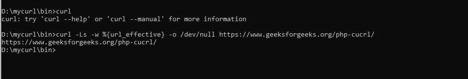

# 如何使用 cURL 找到 URL 将被重定向到的位置？

> 原文:[https://www . geeksforgeeks . org/如何使用-curl/](https://www.geeksforgeeks.org/how-to-find-where-the-url-will-redirected-using-curl/) 找到 url 重定向的位置

一般来说，CUlR 代表“网址的客户端”，这里用大写字母书写的网址表示 CUlR 处理网址。

**PHP 方法:**
**cURL 中使用的基本函数:**

*   **curl_init()函数:**它将启动 curl 一个新的会话并返回一个 curl 句柄。
    **语法:**

    ```
    curl_init();
    ```

*   **CURR _ setopt()函数:**它为由 ch 参数标识的 CURR 会话设置一个选项。选项指定要设置的选项，值指定给定选项的值。
    **语法:**

    ```
    curl_setopt($ch, option, value);

    ```

**其他重要命令参数:**

*   **curl_setopt($ch，CurlOPT_URL，$url)** 它把 URL 作为一个参数传递，这个返回的目标 URL 就是你想从互联网上获取的。
*   **curl_setopt($ch，CURLOPT_RETURNTRANSFER，TRUE)** 设置为 TRUE，以 curl_exec()返回值的字符串形式返回传输，而不是直接输出。
*   **curl_setopt($ch，CURLOPT_FOLLOWLOCATION，TRUE)** 它被设置为 TRUE，以跟随服务器作为 HTTP 头的一部分发送的任何“LOCATION:”头。
*   **curl_getinfo($ch，CurlINFO_EFFECTIVE_URL)** 它通过获取有效 URL 的 curl 信息。
*   **curl_exec($ch)** 它抓取 url 并将其传递给变量以显示输出。
*   **curl_close($ch)** 关闭 curl 资源，释放系统资源。

**程序:**

```
<?php

// From URL to get redirected URL
$url = 'https://geeksforgeeks.org/';

// Initialize a CURL session.
$ch = curl_init();

// Grab URL and pass it to the variable.
curl_setopt($ch, CURLOPT_URL, $url);

// Catch output (do NOT print!)
curl_setopt($ch, CURLOPT_RETURNTRANSFER, TRUE);

// Return follow location true
curl_setopt($ch, CURLOPT_FOLLOWLOCATION, TRUE);
$html = curl_exec($ch);

// Getinfo or redirected URL from effective URL
$redirectedUrl = curl_getinfo($ch, CURLINFO_EFFECTIVE_URL);

// Close handle
curl_close($ch);
echo "Original URL:   " . $url . "<br/>";
echo "Redirected URL: " . $redirectedUrl . "<br/>";

?> 
```

**输出:**

```
Original URL: https://geeksforgeeks.org/
Redirected URL: https://www.geeksforgeeks.org/

```

**命令行方式:**

1.  **Get Redirect URL with cURL:**
    **Syntax:**

    ```
    curl -Ls -w %{url_effective} -o /dev/null [URL]

    ```

    **描述:**

    *   **卷曲** —命令名称
    *   **-s**-静音模式
    *   **-L**-跟随重定向的位置
    *   **-D–**-在此处转储集管
    *   **【URL】**—执行重定向的 URL
    *   **-o/dev/null**-删除额外的标准输出信息
    *   **-w“% { URL _ effect }”**-最终目的地

    **例 1:**

    ```
    curl -Ls -w %{url_effective} -o /dev/null 
    https://www.geeksforgeeks.org/php-cucrl/

    ```

    **输出:**
    

2.  **Follow the redirects with cURL:**

    **语法:**

    ```
    curl -s -L -D - [URL] -o /dev/null -w '%{url_effective}'

    ```

    **示例 2:** 以下重定向至 404 错误页面。

    ```
    curl -s -L -D - 
    https://www.geeksforgeeks.org/php-cucrl/ -o /dev/null -w 
    '%{url_effective}'

    ```

    **输出:**

    ```
    D:\mycurl\bin>curl -s -L -D - https://www.geeksforgeeks.org/php-cucrl/ 
    -o /dev/null -w '%{url_effective}'
    HTTP/2 404
    server: Apache
    strict-transport-security: max-age=3600; includeSubDomains
    link: ; rel="https://api.w.org/"
    access-control-allow-credentials: true
    x-frame-options: DENY
    x-content-type-options: nosniff
    content-type: text/html; charset=UTF-8
    cache-control: must-revalidate, max-age=3, s-maxage=21600
    date: Mon, 08 Jul 2019 01:34:28 GMT

    'https://www.geeksforgeeks.org/php-cucrl/'

    ```

3.  **Followed redirect to correct page:**
    **Example 3:**

    ```
    curl -s -L -D - 
    https://www.geeksforgeeks.org/php-curl/ -o /dev/null -w 
    '%{url_effective}'

    ```

    **输出:**

    ```
    D:\mycurl\bin>curl -s -L -D - https://www.geeksforgeeks.org/php-curl/ 
    -o /dev/null -w '%{url_effective}'
    HTTP/2 200
    server: Apache
    strict-transport-security: max-age=3600; includeSubDomains
    access-control-allow-credentials: true
    x-frame-options: DENY
    x-content-type-options: nosniff
    content-type: text/html; charset=UTF-8
    cache-control: must-revalidate, max-age=3, s-maxage=21600
    date: Mon, 08 Jul 2019 01:34:55 GMT

    'https://www.geeksforgeeks.org/php-curl/'

    ```