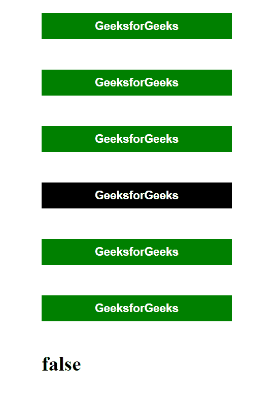
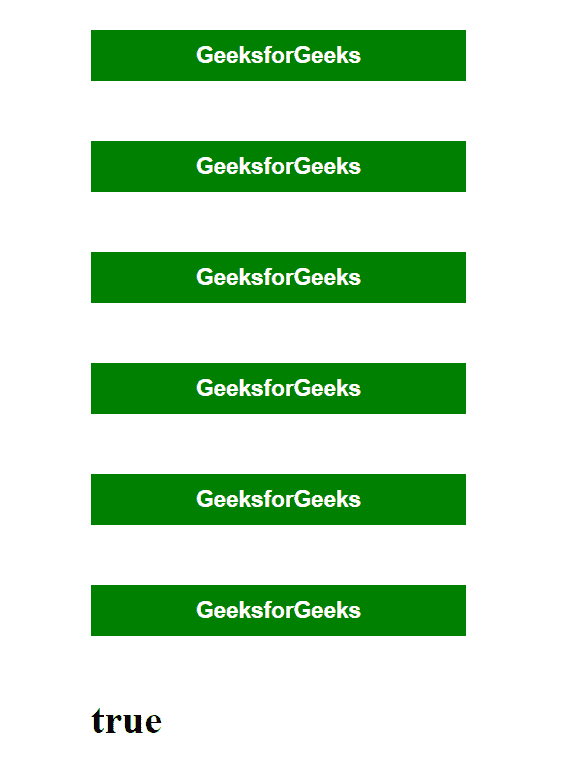

# 如何查找所有元素是否包含同一个类？

> 原文:[https://www . geeksforgeeks . org/如何查找所有元素是否包含同类/](https://www.geeksforgeeks.org/how-to-find-whether-all-element-contains-same-class-or-not/)

**问题陈述:**给定一个有很多元素的 HTML 文档，我们必须找出所有选中的元素是否包含相同的特定 CSS 类。这个问题可以在 JavaScript 的帮助下轻松完成。

**方法:**对于这个问题，我们将使用 JavaScript 中数组对象上可用的 **Array.prototype.every()** 方法。只有当数组的所有元素(在其上调用该方法)满足给定的条件时，该方法才返回 **true** 。

*   首先，我们需要从 HTML 文档中选择所有这些元素，我们要检查它们是否具有相同的 CSS 类，或者是否使用 JavaScript 中的**document . queryselectorall()**方法。
*   由于 **querySelectorAll()** 方法返回所有选定元素的节点列表，我们首先需要使用 **Array.prototype.from()** 方法将这个节点列表转换成一个数组，这样我们就可以在上面调用 **every()** 方法。
*   最后，我们将对所选元素的返回数组使用 **every()** 方法，只有当数组的所有元素都具有指定的类时，该方法才会返回 *true* 。

**示例:**在下面的示例中，我们在 HTML 文档中有六个按钮元素，其中只有五个添加了“*active*”CSS 类。

## 超文本标记语言

```html
<!DOCTYPE html>
<html lang="en">

<head>
    <meta charset="UTF-8" />
    <meta name="viewport" content=
        "width=device-width, initial-scale=1.0" />

    <style>
        button {
            background-color: black;
            color: white;
            padding: 10px 24px;
            width: 300px;
            font-size: 18px;
            border: none;
            font-weight: bold;
            transition: all 0.4s;
            margin: 24px 80px;
        }

        #container {
            display: flex;
            flex-direction: column;
        }

        h1 {
            margin: 24px 80px;
        }

        .active {
            background-color: green;
        }
    </style>

    <script>

        // Select the required elements
        let buttons = document.querySelectorAll("button");
        let text = document.querySelector("h1");

        // Convert the returned node list into an array
        buttons = Array.from(buttons);

        // Check if all the selected elements have
        // the class using every() method
        let check = buttons.every((btn) 
            => btn.classList.contains("active"));
        text.textContent = check;
    </script>
</head>

<body>
    <div id="container">
        <button class="active">GeeksforGeeks</button>
        <button class="active">GeeksforGeeks</button>
        <button class="active">GeeksforGeeks</button>
        <button>GeeksforGeeks</button>
        <button class="active">GeeksforGeeks</button>
        <button class="active">GeeksforGeeks</button>
        <h1></h1>
    </div>
</body>

</html>
```

**输出:**



如果将“活动”CSS 类添加到所有按钮中，将显示以下输出。

