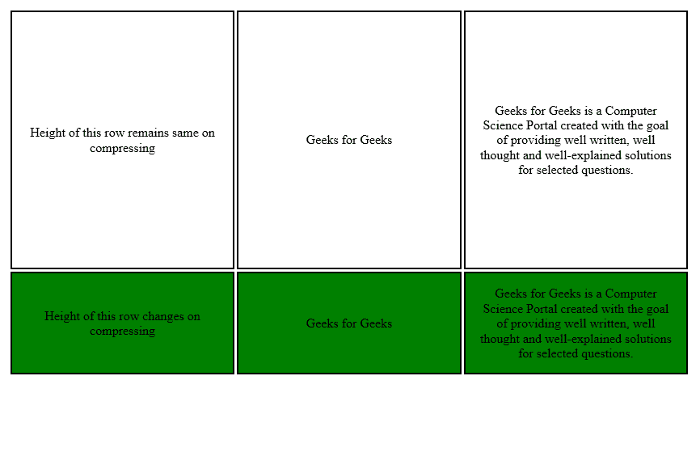

# 如何固定表格中行的高度？

> 原文:[https://www . geeksforgeeks . org/如何修复表中行的高度/](https://www.geeksforgeeks.org/how-to-fix-the-height-of-rows-in-the-table/)

表格中行“tr”的高度可以非常容易地固定。这可以通过在 tr 标签中添加 height 属性来实现。如果未指定高度，行的高度将根据内容而变化。高度可以用像素或百分比来指定。

**语法:**

```htmlhtml
<tr height="px | %">
```

**进场:**

*   高度属性用于设置行的高度。添加在标签中。
*   应该根据内容指定高度，以像素或百分比为单位。
*   如果行中的内容很大，就会溢出。

**示例:**在本例中，第一行的高度已经固定，但第二行的高度尚未固定。所以，当我们改变屏幕大小时，第一行的高度保持不变，但第二行的高度会根据内容而变化。但是，如果指定的高度根据内容不够大，这可能不起作用，第一行将溢出，行为类似于第二行。

运行以下代码并改变屏幕大小，以查看两行之间的差异:

```htmlhtml
<!DOCTYPE html>
<html>
<head>
    <meta charset="UTF-8">
    <title>How to fix height of table tr?</title>

    <style>
        table {
            margin-left: auto;
            margin-right: auto;
            font-size: 10px;
            width: 100%;
            table-layout:fixed;
        }

        td {
            border: 1px solid black;
            text-align: center;
            padding: 10px;
        }

        tr:nth-child(even) {
            background-color: green;
        }
    </style>
</head>
<body>

<table>

<!-- row with fixed height-->
  <tr height="300px">
    <td>Height of this row remains same on varying screen-size</td>
    <td>Geeks for Geeks</td>
    <td>
        Geeks for Geeks is a Computer Science
        Portal created with the goal of
        providing well written, well thought
        and well-explained solutions for
        selected questions.
    </td>
  </tr>

<!-- row without fixed height-->
  <tr>
    <td>Height of this row changes on varying screen-size</td>
    <td>Geeks for Geeks</td>
    <td>
        Geeks for Geeks is a Computer Science
        Portal created with the goal of
        providing well written, well thought
        and well-explained solutions for
        selected questions.
    </td>
  </tr>
</table>

</body>
</html>
```

**输出:**

*   **Before decreasing screen-size:**

    

*   **After decreasing screen-size:**

    

HTML 是网页的基础，通过构建网站和网络应用程序用于网页开发。您可以通过以下 [HTML 教程](https://www.geeksforgeeks.org/html-tutorials/)和 [HTML 示例](https://www.geeksforgeeks.org/html-examples/)从头开始学习 HTML。