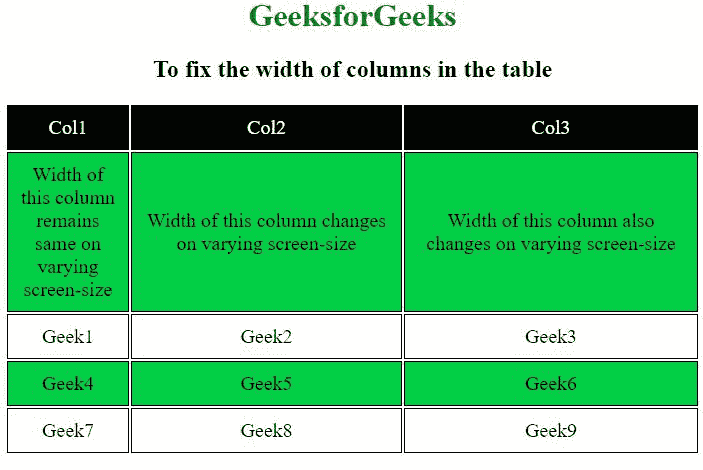
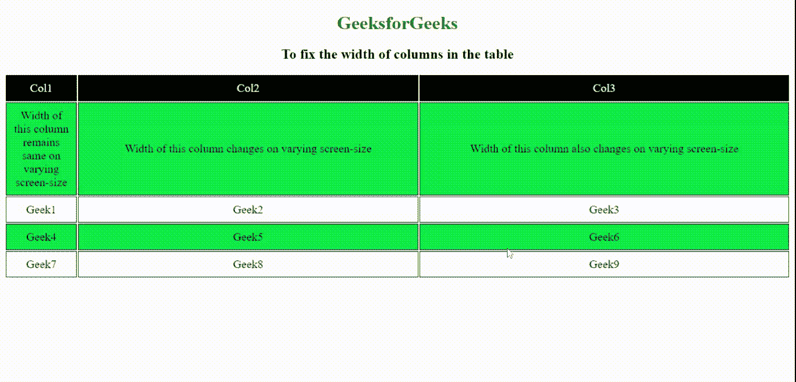
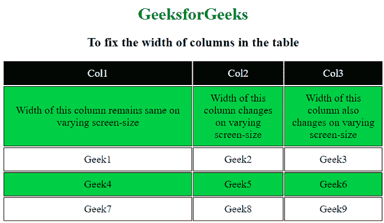
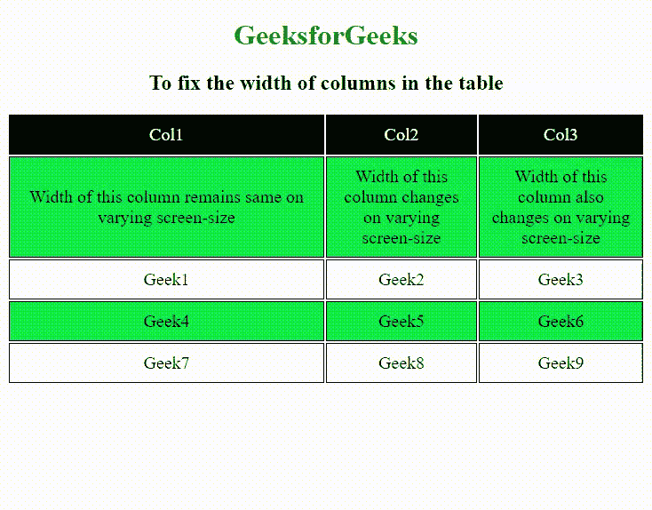

# 如何固定表格中列的宽度？

> 原文:[https://www . geeksforgeeks . org/如何修复表中列的宽度/](https://www.geeksforgeeks.org/how-to-fix-the-width-of-columns-in-the-table/)

我们已经看过文章， [**如何固定表格中各行的高度**。](https://www.geeksforgeeks.org/how-to-fix-the-height-of-rows-in-the-table/?ref=rp)

表格中列的宽度，即 *td* 可以非常容易地固定。这可以通过在 [< td >标签](https://www.geeksforgeeks.org/html-td-tag/)中添加宽度属性来实现。如果未指定宽度，列的宽度将根据内容的变化而变化。列的宽度规格可以是像素或百分比。

**语法:**

```html
<td width ="px | %">
```

**进场:**

*   *宽度*属性用于设置一列的宽度。它被添加到< td >标签中。
*   宽度应该根据内容指定，以像素或百分比为单位。
*   如果列中的内容很大，就会溢出。

**例 1:** 在本例中，第一列的宽度是固定的，但其他列的宽度不是固定的。所以，当我们改变屏幕的大小时，第一列的宽度保持不变，但是其他列的宽度根据内容而变化。但是，如果根据内容指定的宽度不够大，这可能不起作用，并且第一列将溢出，行为类似于另一列。

## 超文本标记语言

```html
<!DOCTYPE html>
<html>

<head>
    <style>
        table {
            margin-left: auto;
            margin-right: auto;
            font-size: 20px;
            height: 100%;
            table-layout: fixed;
        }

        td {
            border: 1px solid black;
            text-align: center;
            padding: 10px;
        }

        tr:nth-child(even) {
            background-color: #00cf45;
        }

        h1 {
            color: green;
        }
    </style>
</head>

<body>
    <center>
        <h1>GeeksforGeeks</h1>

        <h2>
            To fix the width of 
            columns in the table
        </h2>

        <table>
            <tr style="color:white; 
                background-color:black;">
                <td width="100px">Col1</td>
                <td>Col2</td>
                <td>Col3</td>
            </tr>
            <tr>
                <td>
                    Width of this column remains 
                    same on varying screen-size
                </td>
                <td>
                    Width of this column changes 
                    on varying screen-size
                </td>
                <td>
                    Width of this column also changes 
                    on varying screen-size
                </td>
            </tr>
            <tr>
                <td>Geek1</td>
                <td>Geek2</td>
                <td>Geek3</td>
            </tr>
            <tr>
                <td>Geek4</td>
                <td>Geek5</td>
                <td>Geek6</td>
            </tr>
            <tr>
                <td>Geek7</td>
                <td>Geek8</td>
                <td>Geek9</td>
            </tr>
        </table>
    </center>
</body>

</html> 
```

**输出:**运行以下代码并更改屏幕大小，查看各列之间的差异。

*   **更改屏幕尺寸前:**
    
*   **更改屏幕尺寸后:**
    

**例 2:** 在本例中，使用了< td width ="%" >。

## 超文本标记语言

```html
<!DOCTYPE html>
<html>

<head>
    <style>
        table {
            margin-left: auto;
            margin-right: auto;
            font-size: 20px;
            height: 100%;
            table-layout: fixed;
        }

        td {
            border: 1px solid black;
            text-align: center;
            padding: 10px;
        }

        tr:nth-child(even) {
            background-color: #00cf45;
        }

        h1 {
            color: green;
        }
    </style>
</head>

<body>
    <center>
        <h1>GeeksforGeeks</h1>

        <h2>
            To fix the width of
            columns in the table
        </h2>

        <table>
            <tr style="color:white; 
                background-color:black;">
                <td width="50%">Col1</td>
                <td>Col2</td>
                <td>Col3</td>
            </tr>
            <tr>
                <td>
                    Width of this column remains 
                    same on varying screen-size
                </td>
                <td>
                    Width of this column changes 
                    on varying screen-size
                </td>
                <td>
                    Width of this column also changes 
                    on varying screen-size
                </td>
            </tr>
            <tr>
                <td>Geek1</td>
                <td>Geek2</td>
                <td>Geek3</td>
            </tr>
            <tr>
                <td>Geek4</td>
                <td>Geek5</td>
                <td>Geek6</td>
            </tr>
            <tr>
                <td>Geek7</td>
                <td>Geek8</td>
                <td>Geek9</td>
            </tr>
        </table>
    </center>
</body>

</html>
```

**输出:**列的*宽度*设置为“50%”，所以即使改变屏幕尺寸后，第一列的宽度仍保持“50%”。

*   **更改屏幕尺寸前:**
    
*   **更改屏幕尺寸后:**
    