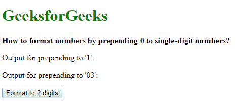

# 如何在一位数前加 0 格式化数字？

> 原文:[https://www . geeksforgeeks . org/如何通过在数字前添加 0 到个位数来格式化数字/](https://www.geeksforgeeks.org/how-to-format-numbers-by-prepending-0-to-single-digit-numbers/)

可以使用 3 种方法将数字格式化为在一位数前添加 0:

**方法一:使用 padStart()方法:**
使用 **padStart()** 方法将一根弦与另一根弦垫到一定长度。填充从字符串的左边开始。它需要两个参数，目标长度和要替换的字符串。

要格式化的数字首先通过传递给字符串构造函数转换为字符串。 **padStart()** 方法用于该字符串，长度参数为 2，字符串替换为字符“0”。这将通过在前面加上“0”将任何一个数字格式化为 2 位数字，并保持 2 位数字不变。

**语法:**

```
prepended_number = String(number).padStart(2, '0')
```

**示例:**

```
<!DOCTYPE html>
<html>

<head>
    <title>
      How to format numbers by 
      prepending 0 to single-digit numbers?
  </title>
</head>

<body>
    <h1 style="color: green">
      GeeksforGeeks
  </h1>
    <b>How to format numbers by 
      prepending 0 to single-digit numbers?
  </b>
    <p>Output for prepending to '1': <span class="output">
      </span>
  </p>
    <p>Output for prepending to '03': <span class="output-2">
      </span>
  </p>

    <button onclick="padNumber()">
      Format to 2 digits
  </button>
    <script type="text/javascript">
        function padNumber() {
            single_digit = 1;
            two_digits = 03;

            prepended_out = 
              String(single_digit).padStart(2, '0');
            prepended_out2 = 
              String(two_digits).padStart(2, '0');

            document.querySelector(
              '.output').textContent = prepended_out;
            document.querySelector(
              '.output-2').textContent = prepended_out2;
        }
    </script>
</body>

</html>
```

**输出:**

*   **点击按钮前:**
    
*   **点击按钮后:**
    

**方法 2:检查数字是否小于 9:**
在该方法中，首先检查数字是否小于 9。如果为真，字符*‘0’*将被附加到该数字上，否则，该数字将被返回，不做任何更改。这将通过在前面加上一个*‘0’*将任何一个数字格式化为 2 位数，并保持 2 位数不变。

**语法:**

```
        function prependZero(number) {
            if (number < 9)
                return "0" + number;
            else
                return number;
        }

```

**示例:**

```
<!DOCTYPE html>
<html>

<head>
    <title>
      How to format numbers by 
      prepending 0 to single-digit numbers?
  </title>
</head>

<body>
    <h1 style="color: green">
      GeeksforGeeks
  </h1>
    <b>How to format numbers by prepending
      0 to single-digit numbers?</b>
    <p>Output for prepending to '1': <span class="output">
      </span>
  </p>
    <p>Output for prepending to '03': <span class="output-2">
      </span>
  </p>

    <button onclick="padNumber()">
      Format to 2 digits
  </button>
    <script type="text/javascript">
        function prependZero(number) {
            if (number < 9)
                return "0" + number;
            else
                return number;
        }

        function padNumber() {
            single_digit = 1;
            two_digits = 03;

            prepended_out = prependZero(single_digit);
            prepended_out2 = prependZero(two_digits);

            document.querySelector(
              '.output').textContent = prepended_out;
            document.querySelector(
              '.output-2').textContent = prepended_out2;
        }
    </script>
</body>

</html>
```

**输出:**

*   **点击按钮前:**
    
*   **点击按钮后:**
    

**方法 3:使用 slice()方法:**
**slice()**方法用于从指定的开始和结束索引中提取字符串的部分。首先，数字前面加一个*‘0’*字符，不管它是一个数字。这将使一位数变成两位数，但两位数将被转换成三位数，并增加*‘0’*。使用**切片()**方法提取结果编号的最后 2 位数字。

这将正确获得 2 位数的最后 2 位数字，丢弃添加到其中的额外的*‘0’*。一位数的数字现在被格式化为*“0”*。

**语法:**前置 _ number =(“0”+number)。切片(-2)

**示例:**

```
<!DOCTYPE html>
<html>

<head>
    <title>
      How to format numbers by 
      prepending 0 to single-digit numbers?
  </title>
</head>

<body>
    <h1 style="color: green">
      GeeksforGeeks
  </h1>
    <b>How to format numbers by 
      prepending 0 to single-digit numbers?
  </b>
    <p>
      Output for prepending to '1': <span class="output">
      </span>
  </p>
    <p>
      Output for prepending to '03': <span class="output-2">
      </span></p>

    <button onclick="padNumber()">
      Format to 2 digits
  </button>
    <script type="text/javascript">
        function padNumber() {
            single_digit = 1;
            two_digits = 03;

            prepended_out = (
              "0" + single_digit).slice(-2);
            prepended_out2 = (
              "0" + two_digits).slice(-2);

            document.querySelector(
              '.output').textContent = prepended_out;
            document.querySelector(
              '.output-2').textContent = prepended_out2;
        }
    </script>
</body>

</html>
```

**输出:**

*   **点击按钮前:**
    
*   **点击按钮后:**
    