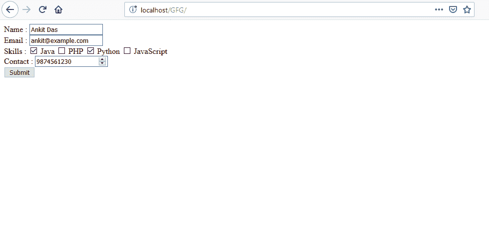
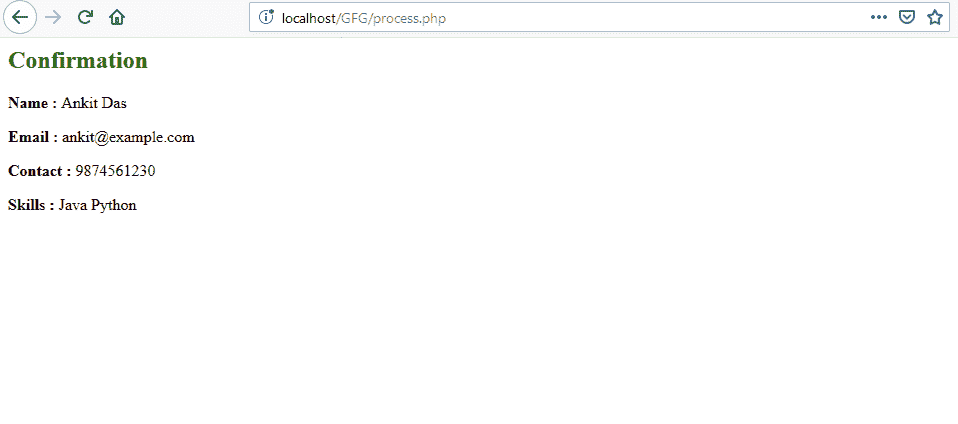

# 如何从多个复选框获取$_POST？

> 原文:[https://www . geesforgeks . org/how-to-get-to-post-from-multiple-check-box/](https://www.geeksforgeeks.org/how-to-get-_post-from-multiple-check-boxes/)

**$_POST** 是一个变量名数组。下面给出的程序说明了如何为多值复选框编写 [HTML](https://www.geeksforgeeks.org/html-tutorials/) 结构，以及如何在 [PHP](https://www.geeksforgeeks.org/php/) 中使用$_POST 获取多值复选框的值。

**注意:**复选框的名称属性必须同名，并且必须用数组初始化。这可以通过在复选框的名称属性末尾使用[]来完成。

**示例:**

*   **代码:**页面(index.html)包含一个表单，其中包含姓名、电子邮件、联系人和技能作为字段和方法帖子。请注意，对于技能，每个复选框输入的名称属性中都有**技能[]** 。

    ```html
    <!DOCTYPE html>
    <html>

    <head>
        <title>
            How to Get $_POST from
            multiple checkboxes?
        </title>
    </head>

    <body>
        <form action="process.php" method="post">
            <div>
                <label>Name :</label>
                <input type="text" name="name">
            </div>

            <div>
                <label>Email :</label>
                <input type="email" name="email">
            </div>

            <div>
                <label>Skills :</label>
                <input type="checkbox" name="skills[]"
                            value="Java"> Java 

                <input type="checkbox" name="skills[]" 
                            value="Php"> PHP

                <input type="checkbox" name="skills[]"
                            value="Python"> Python

                <input type="checkbox" name="skills[]"
                            value="JavaScript"> JavaScript
            </div>

            <div>
                <label>Contact :</label>
                <input type="number" name="contact">
            </div>

            <div>
                <button type="submit">Submit</button>
            </div>
        </form>
    </body>

    </html>
    ```

*   **代码:**我们正在处理用户发送的数据的页面(processing)。

    ```html
    <?php

    // Get the value of name field
    // from $_POST array
    $name = $_POST['name'];

    // Get the value of contact field
    // from $_POST array
    $contact = $_POST['contact'];

    // Get the value of email field
    // from $_POST array
    $email = $_POST['email'];

    // Check if at least one skill has been checked, if
    // checked, then assign the array returned by
    // $_POST['skills'] to $skills variable otherwise
    // assign an empty array
    $skills = (isset($_POST['skills'])) ? $_POST['skills'] : array();

    ?>

    <h2>Confirmation</h2>
    <p><strong>Name :</strong> <?php echo $name; ?></p>
    <p><strong>Email :</strong> <?php echo $email; ?></p>
    <p><strong>Contact :</strong> <?php echo $contact; ?></p>
    <p><strong>Skills :</strong> 
    <?php 

    // Check if $skills array has at least one
    // element, if so, then iterate through 
    // each element and echo its value, otherwise
    // echo that no skill is selected
    if (count($skills) > 0) {
        foreach ($skills as $skill) { 
            echo $skill .' '; 
        } 
    } else {
        echo "No skill has been selected";
    }
    ?>
    </p>
    ```

**输出:**

*   提交表格前，即 ****
*   **提交表单后即**【process . PHP】**
    **