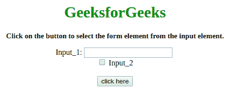
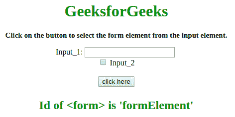

# 如何获取输入的包含形式？

> 原文:[https://www . geesforgeks . org/如何访问包含输入形式的/](https://www.geeksforgeeks.org/how-to-get-access-to-the-containing-form-of-an-input/)

工作是从给定的 **<中选择 **<表单>** 元素，输入表单的>** 元素。这里很少讨论一些重要的技术。我们将使用 JavaScript。
T5 进场:

*   首先选择 **<输入>** 元素的表格。
*   使用其中一个**。表单属性**或**。最接近(' form ')的方法**来访问父表单元素。

**示例 1:** 该示例使用上述方法并使用**。表单属性。**

```html
<!DOCTYPE HTML>
<html>

<head>
    <title>
        Get access to the containing form of an input.
    </title>
    <script src=
"https://ajax.googleapis.com/ajax/libs/jquery/2.1.1/jquery.min.js">
    </script>
</head>

<body id="body" align="center">
    <h1 style="color:green;">  
            GeeksforGeeks  
        </h1>
    <p id="GFG_UP" 
       style="font-size: 15px; font-weight: bold;">
    </p>
    <form id="formElement">
        Input_1:
        <input id="input1" type="text" />
        <br>
        <input type="checkbox" name="input_2"> 
        Input_2
    </form>
    <br>
    <button onclick="GFG_Fun()">
        click here
    </button>
    <p id="GFG_DOWN" 
       style="font-size: 24px; font-weight: bold; color:green;">
    </p>
    <script>
        var el_up = document.getElementById('GFG_UP');
        var el_down = document.getElementById('GFG_DOWN');
        var input = document.getElementById('input1');
        el_up.innerHTML = "Click on the button to select the " +
                          "form element from the input element.";

        function GFG_Fun() {
            var form = input.form;
            el_down.innerHTML = 
              "Id of <form> is '" + $(form).attr("id") + "'";
        }
    </script>
</body>

</html>
```

**输出:**

*   点击按钮前:
    [](https://media.geeksforgeeks.org/wp-content/uploads/20190904131750/Screenshot-from-2019-09-04-13-15-44.png)

*   After clicking on the button:
    [](https://media.geeksforgeeks.org/wp-content/uploads/20190904131752/Screenshot-from-2019-09-04-13-15-46.png)

    **示例 2:** 该示例使用上述方法并使用**。最近的()方法**。

    ```html
    <!DOCTYPE HTML>
    <html>

    <head>
        <title>
            Get access to the containing form of an input.
        </title>
        <script src=
    "https://ajax.googleapis.com/ajax/libs/jquery/2.1.1/jquery.min.js">
        </script>
    </head>

    <body id="body" align="center">
        <h1 style="color:green;">  
                GeeksforGeeks  
            </h1>
        <p id="GFG_UP" 
           style="font-size: 15px; font-weight: bold;">
        </p>
        <form id="formElement">
            Input_1:
            <input id="input1" type="text" />
            <br>
            <input type="checkbox" name="input_2"> 
            Input_2
        </form>
        <br>
        <button onclick="GFG_Fun()">
            click here
        </button>
        <p id="GFG_DOWN" 
           style="font-size: 24px; font-weight: bold; color:green;">
        </p>
        <script>
            var el_up = document.getElementById('GFG_UP');
            var el_down = document.getElementById('GFG_DOWN');
            var input = document.getElementById('input1');
            el_up.innerHTML = "Click on the button to select the "+
                              "form element from the input element.";

            function GFG_Fun() {
                var form = $(input).closest('form');
                el_down.innerHTML = 
                  "Id of <form> is '" + $(form).attr("id") + "'";
            }
        </script>
    </body>

    </html>
    ```

    **输出:**

    *   点击按钮前:
        [](https://media.geeksforgeeks.org/wp-content/uploads/20190904131750/Screenshot-from-2019-09-04-13-15-44.png)
    *   点击按钮后:
        [](https://media.geeksforgeeks.org/wp-content/uploads/20190904131752/Screenshot-from-2019-09-04-13-15-46.png)