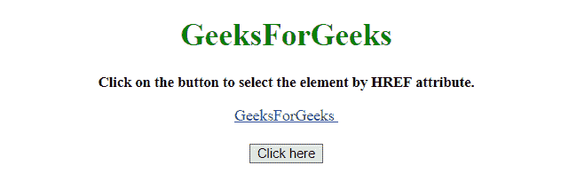
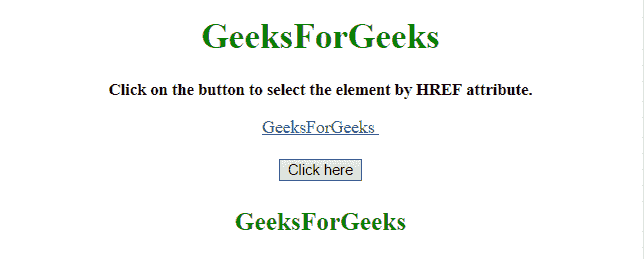

# 如何通过元素的 href 属性获取元素？

> 原文:[https://www . geesforgeks . org/how-to-it-href-attribute 获取元素/](https://www.geeksforgeeks.org/how-to-get-an-element-by-its-href-attribute/)

任务是通过 **href 属性**选择

*   使用 JQuery 选择器**$(' a[href = link _ to _ site]')**。

**示例 1:** 该示例使用上述方法。

```
<!DOCTYPE HTML>  
<html>  
    <head> 
        <title> 
           Get an element by its href attribute.
        </title>
         <script src=
"https://ajax.googleapis.com/ajax/libs/jquery/3.4.1/jquery.min.js">
         </script>
    </head> 
    <body style = "text-align:center;" id = "body">  
        <h1 id = "h1" style = "color:green;" >  
            GeeksforGeeks  
        </h1>
        <p id = "GFG_UP" style = "font-size: 15px; font-weight: bold;">
        </p>
        <a href = "https://www.geeksforgeeks.org">GeeksforGeeks
        </a>
        <br>
        <br>
        <button onclick = "gfg_Run()"> 
            Click here
        </button>
        <p id = "GFG_DOWN" style = "font-size: 23px; 
           font-weight: bold; color: green; ">
        </p>
        <script>
            var el_up = document.getElementById("GFG_UP");
            var el_down = document.getElementById("GFG_DOWN");
            el_up.innerHTML = 
            "Click on the button to select the element by HREF attribute.";
            function gfg_Run() {
                el_down.innerHTML = 
                       $('a[href="https://www.geeksforgeeks.org"]').text();
            }         
        </script> 
    </body>  
</html>
```

**输出:**

*   点击按钮前:
    
*   点击按钮后:
    

**方法 2:**

*   使用 JQuery 选择器**$(' a[href * = part _ of _ link]')**。如果属性的任何部分与值匹配，它将选择元素。

**示例 2:** 该示例使用上述方法。

```
<!DOCTYPE HTML>  
<html>  
    <head> 
        <title> 
           Get an element by its href attribute.
        </title>
         <script src=
"https://ajax.googleapis.com/ajax/libs/jquery/3.4.1/jquery.min.js">    
         </script>
    </head> 
    <body style = "text-align:center;" id = "body">  
        <h1 id = "h1" style = "color:green;" >  
            GeeksForGeeks  
        </h1>
        <p id = "GFG_UP" style = "font-size: 15px; font-weight: bold;">
        </p>
        <a href = "https://www.geeksforgeeks.org"> GeeksforGeeks
        </a>
        <br>
        <br>
        <button onclick = "gfg_Run()"> 
            Click here
        </button>
        <p id = "GFG_DOWN" style = "font-size: 23px; 
           font-weight: bold; color: green; ">
        </p>
        <script>
            var el_up = document.getElementById("GFG_UP");
            var el_down = document.getElementById("GFG_DOWN");
            el_up.innerHTML = 
            "Click on the button to select the element by HREF attribute.";
            function gfg_Run() {
                el_down.innerHTML = $('a[href*="geeks.org"]').text();
            }         
        </script> 
    </body>  
</html>
```

**输出:**

*   点击按钮前:
    
*   点击按钮后:
    