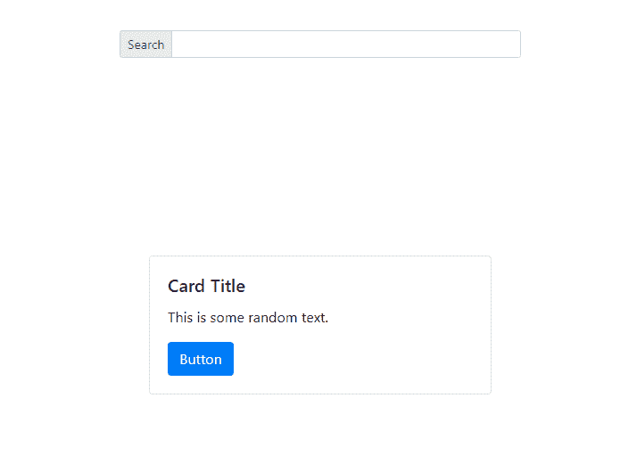
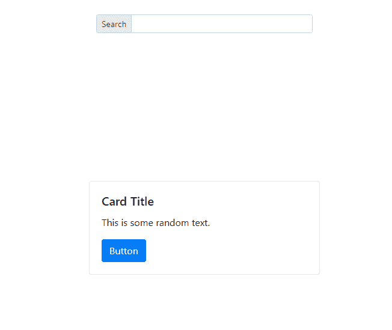
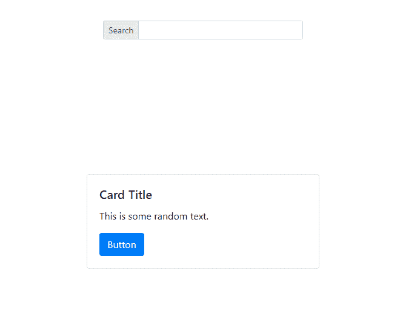

# 如何让卡片在搜索栏和视口底部之间垂直居中？

> 原文:[https://www . geesforgeks . org/如何获取卡片-垂直居中-搜索栏和视口底部之间/](https://www.geeksforgeeks.org/how-to-get-card-vertically-centered-between-search-bar-and-bottom-of-the-viewport/)

要水平居中一个 HTML 元素，你需要指定父元素的宽度。类似地，要使 HTML 元素垂直居中，您需要指定父元素的高度。同样，要使元素水平居中和垂直居中，您需要指定父元素的高度和宽度。

现在指定高度和宽度可能很棘手，您可以通过不同的方式来实现。
**示例 1:** 通过给父元素指定高度和宽度。

```
<!DOCTYPE html>
<html lang="en">

<head>
    <!-- Required meta tags -->
    <meta charset="utf-8">
    <meta name="viewport" 
          content="width=device-width, 
                   initial-scale=1, 
                   shrink-to-fit=no">

    <!-- Bootstrap CSS -->
    <link rel="stylesheet" 
          href=
"https://stackpath.bootstrapcdn.com/bootstrap/4.3.1/css/bootstrap.min.css" 
          integrity=
"sha384-ggOyR0iXCbMQv3Xipma34MD+dH/1fQ784/j6cY/iJTQUOhcWr7x9JvoRxT2MZw1T" 
          crossorigin="anonymous">

    <title>Center Element</title>
    <style>
        .outer {
            /* specifying height width for parent */
            min-width: 100vw;
            min-height: 100vh;
        }

        .flex-center {
            /* centering content of first child */
            display: flex;
            flex-direction: column;
            align-items: center;
            justify-content: flex-start;
        }

        .flex-center-2 {
            /* Centering elements in child div */
            display: flex;
            flex-direction: row;
            justify-content: center;
            align-items: center;
        }

        .child-grow {
            flex-grow: 1;
            /* allowing some child to expand to 
            all width available (Concept in 
            bootstrap is same.) */
        }
    </style>

</head>

<body>

    <div class="container outer flex-center">
        <div class="row w-50 mt-5">
            <div class="input-group input-group-sm ">
                <div class="input-group-prepend">
                    <span class="input-group-text"
                          id="inputGroup-sizing-sm">
                      Search
                  </span>
                </div>
                <input type="text" 
                       class="form-control" 
                       aria-label="Small" 
                       aria-describedby="inputGroup-sizing-sm" />
            </div>
        </div>
        <div class="container child-grow flex-center-2">
            <div class="row ">
                <div class="card" 
                     style="width: 24rem;">
                    <div class="card-body">
                        <h5 class="card-title">
                                       Card Title
                                    </h5>
                        <p>This is some random text.</p>
                        <button class="btn btn-primary">
                          Button
                      </button>
                    </div>
                </div>
            </div>
        </div>
    </div>

    <!-- Optional JavaScript -->
    <!-- jQuery first, then Popper.js, then Bootstrap JS -->
    <script src=
"https://code.jquery.com/jquery-3.3.1.slim.min.js" 
            integrity=
"sha384-q8i/X+965DzO0rT7abK41JStQIAqVgRVzpbzo5smXKp4YfRvH+8abtTE1Pi6jizo" 
            crossorigin="anonymous">
  </script>

    <script src=
"https://cdnjs.cloudflare.com/ajax/libs/popper.js/1.14.7/umd/popper.min.js" 
            integrity=
"sha384-UO2eT0CpHqdSJQ6hJty5KVphtPhzWj9WO1clHTMGa3JDZwrnQq4sF86dIHNDz0W1" 
            crossorigin="anonymous">
  </script>
    <script src=
"https://stackpath.bootstrapcdn.com/bootstrap/4.3.1/js/bootstrap.min.js" 
            integrity=
"sha384-JjSmVgyd0p3pXB1rRibZUAYoIIy6OrQ6VrjIEaFf/nJGzIxFDsf4x0xIM+B07jRM" 
            crossorigin="anonymous">
  </script>
</body>

</html>
```

**输出:**


**示例 2:** 使用引导类(指定子级宽度)

```
<!DOCTYPE html>
<html lang="en">

<head>
    <!-- Required meta tags -->
    <meta charset="utf-8">
    <meta name="viewport"
          content="width=device-width, 
                   initial-scale=1,
                   shrink-to-fit=no">

    <!-- Bootstrap CSS -->
    <link rel="stylesheet"
          href=
"https://stackpath.bootstrapcdn.com/bootstrap/4.3.1/css/bootstrap.min.css" 
          integrity=
"sha384-ggOyR0iXCbMQv3Xipma34MD+dH/1fQ784/j6cY/iJTQUOhcWr7x9JvoRxT2MZw1T" 
          crossorigin="anonymous">

    <title>Center Element</title>

</head>

<body>

    <div class="container">
        <div class="row check d-flex 
                    justify-content-center
                    align-items-center" 
             style="height: 15vh;">

            <div class="input-group input-group-sm w-50">
                <div class="input-group-prepend">
                    <span class="input-group-text" 
                          id="inputGroup-sizing-sm">
                      Search
                  </span>
                </div>
                <input type="text" 
                       class="form-control" 
                       aria-label="Small" 
                       aria-describedby="inputGroup-sizing-sm" />
            </div>
        </div>

        <div class="row d-flex 
                    justify-content-center 
                    align-items-center" 
             style="height: 85vh;">

            <div class="card" style="width: 24rem;">
                <div class="card-body">
                    <h5 class="card-title">
                       Card Title
                    </h5>
                    <p>This is some random text.</p>
                    <button class="btn btn-primary">
                      Button
                  </button>
                </div>
            </div>
        </div>

    </div>

    <!-- Optional JavaScript -->
    <!-- jQuery first, then Popper.js, then Bootstrap JS -->
    <script src=
"https://code.jquery.com/jquery-3.3.1.slim.min.js" 
            integrity=
"sha384-q8i/X+965DzO0rT7abK41JStQIAqVgRVzpbzo5smXKp4YfRvH+8abtTE1Pi6jizo"
            crossorigin="anonymous">
  </script>
    <script src=
"https://cdnjs.cloudflare.com/ajax/libs/popper.js/1.14.7/umd/popper.min.js" 
            integrity=
"sha384-UO2eT0CpHqdSJQ6hJty5KVphtPhzWj9WO1clHTMGa3JDZwrnQq4sF86dIHNDz0W1" 
            crossorigin="anonymous">
  </script>
    <script src=
"https://stackpath.bootstrapcdn.com/bootstrap/4.3.1/js/bootstrap.min.js" 
            integrity=
"sha384-JjSmVgyd0p3pXB1rRibZUAYoIIy6OrQ6VrjIEaFf/nJGzIxFDsf4x0xIM+B07jRM" 
            crossorigin="anonymous">
  </script>
</body>

</html>
```

**输出:**


**示例 3:** 使用引导类(使用引导弹性盒类)

```
<!DOCTYPE html>
<html lang="en">

<head>
    <!-- Required meta tags -->
    <meta charset="utf-8">
    <meta name="viewport"
          content="width=device-width, 
                   initial-scale=1,
                   shrink-to-fit=no">

    <!-- Bootstrap CSS -->
    <link rel="stylesheet" 
          href=
"https://stackpath.bootstrapcdn.com/bootstrap/4.3.1/css/bootstrap.min.css" 
          integrity=
"sha384-ggOyR0iXCbMQv3Xipma34MD+dH/1fQ784/j6cY/iJTQUOhcWr7x9JvoRxT2MZw1T" 
          crossorigin="anonymous">

    <title>Center Element</title>
</head>

<body>

    <div class="container min-vh-100 d-flex flex-column">
        <div class="row mt-5">
            <div class="col-md-6 offset-md-3">
                <div class="input-group input-group-sm">
                    <div class="input-group-prepend">
                        <span class="input-group-text" 
                              id="inputGroup-sizing-sm">
                          Search
                      </span>
                    </div>
                    <input type="text"
                           class="form-control"
                           aria-label="Small"
                           aria-describedby="inputGroup-sizing-sm" />
                </div>
            </div>
        </div>

        <div class="row flex-grow-1 justify-content-center">
            <div class="align-self-center">
                <div class="card" style="width: 24rem;">
                    <div class="card-body">
                        <h5 class="card-title">
                               Card Title
                            </h5>
                        <p>
                          This is some random text.
                      </p>
                        <button class="btn btn-primary">
                          Button
                      </button>
                    </div>
                </div>
            </div>
        </div>

    </div>

    <!-- Optional JavaScript -->
    <!-- jQuery first, then Popper.js, then Bootstrap JS -->
    <script src="https://code.jquery.com/jquery-3.3.1.slim.min.js" 
            integrity=
"sha384-q8i/X+965DzO0rT7abK41JStQIAqVgRVzpbzo5smXKp4YfRvH+8abtTE1Pi6jizo" 
            crossorigin="anonymous">
  </script>

    <script src=
"https://cdnjs.cloudflare.com/ajax/libs/popper.js/1.14.7/umd/popper.min.js" 
            integrity=
"sha384-UO2eT0CpHqdSJQ6hJty5KVphtPhzWj9WO1clHTMGa3JDZwrnQq4sF86dIHNDz0W1" 
            crossorigin="anonymous">
  </script>
    <script src=
"https://stackpath.bootstrapcdn.com/bootstrap/4.3.1/js/bootstrap.min.js" 
            integrity=
"sha384-JjSmVgyd0p3pXB1rRibZUAYoIIy6OrQ6VrjIEaFf/nJGzIxFDsf4x0xIM+B07jRM" 
            crossorigin="anonymous">
  </script>
</body>

</html>
```

**输出:**
