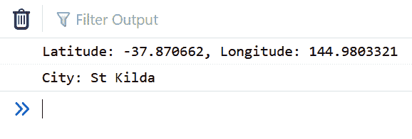

# 如何利用地理定位获取城市名称？

> 原文:[https://www . geeksforgeeks . org/如何使用地理定位获取城市名称/](https://www.geeksforgeeks.org/how-to-get-city-name-by-using-geolocation/)

在本文中，我们将学习如何使用[反向地理编码](https://en.wikipedia.org/wiki/Reverse_geocoding)获取用户的城市名称。我们将使用第三方应用编程接口服务提供商([位置智商](https://locationiq.com/))来帮助我们将收到的经纬度转换为地址。

**步骤:**

1.  获取用户坐标。
2.  获取城市名称。

**注意:**location IQ 账户需要获得一个 API 令牌。

**index.html**[获取用户坐标。](https://www.geeksforgeeks.org/html-geolocation/)

*   地理定位界面允许我们获取用户设备的位置。
*   Geolocation.getCurrentPosition()帮助我们确定用户的位置，并返回一个包含所需数据的 Geoposition 对象。

**index.html**

```
<!DOCTYPE html>
<html lang="en">
<head>
    <meta charset="UTF-8">
    <meta name="viewport" content=
        "width=device-width, initial-scale=1.0">
    <title>Geolocation - City</title>
</head>
<body>
    <script src="script.js" ></script>
    </body>
</html>
```

这个 JavaScript 文件包含两个函数，**getCoordinates()**&**getCity()**

1.  **获取坐标()功能:**
    *   地理定位界面允许我们获取用户设备的位置。
    *   Geolocation.getCurrentPosition()帮助我们确定用户的位置，并返回一个包含所需数据的 Geoposition 对象。
    *   关于使用 JS 进行地理定位的完整信息，请参考[此链接](https://developer.mozilla.org/en-US/docs/Web/API/Geolocation/getCurrentPosition)。
2.  **getCity()功能:**
    *   我们需要一个 **[LocationIQ](https://www.locationiq.com/)** 令牌来进行。
    *   XMLHttpRequest (XHR)是一个 API 对象，它的方法允许我们在网络浏览器和网络服务器之间传输数据。
    *   尽管有这个名字，它也可以与 HTTP 和其他协议一起使用。并且要检索的数据不仅可以是 XML，还可以是 JSON、HTML 或纯文本。
    *   *xhr . readystate = = 4&&xhr . status = = 200*表示数据接收和加载正确。
    *   因为我们接收的数据是一个 JSON 对象，所以我们可以使用点符号来获取属性值。

**script.js**

```
// Step 1: Get user coordinates
function getCoordintes() {
    var options = {
        enableHighAccuracy: true,
        timeout: 5000,
        maximumAge: 0
    };

    function success(pos) {
        var crd = pos.coords;
        var lat = crd.latitude.toString();
        var lng = crd.longitude.toString();
        var coordinates = [lat, lng];
        console.log(`Latitude: ${lat}, Longitude: ${lng}`);
        getCity(coordinates);
        return;

    }

    function error(err) {
        console.warn(`ERROR(${err.code}): ${err.message}`);
    }

    navigator.geolocation.getCurrentPosition(success, error, options);
}

// Step 2: Get city name
function getCity(coordinates) {
    var xhr = new XMLHttpRequest();
    var lat = coordinates[0];
    var lng = coordinates[1];

    // Paste your LocationIQ token below.
    xhr.open('GET', "
https://us1.locationiq.com/v1/reverse.php?key=YOUR_PRIVATE_TOKEN&lat=" +
    lat + "&lon=" + lng + "&format=json", true);
    xhr.send();
    xhr.onreadystatechange = processRequest;
    xhr.addEventListener("readystatechange", processRequest, false);

    function processRequest(e) {
        if (xhr.readyState == 4 && xhr.status == 200) {
            var response = JSON.parse(xhr.responseText);
            var city = response.address.city;
            console.log(city);
            return;
        }
    }
}

getCoordintes();
```

**输出:**
