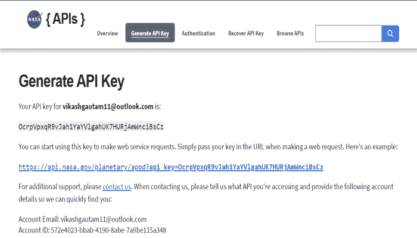
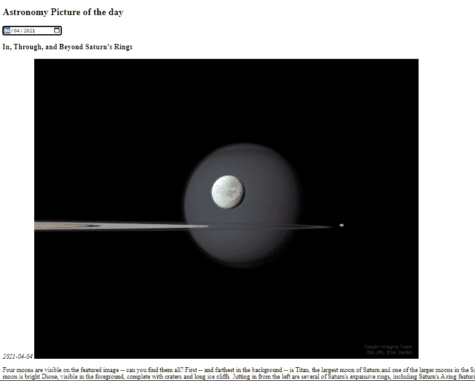

# 如何使用 NASA 公开的 API 从 NASA 联邦机构获取数据？

> 原文:[https://www . geeksforgeeks . org/如何从美国宇航局联邦机构获取数据-使用美国宇航局公共 API/](https://www.geeksforgeeks.org/how-to-get-data-from-nasa-federal-agencies-using-the-nasa-public-apis/)

美国宇航局公开了一些数据，包括图像和视频，供好奇的人探索宇宙。这些数据可以通过使用任何人都可以用来开发相关应用程序的开放 API 来探索。下面的方法介绍了如何使用开放的应用编程接口获取美国宇航局提供的数据。

**如何生成关键的 API 来探索 NASA 的数据？**

为了探索美国宇航局的数据，我们需要生成[API](https://www.geeksforgeeks.org/introduction-to-apis/)键。

**第一步:**前往 NASA 开放的 APIs 网站生成 APIs 密钥[https://api.nasa.gov/](https://api.nasa.gov/)并填写详细信息即可获得 web 服务。

**步骤 2:** 填写完所有必填字段后，将生成 APIs 密钥，如下所示。



只需复制并记录您的 API 密钥，我们将在我们的 JavaScript 中使用该密钥从 NASA 门户获取数据。

**步骤 3:** 生成 API 密钥后，转到浏览 API 部分，浏览 NASA 机构提供的 API 服务。

为了展示应用编程接口的功能，以及我们如何在我们的网站上使用它，我们将使用一个 APOD 应用编程接口来探索当时的天文学图景。APOD 是用于从美国宇航局门户网站获取图片的应用编程接口之一。APOD 代表天文图片。

**取数据的查询参数如下:**

*   **数据:**要检索的 APOD 图像的日期。为 *YYYY-MM-DD* 类型，默认值为*今日*。
*   **start_date:** 请求日期范围的数据时，日期范围的开始。不能用于约会。它是 YYYY-MM-DD 类型，默认值为无。
*   **结束日期:**日期范围的结束，与*开始日期*一起使用。为 *YYYY-MM-DD* 型，默认值为*今*。
*   **计数:**如果指定了这个计数，随机选择的图像将被返回。不能与日期或*开始日期*和*结束日期*一起使用。为 *int* 类型，默认值为无。
*   **拇指:**返回数据视频缩略图的 URL。如果 APOD 不是视频，此参数将被忽略。它属于*布尔*类型，默认值为假。
*   **api_key:** 是扩展使用的 api.nasa.gov 密钥。为*字符串*类型，默认值为 *DEMO_KEY* 。

下面显示了一个示例查询:

```html
https://api.nasa.gov/planetary/apod?api_key=DEMO_KEY
```

**第四步:**创建一个***index.html***文件，使用如下所示的 HTML 和 JavaScript 代码在网页上显示当天的天文图片(APOD)。

## 超文本标记语言

```html
<!DOCTYPE html>
<html>

<body>
    <h2>Astronomy Picture of the day</h2>
    <input type="date" id="date" onchange="getDate();">
    <h3 class="img-title" id="title"></h3>
    <em class="date" id="pic_date"></em>
    
    <p class="caption" id="caption"></p>

    <script type="text/javascript">

        // Declaration of variables
        var method = "GET";
        const key =
        "U0PqJ5UprbVQExkXc7ZgsGVfIM7Z1O8Uiv7g2hOO";

        var url =
        "https://api.nasa.gov/planetary/apod?api_key="
                + key + "&date=";
        var mode = true;
        var date;

        // Function defination to get date from
        // input box and supply in sendHttpRequest
        // function
        function getDate() {
            date = document.getElementById("date").value;
            console.log(date);
            sendHttpRequest(method, url + date,
                mode).then((data) => {
                console.log(data);
                update(data);
            });

        }

        // Declaration of update function to
        // display the fetched data on webpage
        function update(data) {
            document.getElementById("pic_date")
                .innerHTML = data.date;

            document.getElementById("title")
                .innerHTML = data.title;

            document.getElementById("apod_pic")
                .src = data.url;

            document.getElementById("caption")
                .innerHTML = data.explanation;
            return data;
        }

        // Send request to nasa portal to data
        // using the XMLHttpRequest
        function sendHttpRequest(method, url, mode) {
            return new Promise((resolve, reject) => {

                var req = new XMLHttpRequest();
                req.onreadystatechange = function () {
                    if (this.readyState == 4) {
                        if (this.status == 200) {
                            var data = JSON
                                .parse(this.response);
                            console.log(data);
                            resolve(data);
                        }
                    }
                }
                req.open(method, url, mode);
                req.send();
            });
        }
    </script>
</body>

</html>
```

**输出:**打开网页，选择上一个日期。选择日期后，当天的天文图片将显示在网页上，图片的日期、标题和描述如下所示。



**结论:**这就是我们如何使用 NASA 开放 API 从 NASA 门户获取数据。我们还可以使用其他服务，如 EPIC(地球多色成像相机)、火星漫游车以及图像和视频库。