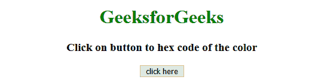
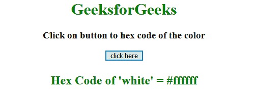
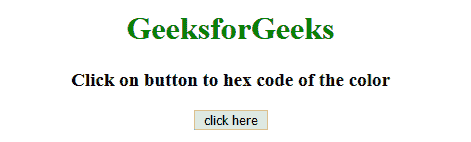
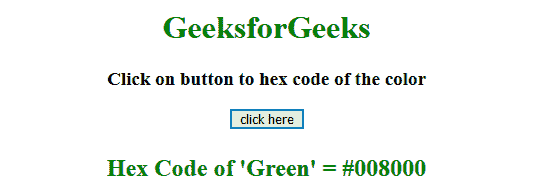

# 如何获取 RGB 值的十六进制色值？

> 原文:[https://www . geesforgeks . org/how-get-hex-color-value-of-RGB-value/](https://www.geeksforgeeks.org/how-to-get-hex-color-value-of-rgb-value/)

给定 RGB 颜色值，任务是使用 JavaScript 获取该颜色的十六进制代码。

**方法 1:**

*   调用 convert()用户定义函数，并使用 RGB 值作为参数。
*   使用 match()方法选择红色、绿色和蓝色的值。RGB 的值以数组的形式存储。
*   函数的作用是:将 RGB 值转换成 hexCode。
*   slice()方法获取字符串的一部分，并在新字符串中返回提取的部分。toString()方法将数字转换为字符串。

**示例 1:** 本示例获取白色的 RGB 值，即 rgb(255，255，255)，并使用 JavaScript 将其转换为 HexCode。

```
<!DOCTYPE html>
<html>

<head>
    <title>
        How to get hex color value
        of RGB color value
    </title>
</head>

<body style="text-align:center;">

    <h1 style="color:green;"> 
        GeeksforGeeks 
    </h1>

    <p id="GFG_UP" style=
        "font-size: 19px; font-weight: bold;">
    </p>

    <button onClick="GFG_Fun()">
        click here
    </button>

    <p id="GFG_DOWN" style=
        "color: green; font-size: 24px; font-weight: bold;">
    </p>

    <script>
        var up = document.getElementById('GFG_UP');
        var down = document.getElementById('GFG_DOWN');
        up.innerHTML = 'Click on button to hex code of the color';

        function convert(rgb) {
            rgb = rgb.match(/^rgb\((\d+),\s*(\d+),\s*(\d+)\)$/);

            function hexCode(i) {
                return ("0" + parseInt(i).toString(16)).slice(-2);
            }
            return "#" + hexCode(rgb[1]) + hexCode(rgb[2]) 
                    + hexCode(rgb[3]);
        }

        function GFG_Fun() {
            down.innerHTML = "Hex Code of 'white' = "
                + convert('rgb(255,255,255)');
        }
    </script>
</body>

</html>                    
```

**输出:**

*   **点击按钮前:**
    
*   **点击按钮后:**
    

**示例 2:** 该方法首先检查是否提供了十六进制值而不是 RGB 值。因为有些浏览器返回十六进制值来代替 RGB 值。本示例获取绿色的 RGB 值，即 RGB(0，128，0)，并通过创建函数将其转换为十六进制代码。

```
<!DOCTYPE Html>
<html>

<head>
    <title>
        How to get hex color value
        of RGB color value
    </title>
</head>

<body style="text-align:center;">

    <h1 style="color:green;"> 
        GeeksforGeeks 
    </h1>

    <p id="GFG_UP" style=
        "font-size: 19px; font-weight: bold;">
    </p>

    <button onClick="GFG_Fun()">
        click here
    </button>

    <p id="GFG_DOWN" style=
        "color: green; font-size: 24px; font-weight: bold;">
    </p>

    <script>
        var up = document.getElementById('GFG_UP');
        var down = document.getElementById('GFG_DOWN');
        up.innerHTML = 'Click on button to hex code of the color';

        function convert(rgb) {
            if (/^#[0-9A-F]{6}$/i.test(rgb)) return rgb;

            rgb = rgb.match(/^rgb\((\d+),\s*(\d+),\s*(\d+)\)$/);

            function hexCode(i) {
                return ("0" + parseInt(i).toString(16)).slice(-2);
            }
            return "#" + hexCode(rgb[1]) + hexCode(rgb[2])
                    + hexCode(rgb[3]);
        }

        function GFG_Fun() {
            down.innerHTML = "Hex Code of 'Green' = "
                    + convert('rgb(0,128,0)');
        }
    </script>
</body>

</html>                    
```

**输出:**

*   **点击按钮前:**
    
*   **点击按钮后:**
    