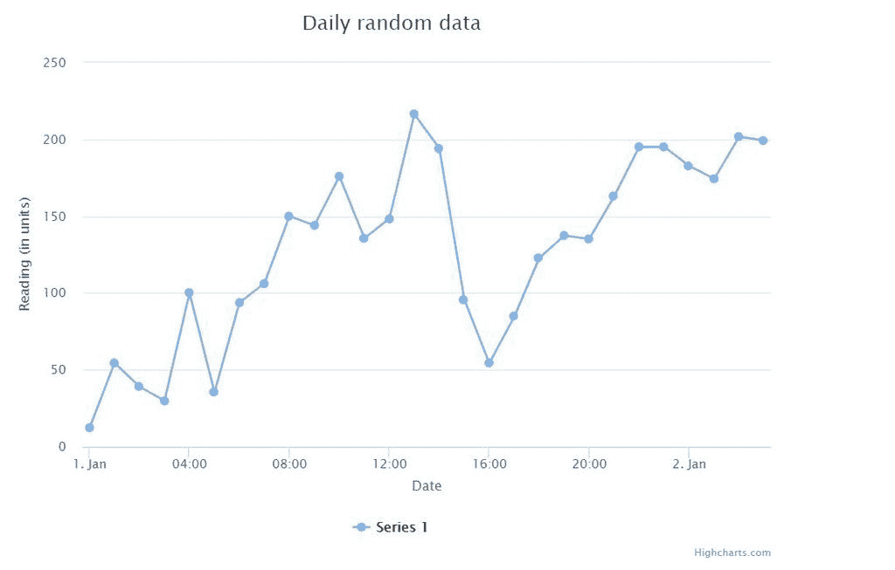
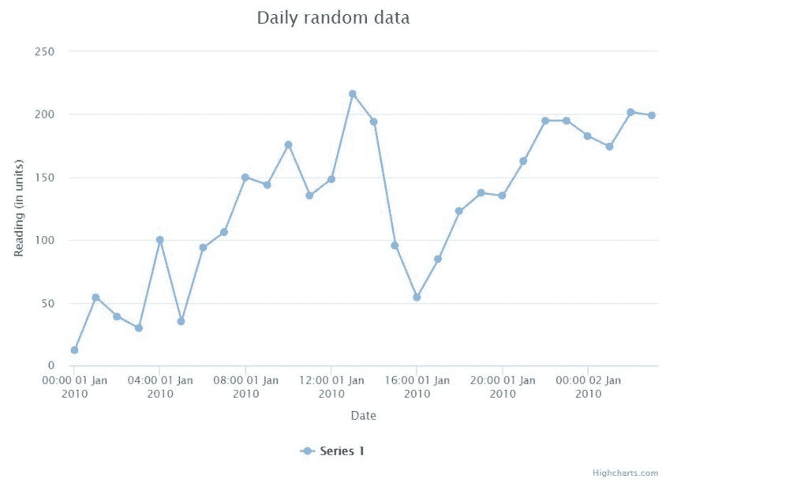

# 如何获取 x 轴上的高图表日期？

> 原文:[https://www . geesforgeks . org/how-to-high-charts-x 轴中的日期/](https://www.geeksforgeeks.org/how-to-get-highcharts-dates-in-the-x-axis/)

图形或图表是表示数据的最佳方式，因为它们比查看原始数据更方便用户。它还可以轻松地对数据进行分析。JavaScript 中有许多库，可以很容易地创建这些可视化，并在移动或网络应用程序中使用它们。一个这样的库是**高图表 JS** 。这是一个基于 SVG 的多平台 JavaScript 图表库，可以轻松地将交互式可视化添加到应用程序中。

**示例:**下面的示例显示了一个带有随机数据的简单折线图，x 轴具有 DateTime 类型。下面的代码将用于定义绘制图形的 HTML 文档。

## 超文本标记语言

```htmlhtml
<!DOCTYPE html>
<html>
  <head>
  <title>Highcharts JS line chart</title>

  <!-- Include the highcharts library -->
  <script 
    src="https://code.highcharts.com/highcharts.js">
  </script>

  <!-- Include additional JavaScript here -->
  </head>
  <body>
    <div id="plot-container" 
      style="height: 500px; width: 700px">
    </div>
  </body>
</html>
```

JavaScript 代码显示了图表及其所需的参数。

## java 描述语言

```htmlhtml
// Define the chart
var chart = new Highcharts.Chart({
  chart: {
    renderTo: 'plot-container',
    type: 'line'
  },
  title: {
    text: 'Daily random data'
  },
  xAxis: {
    title: {
      text: 'Date'
    },
    type: 'datetime'
  },
  yAxis: {
    title: {
      text: 'Reading (in units)'
    }
  },

  // Define the data to be represented
  series: [{
      data: [
        12.2, 54.5, 39.1, 29.9, 100,
        35.4, 93.7, 106.4, 150, 144.0, 176.0,
        135.6, 148.5, 216.4, 194.1, 95.6, 54.4,
        84.7, 122.9, 137.4, 135.2, 163.1, 195.2,
        195.1, 182.7, 174.3, 201.8, 199.2, 
    ],
    pointStart: Date.UTC(2010, 0, 1),
    pointInterval: 3600 * 1000 // one hour
  }]
});
```

**输出:**



上图给出了一天中每个小时的一些数值。例如，在 4:00 时，y 轴上的值为 100，在 8:00 时，该值为 150，依此类推。是否可以从 x 轴确定每个时间标签的日期？是的，通过观察，我们看到有两个日期:1。一月二日。Jan 和所有位于它们之间的时间标签代表 1 点的时间。简和那些说谎的人。一月代表那一天的时间。

在本例中，这种观察很容易，因为图表的数据集很小。但是在现实世界的项目中，图表上显示的数据通常是巨大的，用户在查看这样的图表时，可能希望通过浏览图表就能获得特定日期和时间的数据。

这就是高图表库提供的灵活性和控制变得有用的地方。可以通过显式定义所选轴的日期时间标签格式来修改库的默认行为。默认情况下，根据下面定义的间隔，它对日期时间标签使用以下格式:

```htmlhtml
{
    millisecond: '%H:%M:%S.%L',
    second: '%H:%M:%S',
    minute: '%H:%M',
    hour: '%H:%M',
    day: '%e. %b',
    week: '%e. %b',
    month: '%b \'%y',
    year: '%Y'
}

```

用于表示时间的标签定义如下:

```htmlhtml
%a: Short weekday, like 'Mon'.
%A: Long weekday, like 'Monday'.
%d: Two digit day of the month, 01 to 31.
%e: Day of the month, 1 through 31.
%b: Short month, like 'Jan'.
%B: Long month, like 'January'.
%m: Two digit month number, 01 through 12.
%y: Two digits year, like 09 for 2009.
%Y: Four digits year, like 2009.
%H: Two digits hours in 24h format, 00 through 23.
%I: Two digits hours in 12h format, 00 through 11.
%l (Lower case L): Hours in 12h format, 1 through 11.
%M: Two digits minutes, 00 through 59.
%p: Upper case AM or PM.
%P: Lower case AM or PM.
%S: Two digits seconds, 00 through 59

```

在本例中，时间以小时为间隔显示在 x 轴上。因此，使用的默认标签是“%H:%M”，它代表数据点的两位数小时和两位数分钟值。

这必须改变，以便随着时间，它也显示两位数的日子，短月和四位数的年。参考上面的标签定义，要使用的新标签将是:“%H:%M %d %b %Y”

必须通过定义具有所需格式的格式化程序函数，在 labels 属性中进行此更改。该代码是为 x 轴添加的:

```htmlhtml
labels: {
  formatter: function() {
    return Highcharts.dateFormat('%H:%M %d %b %Y',this.value);
  }
}

```

包含变更的最终代码是:

## java 描述语言

```htmlhtml
var chart = new Highcharts.Chart({
  chart: {
    renderTo: 'plot-container',
    type: 'line'
  },
  title: {
    text: 'Daily random data'
  },
  xAxis: {
    title: {
      text: 'Date'
    },
    type: 'datetime',

    // Use the date format in the
    // labels property of the chart
    labels: {
      formatter: function() {
        return Highcharts.dateFormat('%H:%M %d %b %Y',
                                      this.value);
      }
    }
  },
  yAxis: {
    title: {
      text: 'Reading (in units)'
    }
  },

  series: [{
      data: [
        12.2, 54.5, 39.1, 29.9, 100,
        35.4, 93.7, 106.4, 150, 144.0, 176.0,
        135.6, 148.5, 216.4, 194.1, 95.6, 54.4,
        84.7, 122.9, 137.4, 135.2, 163.1, 195.2,
        195.1, 182.7, 174.3, 201.8, 199.2, 
    ],
    pointStart: Date.UTC(2010, 0, 1),
    pointInterval: 3600 * 1000 // one hour
  }]
});
```

**输出:**



上面的图表现在在 x 轴上显示了日期和时间。

**参考文献:**
[https://API . high charts . com/high charts/xaxis . datetime label formats](https://api.highcharts.com/highcharts/xAxis.dateTimeLabelFormats)
[https://www.highcharts.com/forum/viewtopic.php?t=13389](https://www.highcharts.com/forum/viewtopic.php?t=13389)