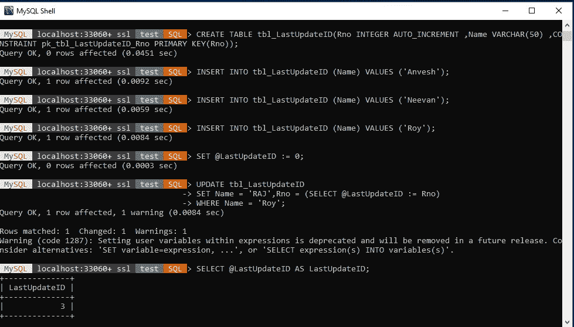
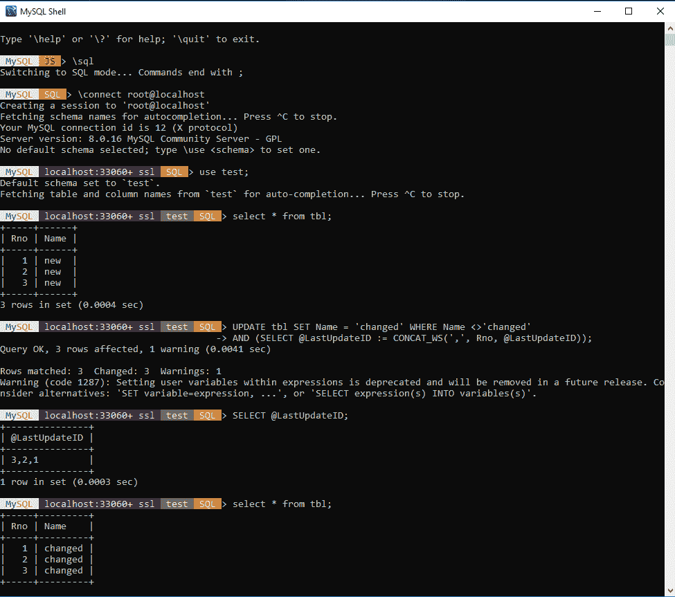

# 如何获取 MySQL 中最后更新行的 ID？

> 原文:[https://www . geesforgeks . org/如何获取最新更新的 mysql 中的行 id/](https://www.geeksforgeeks.org/how-to-get-id-of-the-last-updated-row-in-mysql/)

很多时候，我们需要根据上次更新的表 id 来更新数据。

我们应该编写一个更新查询，这样我们就可以在更新语句本身
中获得最后一个更新的 ID。下面提到的代码是广义上创建的，只需替换**“**中的值就可以轻松使用，如下所示:

**创建表格**

```

CREATE TABLE 
tbl(Rno INTEGER AUTO_INCREMENT ,
      Name VARCHAR(50) ,
       CONSTRAINT tbl_Rno PRIMARY KEY(Rno));
INSERT INTO tbl (Name) VALUES ('value1');
INSERT INTO tbl (Name) VALUES ('value2');
INSERT INTO tbl (Name) VALUES ('value3');

```

**获取最后更新的 ID**
这里的逻辑建议我们首先将最后更新的 ID 更新为 0，因为它清除了之前执行的任何函数，然后我们使用 SQL 中的 where 子句/查询更新我们的值，并使用@ lastupdatedID 查询选择最后更新的 ID

```

SET @LastUpdateID := 0;
UPDATE tbl SET Name = 'value_new',Rno = (SELECT @LastUpdateID := Rno) 
   WHERE Name = 'value3';
SELECT @LastUpdateID AS LastUpdateID;

```

**获取多个最后更新的标识**
这里的逻辑建议我们使用 SQL 中的 where 子句/查询更新我们的值，并使用@lastupdatedID 查询选择最后更新的标识，为了选择多个标识，我们使用 Concat 查询，因为它这段代码从底部开始搜索，您将获得我们的答案，如示例所示。

```
SET @LastUpdateID = NULL;

UPDATE tbl SET Name = 'changed' WHERE Name 'changed'
AND (SELECT @LastUpdateID := CONCAT_WS(',', Rno, @LastUpdateID));
SELECT @LastUpdateID;

```

**示例#1(针对最后更新的标识)**



**示例#2(针对多个上次更新的 ID)**
