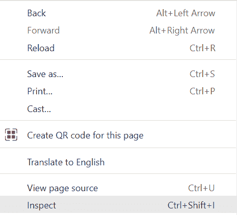
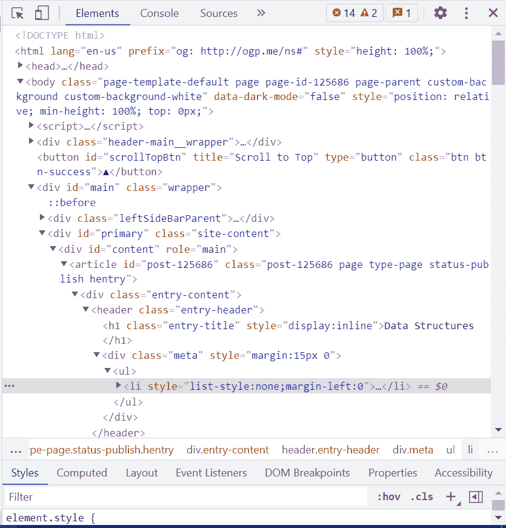
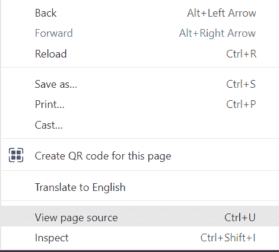
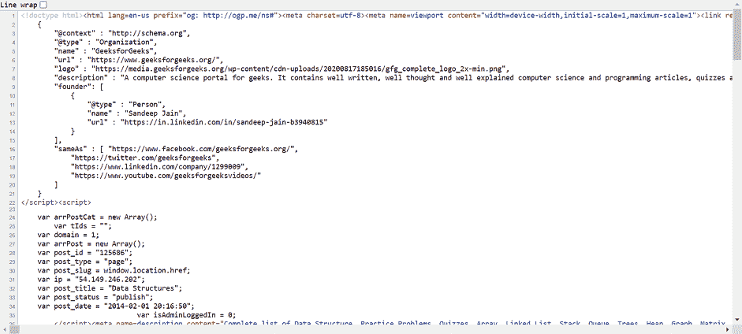

# 如何获取任何网站的源代码？

> 原文:[https://www . geesforgeks . org/如何获取任何网站的源代码/](https://www.geeksforgeeks.org/how-to-get-source-code-of-any-website/)

网站被定义为网页的集合。一个网站可以使用 HTML，CSS，Bootstrap 等设计。HTML 语言决定网页上会出现什么，CSS 语言描述网页会如何出现。换句话说，HTML 将元素放在网页上，而 CSS 为其设置样式。Bootstrap 是预编译的 CSS。假设我们看到一个网站，例如 geeksforgeeks.org，我们想要它的源代码，那么有两种方法可以得到它:

*   使用检查元素(Ctrl + Shift + I)
*   使用视图页面源

让我们逐一了解这两种方法。

**1。使用检查元件**

下面是逐步实现。

**第一步:**访问你想要的网站，如 geeksforgeeks.org。


**第二步:**点击检查。



**第三步:**你会在右手边得到代码。



**快捷键:**

```
(Ctrl + Shift + I )
```

**2。使用页面来源:**

**第一步:**访问你想要的网站，如**geeksforgeeks.org。**


**第二步:**右键点击网站，点击**“查看页面来源”。**



**第三步:**你会得到如下源代码。



**快捷键**

```
CTRL + U
```