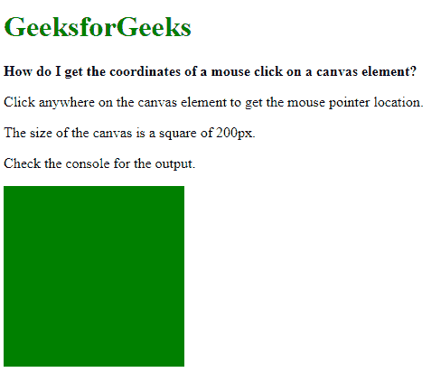
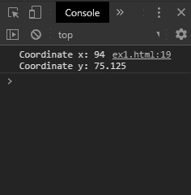

# 如何获取鼠标点击画布元素的坐标？

> 原文:[https://www . geeksforgeeks . org/如何获取鼠标点击画布元素的坐标/](https://www.geeksforgeeks.org/how-to-get-the-coordinates-of-a-mouse-click-on-a-canvas-element/)

通过事件监听器检测点击事件并找到事件的 x 和 y 位置，可以找到每次点击时鼠标的坐标。

创建了一个函数，该函数将画布元素和事件作为参数。使用 **getBoundingClientRect()** 函数可以找到画布的尺寸。此方法返回元素的大小及其相对于视口的位置。

鼠标点击的 x 坐标位置是通过用边框的 x 位置减去事件的 x 位置得到的。使用“clientX”属性可以找到事件的 x 位置。画布元素的 x 位置，即矩形的左侧，可以使用' left '属性找到。

类似地，通过用边框的 y 位置减去事件的 y 位置，可以找到点击的 y 坐标位置。使用“clientY”属性可以找到事件的 y 位置。画布元素的 y 位置，即矩形的上侧，可以使用“top”属性找到。

这个减法将补偿画布在页面上的位置，因为事件的 x 和 y 位置是相对于页面而不是画布的。

为了检测点击，首先使用 querySelector()方法选择画布元素。在这个元素上使用 **addEventListener()** 方法来监听‘mouse down’事件。只要按下鼠标按钮，就会触发此事件。这个函数的回调用于调用上面创建的函数来检测点击的位置。

**示例:**

```
<!DOCTYPE html>
<html>

<head>
    <title>
        How to get the coordinates of a mouse
        click on a canvas element?
    </title>
</head>

<body>
    <h1 style="color: green">
        GeeksforGeeks
    </h1>

    <b>
        How do I get the coordinates of a 
        mouse click on a canvas element?
    </b>

    <p>
        Click anywhere on the canvas element
        to get the mouse pointer location.
    </p>

    <p>
        The size of the canvas
        is a square of 200px.
    </p>

    <p>Check the console for the output.</p>

    <canvas width="200" height="200"
        style="background-color: green">
    </canvas>

    <script type="text/javascript">
        function getMousePosition(canvas, event) {
            let rect = canvas.getBoundingClientRect();
            let x = event.clientX - rect.left;
            let y = event.clientY - rect.top;
            console.log("Coordinate x: " + x, 
                        "Coordinate y: " + y);
        }

        let canvasElem = document.querySelector("canvas");

        canvasElem.addEventListener("mousedown", function(e)
        {
            getMousePosition(canvasElem, e);
        });
    </script>
</body>

</html>
```

**输出:**

*   在点击画布的任何地方之前:
    
*   **在画布中点击后:**
    