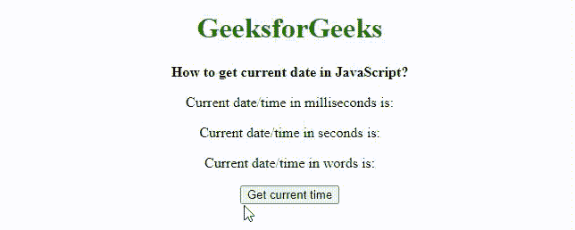
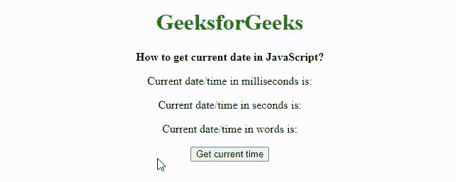

# 如何以秒为单位获取当前日期和时间？

> 原文:[https://www . geesforgeks . org/如何获取当前日期和时间(秒)/](https://www.geeksforgeeks.org/how-to-get-the-current-date-and-time-in-seconds/)

在本文中，我们将学习如何使用 Javascript 内置方法在*秒*中*获取当前日期&时间*。我们将以两种方式执行:

*   使用 Date.now()方法
*   使用新的 Date.getTime()方法

**方法 1:使用** [**Date.now()方法**](https://www.geeksforgeeks.org/javascript-date-now-method/)

Date.now()方法返回自世界协调时 1970 年 1 月 1 日 00:00:00 以来经过的毫秒数。这就是所谓的纪元时间。它可以用于时间戳，因为通过比较时间戳可以很容易地检查事件的顺序。通过将该值除以 1000，然后使用 Math.round()函数对该值进行舍入，可以将返回的毫秒数转换为秒。这样做是为了防止由于浮点值造成的不一致。

**语法:**

```
Date.now();
```

**参数:**此方法不接受任何参数。

**返回值:**返回自 1970 年 1 月 1 日 00:00:00 UTC 以来经过的毫秒数。

**示例:**本示例描述使用 Date.now()方法获取当前日期&时间。

## 超文本标记语言

```
<!DOCTYPE html>
<html>

<head>
    <title>How to get current date in JavaScript?</title>
</head>

<body style=" text-align:center;">
    <h1 style="color: green;">
        GeeksforGeeks
    </h1> 
    <b>
        How to get current date in JavaScript?
    </b>
    <p>
        Current date/time in milliseconds is: 
        <span class="output-msecs"> 
    </p>

    <p>
        Current date/time in seconds is: 
        <span class="output-secs"> 
    </p>

    <p>
        Current date/time in words is: 
        <span class="output-words"> 
    </p>

    <button onclick="getCurrentDate()">Get current time</button>

    <script type="text/javascript">
    function getCurrentDate() {
        dateInMillisecs = Date.now();

        // rounding the value to prevent inconsistencies
        // due to floating points
        dateInSecs = Math.round(dateInMillisecs / 1000);
        dateInWords = new Date(dateInMillisecs);
        document.querySelector('.output-msecs').textContent = 
        dateInMillisecs;
        document.querySelector('.output-secs').textContent = 
        dateInSecs;
        document.querySelector('.output-words').textContent = 
        dateInWords;
    }
    </script>
</body>

</html>
```

**输出:**



Date.now()方法

**方法二:使用** [**新 Date.getTime()方法**](https://www.geeksforgeeks.org/javascript-date-gettime-method/)

Date.getTime()方法返回自世界协调时 1970 年 1 月 1 日 00:00:00 以来经过的毫秒数。它总是使用世界协调时来表示时间。与 Date.now()方法不同，它必须用新的关键字初始化。通过将该值除以 1000，然后使用 Math.round()函数对该值进行舍入，可以将返回的毫秒数转换为秒。这样做是为了防止由于浮点值造成的不一致。

**语法:**

```
new Date().getTime();
```

**参数:**此方法不接受任何参数。

**返回类型:**自 Unix Epoch 以来等于毫秒数的数值。

**示例:**本示例描述使用 Date.getTime()方法获取当前日期&时间。

## 超文本标记语言

```
<!DOCTYPE html>
<html>

<head>
    <title>How to get current date in JavaScript?</title>
</head>

<body style=" text-align:center;">
    <h1 style="color: green">
        GeeksforGeeks
    </h1>
    <b>
        How to get current date in JavaScript?
    </b>
    <p>
        Current date/time in milliseconds is: 
        <span class="output-msecs"> 
    </p>

    <p>
        Current date/time in seconds is: 
        <span class="output-secs"> 
    </p>

    <p>
        Current date/time in words is: 
        <span class="output-words"> 
    </p>

    <button onclick="getCurrentDate()">Get current time</button>

    <script type="text/javascript">
    function getCurrentDate() {
        dateInMillisecs = new Date().getTime();

        // Rounding the value to prevent inconsistencies
        // due to floating points
        dateInSecs = Math.round(dateInMillisecs / 1000);
        dateInWords = new Date(dateInMillisecs);
        document.querySelector('.output-msecs').textContent = 
        dateInMillisecs;
        document.querySelector('.output-secs').textContent = 
        dateInSecs;
        document.querySelector('.output-words').textContent = 
        dateInWords;
    }
    </script>
</body>

</html>
```

**输出:**



Date.getTime()方法