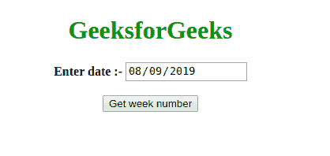
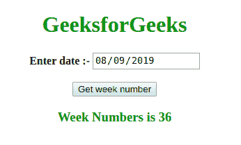

# 如何获取一年中的当前周数？

> 原文:[https://www . geeksforgeeks . org/如何获取当前周年度数/](https://www.geeksforgeeks.org/how-to-get-the-current-weeknumber-of-the-year/)

问题是找到给定日期的年周数(以 dd/mm/yy 格式)。

```html
Input: date = "02/01/2019"
Output: 1
Explanation: We can check from the calendar that 2nd January 2019 lies
 in 1st week of 2019.

Input: date = "08/09/2019"
Output: 36

```

**方法:**
我们将给一周的每一天分配一个数字。假设星期日被指定为 1，星期一被指定为 2，以此类推，我们为其他日子指定数字。根据我们的惯例，每周从周日开始，周六结束。
所以，假设今天是星期一，因此，周数也是 1。20 天后，周数显然会是第 3。

```html
20 days = 7+7+6 days
```

仔细观察，我们可以看到 p 天后的周数可以用下面提到的公式来计算。

```html
Week Number = least integer [ p/7 ]           

```

(x 的最小整数值是大于或等于 x 的最小整数，例如，8.9 的最小整数值是 9，8 的最小整数值是 8)。

我们可以用上面的概念找到给定日期的周数，如下所示:

*   找出给定年份 1 月 1 日的天数。就叫它 x 吧。
*   现在，找出给定年份中给定日期之前的天数。就叫它 y 吧。
*   我们可以用下面的公式计算周数

```html
Week Number = least integer [ (x+y)/7 ]
```

**示例:**下面是上述方法的实现。

```html
<!DOCTYPE html>
<html>

<head>
    <title>Calculate Week Number</title>
    <script>
        Date.prototype.getWeekNumber = function() {

            var oneJan = 
                new Date(this.getFullYear(), 0, 1);

            // calculating number of days 
            //in given year before given date

            var numberOfDays = 
                Math.floor((this - oneJan) / (24 * 60 * 60 * 1000));

            // adding 1 since this.getDay()
            //returns value starting from 0

            return Math.ceil((this.getDay() + 1 + numberOfDays) / 7);

        }

        function printWeekNumber() {
            var dateInput = 
                document.getElementById("dateInput").value;
            var date = new Date(dateInput);
            var result = date.getWeekNumber();
            document.getElementById("result").innerHTML = 
              "Week Numbers is " + result;
        }
    </script>
</head>

<body>

    <h1 style="color: green" align="center"> 
            GeeksforGeeks 
        </h1>

    <p align="center"> <b> Enter date :- </b>
        <input type="date" id="dateInput">
        <br>
        <br>

        <button onclick="printWeekNumber()">
          Get week number
      </button>
    </p>

    <h3 style="color:green" id="result" align="center"></h3>

</body>

</html>
```

**输出:**

*   **Before clicking the button:**

    

*   **After clicking the button:**

    