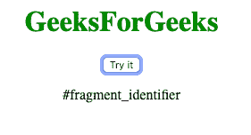
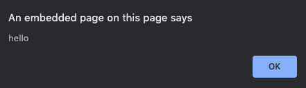

# 如何从一个 URL 获取片段标识符？

> 原文:[https://www . geesforgeks . org/如何从 url 获取片段标识符/](https://www.geeksforgeeks.org/how-to-get-the-fragment-identifier-from-a-url/)

片段标识符是指次于主资源的资源的字符串。

*   **Approach 1:** We are able to print the fragment identifier by defining a new variable as location.hash and then displaying it with the help of document.getElementbyId() method.

    **语法:**

    ```html
    var x =  location.hash;
    document.getElementById("demo").innerHTML = x;
    ```

    **示例:**在本例中，我们将使用 **location.hash** 属性。

    ```html
    <!DOCTYPE html>
    <html>

    <head>
        <title>
            How to get the fragment
            identifier from a URL?
        </title>
    </head>

    <body style = "text-align:center;"> 

        <h1 style = "color:green;" > 
            GeeksForGeeks
        </h1> 

        <button onclick="GFG()">
            Try it
        </button>

        <p id="demo"></p>

        <script>
            function GFG() {
                location.hash = "#fragment_identifier";
                var x = location.hash;

                document.getElementById(
                        "demo").innerHTML = x;
            }
        </script>
    </body>

    </html>
    ```

    **输出:**

    *   **点击按钮前:**
        
    *   **点击按钮后:**
        
*   **Approach 2:** We have defined a variable hash which stores whatever is after the # in the URL i.e. the fragment identifier and then we display it as an alert. It is done by storing the substring in the variable.

    **语法:**

    ```html
    var hash = url.substring(url.indexOf('#') + 1);
    alert(hash);
    ```

    **示例 2:** 本示例使用 substring()方法显示片段标识符。

    ```html
    <!DOCTYPE html>
    <html>

    <head>
        <title>
            How to get the fragment
            identifier from a URL?
        </title>
    </head>

    <body style = "text-align:center;"> 

        <h1 style = "color:green;" > 
            GeeksForGeeks 
        </h1> 

        <p id="demo"></p>

        <script>
            var url = 
                "www.geeksforgeeks.com/article.php#hello";

            var hash = url.substring(url.indexOf('#') + 1);

            alert(hash);
        </script>
    </body>

    </html>
    ```

    **输出:**
    