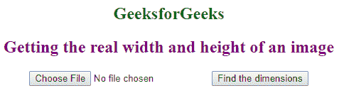
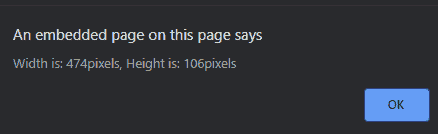
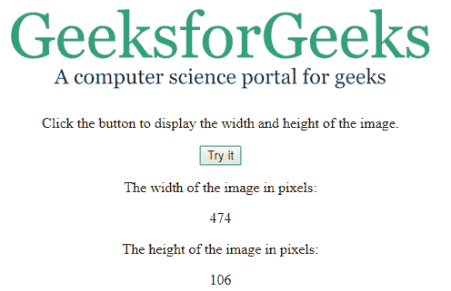

# 如何得到一个图像的宽度和高度？

> 原文:[https://www . geesforgeks . org/如何获得图像的宽度和高度/](https://www.geeksforgeeks.org/how-to-get-the-width-and-height-of-an-image/)

给定一个图像，任务是使用 JavaScript 获取图像的宽度和高度。宽度和高度属性用于显示图像的宽度和高度。

**宽度语法:**

```
var width = this.width;
```

**高度语法:**

```
var height = this.height;
```

**示例 1:** 本示例选择图像，然后使用 this.width 和 this.height 方法获取图像的宽度和高度。

```
<!DOCTYPE html>
<html>

<head>
    <title>
        Get the real width and height of
        an image using JavaScript
    </title>
</head>

<body style="text-align:center;">

        <h2 style="color:green;">
            GeeksforGeeks
        </h2>

        <h2 style="color:purple;">
            Getting the real width and height of an image
        </h2>

        <script>
            function CheckImageSize() {
                var image = document.getElementById("Image").files[0];
                createReader(image, function(w, h) {

                    alert("Width is: " + w + 
                    "pixels, Height is: " + h + "pixels");
                });
            }

            function createReader(file, whenReady) {
                var reader = new FileReader;
                reader.onload = function(evt) {
                    var image = new Image();
                    image.onload = function(evt) {
                        var width = this.width;
                        var height = this.height;
                        if (whenReady) whenReady(width, height);
                    };
                    image.src = evt.target.result;
                };
                reader.readAsDataURL(file);
            }
        </script>

        <input type="file" id="Image" />
        <input type="button" value="Find the dimensions"
                            onclick="CheckImageSize()"/>
</body>

<html>
```

**输出:**

*   **点击按钮前:**
    
*   **点击按钮后:**
    

**示例 2:** 本示例显示图像的尺寸。它将显示结果，而不使用报警功能。这里我们将在同一个窗口中显示结果。

```
<!DOCTYPE html>
<html>

<head>
    <title>
        Get the real width and height of
        an image using JavaScript
    </title>
</head>

<body style="text-align:center;">

    

    <p>
        Click the button to display the width
        and height of the image
    </p>

    <button onclick="myFunction()">Try it</button>

    <p>The width of the image in pixels:</p>

    <p id="geeks"></p>

    <p>The height of the image in pixels:</p>

    <p id="gfg"></p>

    <script>
        function myFunction() {
            var x = document.getElementById("myImg").width;
            var y = document.getElementById("myImg").height;
            document.getElementById("geeks").innerHTML = x;
            document.getElementById("gfg").innerHTML = y;
        }
    </script>
</body>

</html>                    
```

**输出:**

*   **点击按钮前。**
    
*   **点击按钮后:**
    