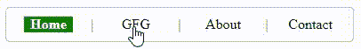

# 如何根据当前页面/url 选择 class =“selected”？

> 原文:[https://www . geesforgeks . org/如何根据当前页面 url 选择类别/](https://www.geeksforgeeks.org/how-to-have-the-classselected-depending-on-what-the-current-page-url-is/)

根据页面/网址选择类别=。这个概念非常重要，尤其是在为网站设计导航栏时，这样网站上的访问者就知道他们在网站的哪个页面上

**方法:**根据当前页面/网址选择 class =“selected”:

*   写你的 [HTML](https://www.geeksforgeeks.org/html-tutorials/) 代码。
*   为所选班级编写 [CSS](https://www.geeksforgeeks.org/css-tutorials/) 。
*   在 [javascript](https://www.geeksforgeeks.org/javascript-tutorial/) 中，使用 location.href 找到你页面的当前位置。
*   现在把所有的 a 标签保存在一个变量中，让我们用 document.querySelector 函数说“Items”。
*   迭代项目，并将其位置与当前页面网址进行比较。
*   如果“项目”位置与页面的当前位置匹配，则将当前的标签类添加到选定的类中。

**语法:**

```
const currentLocation = location.href
```

**示例:**这个代码应该粘贴在所有 4 个文件中。

## 超文本标记语言

```
<html>
  <head>
    <style>
      a {
        color: #000;
        text-decoration: none;
      }

      .nav {
        padding: 10px;
        border: solid 1px #c0c0c0;
        border-radius: 5px;
        float: left;
      }
      .nav li {
        list-style-type: none;
        float: left;
        margin: 0 10px;
      }
      .nav li a {
        text-align: center;
        width: 55px;
        float: left;
      }
      .nav li a.selected {
        background-color: green;
        color: #fff;
        font-weight: bold;
      }
    </style>
  </head>

  <body>
    <ul class="nav">
      <li><a href="home.html">Home</a></li>
      <li>|</li>
      <li><a href="gfg.html">GFG</a></li>
      <li>|</li>
      <li><a href="about.html">About</a></li>
      <li>|</li>
      <li><a href="contact.html">Contact</a></li>
    </ul>
  </body>
  <script type="text/javascript">
    const currentLocation = location.href;
    const Items = document.querySelectorAll("a");
    const Length = Items.length;

    for (let i = 0; i < Items.length; i++) {
      if (Items[i].href === currentLocation) {
        Items[i].className = "selected";
      }
    }
  </script>
</html>
```

**输出:**

