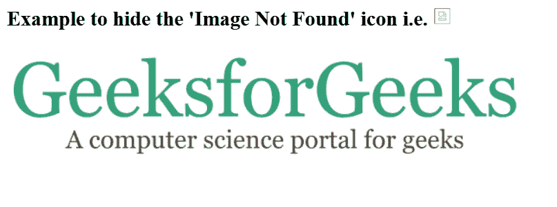
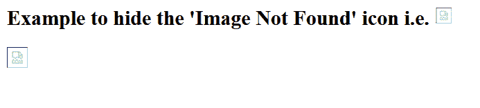
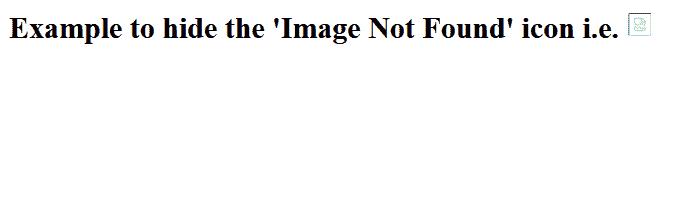

# 找不到源图像如何隐藏“找不到图像”图标？

> 原文:[https://www . geeksforgeeks . org/如何隐藏未找到的图像-源图像未找到时的图标/](https://www.geeksforgeeks.org/how-to-hide-image-not-found-icon-when-source-image-is-not-found/)

**JavaScript** 和 **jQuery** 可以在找不到图像时隐藏**“图像未找到”**图标。基本思想是当出现错误时，将图像对象的显示属性设置为**‘隐藏’**。让我们考虑下面的 HTML 代码，它显示了 GeeksforGeeks 徽标，用于演示目的。
**示例:**在本例中，我们不会隐藏未找到图像的图标。

## 超文本标记语言

```htmlhtml
<!DOCTYPE html>
<html>
    <head>
    </head>
    <body>
        <h2>
            Example to hide the 'Image Not Found' icon i.e.
            
        </h2>
        
    </body>
</html>
```

**输出:**

*   当图像可用时:



*   找不到图像时:



**隐藏图像错误图标的方法:**

*   **使用 onerror()事件:**当相应的项引发错误时，会自动调用 onerror 事件。当找不到图像时，onerror 事件会调用 hideImg()函数，将图像的可见性设置为隐藏。
    T3】程序:T5】

## 超文本标记语言

```htmlhtml
<!DOCTYPE html>
<html>
    <head>
    </head>
    <body>
        <h2>
            Example to hide the 'Image Not Found' icon i.e.
            
        </h2>
        
        <script>
      function hideImg() {
        document.getElementById("HideImg")
                          .style.display = "none";
       }
        </script>
    </body>
</html>
```

*   **使用简写符号:**您可以将这种简写符号应用于 HTML 事件。这将参考对象的可见性设置为隐藏。
    T3】程序:T5】

## 超文本标记语言

```htmlhtml
<html>
    <head>
    </head>
    <body>
        <h2>
            Example to hide the 'Image Not Found' icon i.e.
            
        </h2>
        
    </body>
</html>   
```

*   **使用 jQuery:** 使用 **JQuery** 错误处理函数 **error()** ，我们可以通过 **hide()** 函数捕捉错误并隐藏对象。
    **注意:**错误()功能已从 jquery 版本中移除。后来。
    **程序:**

## 超文本标记语言

```htmlhtml
<!DOCTYPE html>
<html>
    <head>
        <script src=
"https://ajax.googleapis.com/ajax/libs/jquery/1.8/jquery.min.js">
       </script>
    </head>
    <body>
        <h2>
            Example to hide the 'Image Not Found' icon i.e.
            
        </h2>
        
    </body>
</html>
<script>
    $(document).ready(function () {
        $("#HideImg").error(function () {
            $(this).hide();
        });
    });
</script>
```

**输出:**以上所有代码给出相同的输出。

