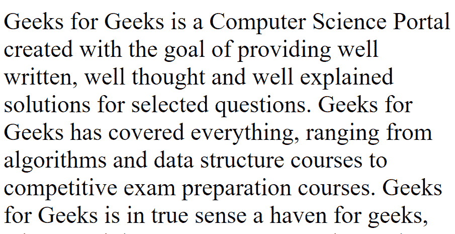

# 如何隐藏滚动条不活动？

> 原文:[https://www . geeksforgeeks . org/如何隐藏滚动条以获取不活动状态/](https://www.geeksforgeeks.org/how-to-hide-scroll-bar-for-inactivity/)

当页面不活动时，有许多方法可以隐藏滚动条。其中一种方法是使用 onscroll、onmousewheel、onclick 和 onmousemove 事件，这些事件帮助我们使用基本的 HTML 和 JavaScript 来实现我们的目标。

**进场:**

*   onscroll 事件用于禁用滚动条。
*   页面一滚动，onscroll 事件就开始工作。所以，setTimeout()方法用来提供一个延迟来隐藏滚动条，这样我们就能够先向下滚动。
*   时间可以根据我们的要求调整。
*   onmousemove 事件用于在鼠标指针移动后立即启用滚动。onclick 事件用于在用户单击时启用滚动。onmousewheel 事件用于在页面向下滚动时立即启用滚动。因此，这些事件帮助我们在页面再次激活时启用滚动。

**例 1:** 鼠标一移动，鼠标一滚动，或者用户一点击，就会调用 enableScrolling()函数，允许我们向下滚动。当用户试图向下滚动时，调用 disableScrolling()函数，使滚动条在 1000 毫秒后消失。这个时间可以变化。要再次启用滚动条，请移动鼠标指针，或单击或滚动鼠标指针以调用 enableScrolling()函数。文本的样式是使用“style”标签完成的。HTML 和 JavaScript 代码如下:

```html
<!DOCTYPE html>
<html>

<head>
    <meta charset="UTF-8">
    <title>
        How to hide scroll bar
        for inactivity?
    </title>

    <style>
        p {
            font-size: 2rem;
        }
    </style>
</head>

<body onscroll="disableScrolling()" 
        onmousewheel="enableScrolling()" 
         onclick="enableScrolling()"
          onmousemove="enableScrolling()">

    <p>
        Geeks for Geeks is a Computer Science
        Portal created with the goal of
        providing well written, well thought
        and well-explained solutions for
        selected questions. Geeks for Geeks 
        has covered everything, ranging from
        algorithms and data structure courses
        to competitive exam preparation courses. 
        Geeks for Geeks is in true sense a
        a haven for geeks, where Tech lovers can
        come together and share their knowledge.
    </p>

    <script>

        // JavaScript code
        function disableScrolling() {
            setTimeout(function() {
                document.body.style.overflow = 'hidden';
            }, 1000);
        }

        function enableScrolling() {
            document.body.style.overflow = '';
        }
    </script>
</body>

</html>
```

**输出:**


**示例 2:** 本示例隐藏图像上的滚动条。

```html
<!DOCTYPE html>
<html>

<head>
    <meta charset="UTF-8">
    <title>
        How to hide scroll bar
        for inactivity?
    </title>

    <style>
        img {
            display: block;
            margin-left: auto;
            margin-right: auto;
            width: 150%;
        }
    </style>
</head>

<body onscroll="disableScrolling()" 
        onmousewheel="enableScrolling()" 
         onclick="enableScrolling()"
          onmousemove="enableScrolling()">

    

    <script>

        // JavaScript code
        function disableScrolling() {
            setTimeout(function() {
                document.body.style.overflow = 'hidden';
            }, 1000);
        }

        function enableScrolling() {
            document.body.style.overflow = '';
        }
    </script>
</body>

</html>
```

**输出:**


隐藏滚动条不活动的主要缺点是，滚动条一隐藏，正文的内容就会“跳”起来，填满滚动条占据的空间。因此，它对用户来说似乎不是很有吸引力。