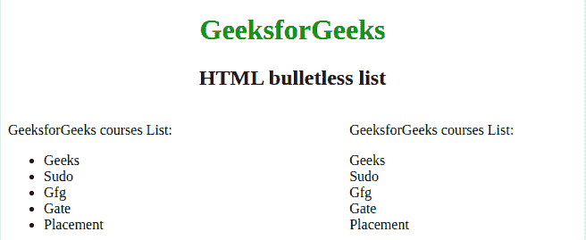

# 如何隐藏侧边栏列表中的项目符号？

> 原文:[https://www . geesforgeks . org/如何隐藏边栏列表中的项目符号/](https://www.geeksforgeeks.org/how-to-hide-the-bullets-on-list-for-the-sidebar/)

通常，当我们创建一个列表([有序的](https://www.geeksforgeeks.org/html-ol-tag/)或[无序的](https://www.geeksforgeeks.org/html-ul-tag/)列表)时，它会以标记或项目符号的形式出现。很多时候，我们不想要子弹或任何标记，我们只想要一个没有子弹的简单列表。为此，我们可以使用纯 CSS 从列表中移除这些项目符号。

为此我们使用 **[CSS 列表样式类型属性](https://www.geeksforgeeks.org/css-list-style-type-property/)** 。如果“列表样式图像”的值为“无”，它指定列表项标记的外观(如光盘、字符或自定义计数器样式)。如果我们设置无值，它不会为列表创建标记或项目符号。我们还必须设置**边距:0** 和**填充:0** ，因为列表有默认边距和填充。

下面的例子说明了这种方法:

*   **例:**

    ```html
    <!DOCTYPE html> 
    <html> 

    <head> 
        <style>
            h1 {
                color: green;
            }
            ul#remove {
                list-style-type: none;
                padding: 0;
            }
            .left {
                width : 40%;
                float: left;
            }
            .right {
                width : 40%;
                float: right;
            }
        </style>
    </head> 

    <body> 
        <center>
            <h1>GeeksforGeeks</h1> 

            <h2>HTML bulletless list</h2> 
        </center>
        <div class="left">
            <p>GeeksforGeeks courses List:</p> 
            <ul> 
                <li>Geeks</li> 
                <li>Sudo</li> 
                <li>Gfg</li> 
                <li>Gate</li> 
                <li>Placement</li> 
            </ul> 
        </div>
        <div class="right">
        <p>GeeksforGeeks courses List:</p> 
        <ul id="remove"> 
            <li>Geeks</li> 
            <li>Sudo</li> 
            <li>Gfg</li> 
            <li>Gate</li> 
            <li>Placement</li> 
        </ul> 
    </body> 

    </html>                     
    ```

*   **输出:** 