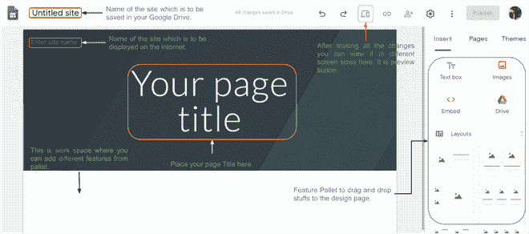
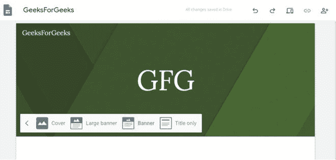
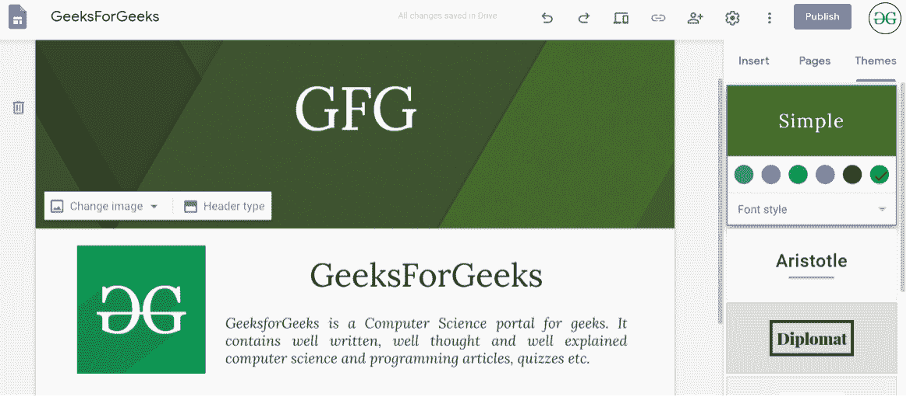
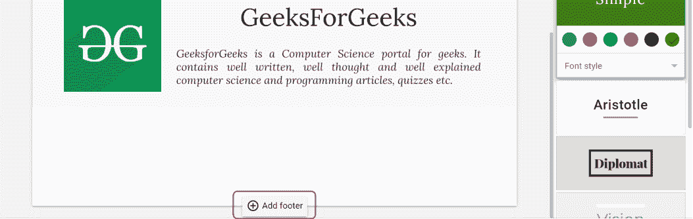
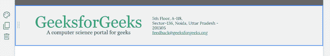
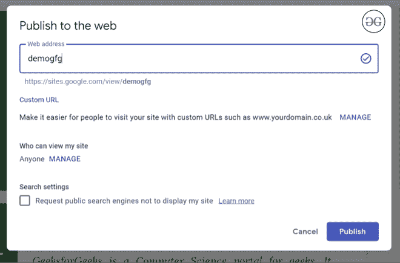

# 如何使用 Google Sites 托管一个简单的网站？

> 原文:[https://www . geesforgeks . org/how-to-host-a-simple-网站-使用-google-sites/](https://www.geeksforgeeks.org/how-to-host-a-simple-website-using-google-sites/)

首先，您必须在下面提到的网站中使用您想要的谷歌帐户登录:

**网站:[https://sites.google.com/new](https://sites.google.com/new)T3】**

登录后，您可以选择空白页并从头开始构建网站，也可以选择预先设计的模板。现在，在这篇文章中，我们将帮助您从头开始制作一个网站。

当您加载该页面时，该页面看起来类似于下面提到的页面。

然后开始添加内容。在给出标题和输入站点名称等之后。你可以预览网站。您可以在工作区添加不同的布局，或者直接从谷歌或驱动器添加图像。您的工作将一直是安全的，因为您的所有更改都保存在驱动器本身。当我们必须制作一个小规模的网站时，这个网站非常有用。它可以用来制作多页网站，因为你可以添加网页到你的网站。虽然主题有限，但您可以为您的网站选择合适的主题。

**表头:**有 4 种不同类型的表头:

*   仅标题
*   旗帜
*   大横幅
*   涉及

目前，谷歌网站只支持上述四种类型，但它可以在以后更新。除此之外，用户可以选择标题的背景图像，网站将**调整文本和图像的亮度和颜色**，使其成为**可读性最强的**。这是遗址最美丽的特征。不仅如此，如果你添加你的标志，然后网站会发现你的标志的颜色，以及它的对比，这样你就可以只需点击一下就能创建一个美丽的网站。

在此图像中，您可以看到四种不同类型的横幅。

**Layout Pallet:** You can also add images and some text by deciding the layout from the pallet window. After adding some text the site will look like:

**Footer:** Apart from the header, you can also add footer in your webpage. To enable footer just click the **Add Footer** button at the bottom of the design page.

在页脚，你可以给你的公司信息和其他重要的东西。之后，您的页脚可以如下所示:

 **页面:**同样的方式，你也可以制作不同的页面，然后为你的作品制作一个多页的网站。谷歌网站的一个特点是你可以选择你想显示的页面和不想显示的页面。此外，您还可以将另一个网站与该网站链接，因为当您去添加页面时，您会看到有两个选项**新页面**和**新链接**。此外，一旦您添加它们，它们就会按照创建顺序显示在顶部的导航菜单中，但是您可以通过在页面部分滑动页面来更改顺序。

**与他人共享:**如果这是一个群组任务，那么您可以与其他人共享，您只需要有电子邮件 id。只需点击屏幕顶部面板上的共享图标即可。

**发布:**这样就可以做一个基础网站了，然后只需要点击**发布**按钮就可以发布网站了。你必须选择网址，它将检查其在互联网上的可用性，如果该域目前没有被使用，那么它将允许你使用它。除此之外，您还可以在自己的自定义网址上发布它。

你可以看到蓝色的刻度。它描述了这个网址是可以被我使用的。

之后点击发布，你的网站就会在网上发布。