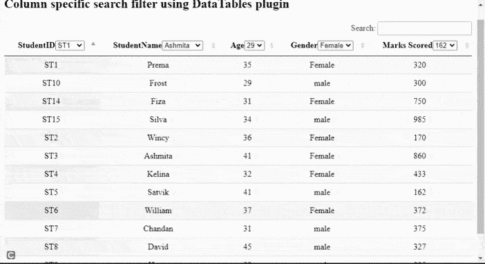

# 如何使用 DataTables 插件实现列特定的搜索过滤器？

> 原文:[https://www . geesforgeks . org/如何实现特定于列的搜索过滤器使用数据表插件/](https://www.geeksforgeeks.org/how-to-implement-column-specific-search-filter-using-datatables-plugin/)

**数据表**是一个现代的 jQuery 插件，用于为网页的 HTML 表格添加交互式和高级控件。这是一个非常简单易用的插件，可以根据应用程序的需要为开发人员的自定义更改提供各种选项。该插件的功能包括分页、排序、搜索和多列排序。

在本文中，我们将演示使用**数据表**插件实现特定于列的搜索过滤器。不是对整个表执行搜索操作，而是只对特定的列执行搜索，以提高系统的性能

**方法:**在以下示例中，**数据表**使用来自 [HTML 表](https://www.geeksforgeeks.org/html-tables/)的学生详细信息作为主要来源。表格中的每一行都显示了一名学生的详细信息。

*   数据表被初始化。
*   开发人员可以根据需要设置分页或搜索功能，如代码的脚本部分所示。
*   **列()** API 用于选择表格的所有列。
*   **flat()**API 用于将 2D 数组结构转换为一维数组，而 **each()** 方法用于对每个选定的列执行任何操作。
*   选择列表附加到每个列标题。
*   对任何列表值的更改执行任何操作。
*   **列()。search()** API 用于搜索所选值， **draw()** API 用于反映表中动作后的变化。
*   **列()。cache()** API 用于从列中获取数据，用 **sort()** 方法显示排序后的数据。
*   对每个列都执行了所有步骤。

需要实现的预编译文件有

**CSS CDN:**

```html
https://cdn.datatables.net/1.10.22/css/jquery.dataTables.min.css
```

**JavaScript CDN:**

```html
https://code.jquery.com/jquery-3.5.1.js
https://cdn.datatables.net/1.10.22/js/jquery.dataTables.min.js
```

**示例:**以下示例演示了显示特定于列的搜索筛选器操作的上述方法。

## 超文本标记语言

```html
<!DOCTYPE html>
<html>

<head>
  <meta content="initial-scale=1,
         maximum-scale=1, user-scalable=0" name="viewport" />
  <meta name="viewport" content="width=device-width" />

  <!--Datatable plugin CSS file -->
  <link rel="stylesheet" href=
"https://cdn.datatables.net/1.10.22/css/jquery.dataTables.min.css" />
  <!--jQuery library file -->
  <script type="text/javascript" src=
    "https://code.jquery.com/jquery-3.5.1.js">
  </script>

  <!--Datatable plugin JS library file -->
  <script type="text/javascript" src=
"https://cdn.datatables.net/1.10.22/js/jquery.dataTables.min.js">
  </script>

  <style>
    td {
      text-align: center;
    }
  </style>
</head>

<body>
  <h2>
    Column specific search filter
    using DataTables plugin
  </h2>

  <!--HTML tables with student data-->
  <table id="tableID" class="display"
      style="width: 100%">
    <thead>
      <tr>
        <th>StudentID</th>
        <th>StudentName</th>
        <th>Age</th>
        <th>Gender</th>
        <th>Marks Scored</th>
      </tr>
    </thead>
    <tbody>
      <tr>
        <td>ST1</td>
        <td>Prema</td>
        <td>35</td>
        <td>Female</td>
        <td>320</td>
      </tr>
      <tr>
        <td>ST2</td>
        <td>Wincy</td>
        <td>36</td>
        <td>Female</td>
        <td>170</td>
      </tr>
      <tr>
        <td>ST3</td>
        <td>Ashmita</td>

        <td>41</td>
        <td>Female</td>
        <td>860</td>
      </tr>
      <tr>
        <td>ST4</td>
        <td>Kelina</td>
        <td>32</td>
        <td>Female</td>
        <td>433</td>
      </tr>
      <tr>
        <td>ST5</td>
        <td>Satvik</td>
        <td>41</td>
        <td>male</td>
        <td>162</td>
      </tr>
      <tr>
        <td>ST6</td>
        <td>William</td>
        <td>37</td>
        <td>Female</td>
        <td>372</td>
      </tr>
      <tr>
        <td>ST7</td>
        <td>Chandan</td>
        <td>31</td>
        <td>male</td>
        <td>375</td>
      </tr>
      <tr>
        <td>ST8</td>
        <td>David</td>
        <td>45</td>
        <td>male</td>
        <td>327</td>
      </tr>
      <tr>
        <td>ST9</td>
        <td>Harry</td>
        <td>29</td>
        <td>male</td>
        <td>205</td>
      </tr>
      <tr>
        <td>ST10</td>
        <td>Frost</td>
        <td>29</td>
        <td>male</td>
        <td>300</td>
      </tr>

      <tr>
        <td>ST14</td>
        <td>Fiza</td>
        <td>31</td>
        <td>Female</td>
        <td>750</td>
      </tr>
      <tr>
        <td>ST15</td>
        <td>Silva</td>
        <td>34</td>
        <td>male</td>
        <td>985</td>
      </tr>
    </tbody>
  </table>
  <br />

  <script>

      /* Initialization of datatables */
      $(document).ready(function () {

        // Paging and other information are
        // disabled if required, set to true
        var myTable = $("#tableID").DataTable({
          paging: false,
          searching: true,
          info: false,
        });

        // 2d array is converted to 1D array
        // structure the actions are
        // implemented on EACH column
        myTable
          .columns()
          .flatten()
          .each(function (colID) {

            // Create the select list in the
            // header column header
            // On change of the list values,
            // perform search operation
            var mySelectList = $("<select />")
              .appendTo(myTable.column(colID).header())
              .on("change", function () {
                myTable.column(colID).search($(this).val());

                // update the changes using draw() method
                myTable.column(colID).draw();
              });

            // Get the search cached data for the
            // first column add to the select list
            // using append() method
            // sort the data to display to user
            // all steps are done for EACH column
            myTable
              .column(colID)
              .cache("search")
              .sort()
              .each(function (param) {
                mySelectList.append(
                  $('<option value="' + param + '">'
                    + param + "</option>")
                );
              });
          });
      });
  </script>
</body>

</html>
```

**输出:**

