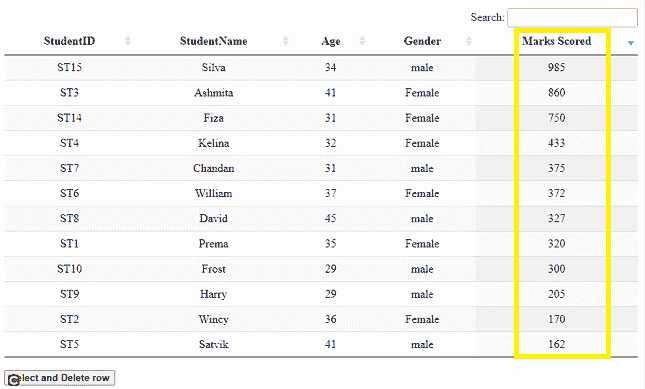
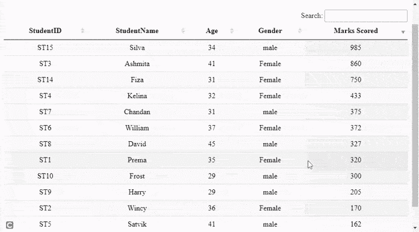

# 如何使用 DataTables 插件实现单行选择和删除？

> 原文:[https://www . geesforgeks . org/如何实现-单行-选择-使用-删除-数据表-插件/](https://www.geeksforgeeks.org/how-to-implement-single-row-select-and-delete-using-datatables-plugin/)

**数据表**是一个现代的 jQuery 插件，用于为网页的 HTML 表格添加交互式和高级控件。这是一个非常简单易用的插件，可以根据应用程序的需要为开发人员的自定义更改提供各种选项。该插件的功能包括分页、排序、搜索和多列排序。

在本文中，我们将演示在使用**数据表**插件选择行后删除单行的实现。

**方法:**在以下示例中，**数据表**使用来自 [HTML 表](https://www.geeksforgeeks.org/html-tables/) 的学生详细信息作为主要来源。表格中的每一行都显示了一名学生的详细信息。

*   数据表被初始化。
*   开发人员可以根据需要设置分页或搜索功能，如代码脚本部分所示。
*   表格按照学生成绩降序设置，只是为了显示排序用法。
*   检查用户选择的行是否有类“选中”，然后删除。
*   如果没有“选择”该类，则从表中的所有其他行中删除该类，并将该类添加到正在选择的行中。
*   单击按钮时，删除该行并将 draw()应用编程接口设置为 false。
*   draw() API 用于反映表中某个操作后的更改。

需要实现的预编译文件有

CSS:

```html
https://cdn.datatables.net/1.10.22/css/jquery.dataTables.min.css
```

**JavaScript:**

```html
https://code.jquery.com/jquery-3.5.1.js
https://cdn.datatables.net/1.10.22/js/jquery.dataTables.min.js
```

**示例:**以下示例演示了上述方法，显示单行选择，然后删除该行。

## 超文本标记语言

```html
<!DOCTYPE html>
<html>

<head>

    <meta content="initial-scale=1, maximum-scale=1,
                   user-scalable=0" name="viewport" />
    <meta name="viewport" content="width=device-width" />

    <!--Datatable plugin CSS file -->
    <link rel="stylesheet" href=
"https://cdn.datatables.net/1.10.22/css/jquery.dataTables.min.css" />

    <!--jQuery library file -->
    <script type="text/javascript" 
        src="https://code.jquery.com/jquery-3.5.1.js">
    </script>

    <!--Datatable plugin JS library file -->
    <script type="text/javascript" src=
"https://cdn.datatables.net/1.10.22/js/jquery.dataTables.min.js">
    </script>

    <style>
        td {
            text-align: center;
        }
    </style>
</head>

<body>
    <h2>Delete single row using DataTables plugin</h2>

    <!--HTML tables with student data-->
    <table id="tableID" class="display" style="width:100%">
        <thead>
            <tr>
                <th>StudentID</th>
                <th>StudentName</th>
                <th>Age</th>
                <th>Gender</th>
                <th>Marks Scored</th>
            </tr>
        </thead>

        <tbody>
            <tr>
                <td>ST1</td>
                <td>Prema</td>
                <td>35</td>
                <td>Female</td>
                <td>320</td>
            </tr>
            <tr>
                <td>ST2</td>
                <td>Wincy</td>
                <td>36</td>
                <td>Female</td>
                <td>170</td>
            </tr>
            <tr>
                <td>ST3</td>
                <td>Ashmita</td>

                <td>41</td>
                <td>Female</td>
                <td>860</td>
            </tr>
            <tr>
                <td>ST4</td>
                <td>Kelina</td>
                <td>32</td>
                <td>Female</td>
                <td>433</td>
            </tr>
            <tr>
                <td>ST5</td>
                <td>Satvik</td>
                <td>41</td>
                <td>male</td>
                <td>162</td>
            </tr>
            <tr>
                <td>ST6</td>
                <td>William</td>
                <td>37</td>
                <td>Female</td>
                <td>372</td>
            </tr>
            <tr>
                <td>ST7</td>
                <td>Chandan</td>
                <td>31</td>
                <td>male</td>
                <td>375</td>
            </tr>
            <tr>
                <td>ST8</td>
                <td>David</td>
                <td>45</td>
                <td>male</td>
                <td>327</td>
            </tr>
            <tr>
                <td>ST9</td>
                <td>Harry</td>
                <td>29</td>
                <td>male</td>
                <td>205</td>
            </tr>
            <tr>
                <td>ST10</td>
                <td>Frost</td>
                <td>29</td>
                <td>male</td>
                <td>300</td>
            </tr>

            <tr>
                <td>ST14</td>
                <td>Fiza</td>
                <td>31</td>
                <td>Female</td>
                <td>750</td>
            </tr>
            <tr>
                <td>ST15</td>
                <td>Silva</td>
                <td>34</td>
                <td>male</td>
                <td>985</td>
            </tr>

        </tbody>
    </table>
    <br />

    <button id="btnID"><b>Select and Delete row</b></button>

    <script>

            /* Initialization of datatables */
            $(document).ready(function () {

                // Paging and other information are
                // disabled if required, set to true
                var mytableVar = $('#tableID').DataTable({
                    "paging": false,
                    "info": false
                });

                // Ordering the table in descending
                // order of students marks
                mytableVar.order([[4, 'desc']]).draw(false);

                $('#tableID tbody').on('click', 'tr', function () {

                    // Check for 'selected' class and remove
                    if ($(this).hasClass('selected')) {
                        $(this).removeClass('selected');
                    }
                    else {
                        mytableVar.$('tr.selected').removeClass('selected');
                        $(this).addClass('selected');
                    }
                });

                // On button click, remove the row with setting
                // the draw() to false
                // draw() API is used to reflect the changes
                // after a action
                $('#btnID').click(function () {
                    mytableVar.row('.selected').remove().draw(false);
                });
            });
    </script>
</body>

</html>
```

**输出:**

*   **点击按钮前:**注意最后一列学生的分数是按降序排列的。



*   **点击按钮后:**以下输出显示学生姓名“William”的行被删除。

