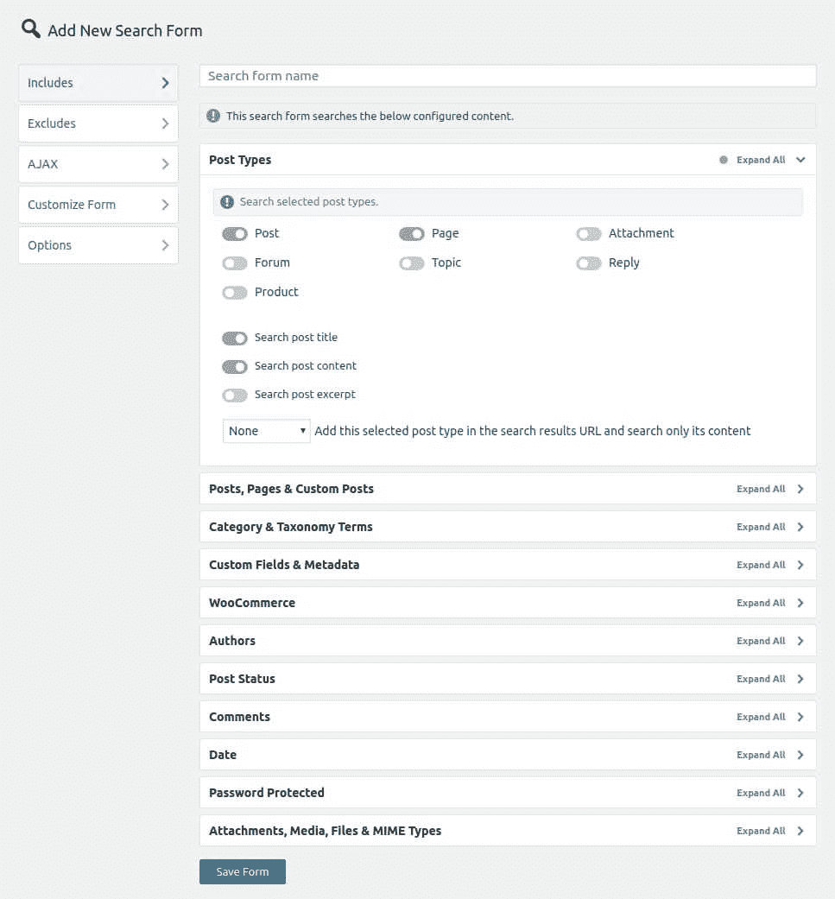
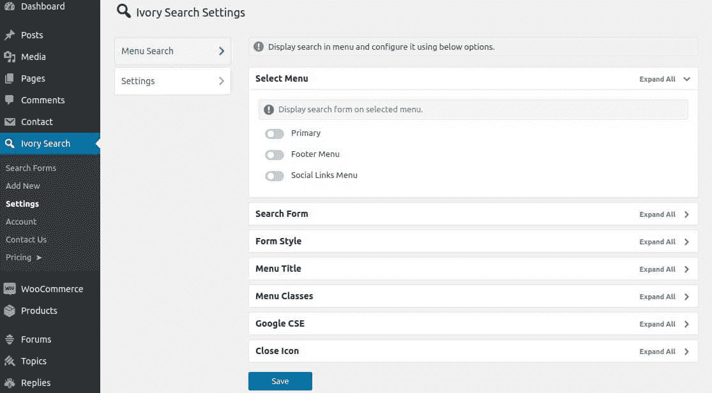
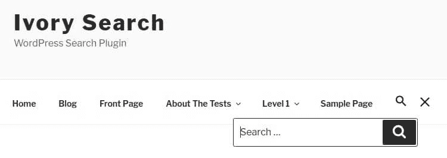
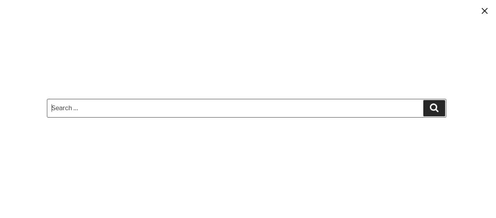

# 如何在你的 wordpress 网站中加入搜索框？

> 原文:[https://www . geesforgeks . org/如何在您的 wordpress 网站中包含搜索框/](https://www.geeksforgeeks.org/how-to-include-search-box-in-your-wordpress-website/)

如果你的主题不提供在你的 WordPress 网站中包含搜索框的功能，那么按照下面的步骤来看看你是如何做到的:

*   转到您的仪表板，点击**插件**按钮。
*   转到添加新插件部分，搜索**象牙搜索**(通过象牙搜索)。
*   点击**立即安装**，然后**激活**它们。
*   一个新的象牙搜索选项卡出现在您的仪表板左侧。

**包含**部分允许您包含您希望用户搜索的所有内容。例如，您只能允许用户在电子商务网站中搜索产品，或者您也可以允许他/她搜索某些页面或附件。
**排除**部分允许您从用户搜索中排除您想要隐藏的内容。例如，如果您已经允许用户搜索页面，但您想从搜索结果中排除某些页面，您可以在排除部分进行。
同样的，你也可以探索**自定义**、 **AJAX** 和**选项**部分来自定义你的搜索栏。

当您在象牙搜索表单中工作时，将鼠标悬停在**设置**选项上(在仪表板的左侧面板上象牙搜索下)，以设置搜索框的位置。这可以在页眉或页脚或水平菜单中，等等。**菜单搜索**部分提供的选项是特定于主题的。

在**设置**部分，您可以设置搜索框的外观。以下是象牙搜索表单中提供的样式:

