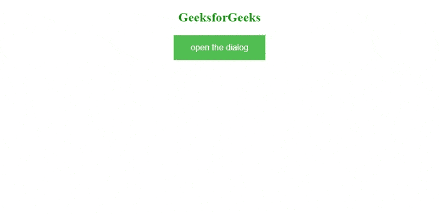

# 如何初始化没有标题栏的对话框？

> 原文:[https://www . geesforgeks . org/如何初始化不带标题栏的对话框/](https://www.geeksforgeeks.org/how-to-initialize-a-dialog-without-a-title-bar/)

任务是初始化一个没有标题栏的对话框。在本文中，我们将看到如何在没有任何标题栏的情况下初始化对话框。

对话框用于在网页上以特定的方式提供信息。它创建了一个小窗口，不受页面内容的影响。如果你想改变它的大小，颜色或任何其他东西，那么只需编辑一些代码，如果你想关闭对话框，那么你只需点击对话框右侧的“X”按钮。

对话框用于提供有关该主题的更多信息。当我们在您的 web 应用程序中使用这种小部件时，它看起来是系统的。

**进场:**

*   创建一个 HTML 页面并导入 jQuery 库。
*   下一步是使用对话框和[单击()](https://www.geeksforgeeks.org/jquery-click-with-examples/)方法，每当我们单击按钮时都会创建一个对话框。
*   在最后一步中，您只需要使用 [hide()](https://www.geeksforgeeks.org/how-to-use-hide-method-on-button-click-using-jquery/) 方法来隐藏对话框小部件的标题栏。

**示例:**

## 超文本标记语言

```
<!doctype html>
<html lang="en">
<head>
  <meta charset="utf-8"> 
  <link rel="stylesheet" href=
"//code.jquery.com/ui/1.12.1/themes/smoothness/jquery-ui.css">
  <script src=
"//code.jquery.com/jquery-1.12.4.js">
  </script>
  <script src=
"//code.jquery.com/ui/1.12.1/jquery-ui.js">
  </script>
  <style>
     button 
     {
       background-color: #4CAF50; /* Green */
       border: none;
       color: white;
       padding: 15px 32px;
       text-align: center;
       text-decoration: none;
       display: inline-block;
       font-size: 16px;
    }
    body{
        text-align:center;    
    }
   </style>
</head>
<body>
    <h2 style="color:green">GeeksforGeeks</h2>

    <button id="opener">open the dialog</button>
    <div id="dialog" title="Dialog Title">
       I'm a dialog
    </div>

     <script>
          $( "#dialog" ).dialog({ autoOpen: false });
          $( "#opener" ).click(function() {
             $( "#dialog" ).dialog( "open" );
             $(".ui-dialog-titlebar").hide();
          });
    </script> 
</body>
</html>
```

**输出:**

