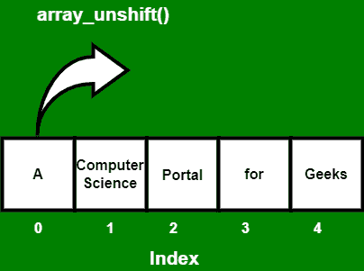

# 如何在数组中插入新元素？

> 原文:[https://www . geesforgeks . org/如何在数组中插入新元素/](https://www.geeksforgeeks.org/how-to-insert-a-new-element-in-an-array/)

在 PHP 中，数组是一种数据结构，它允许我们在单个变量下存储类似类型的数据。数组有助于创建相似类型的元素列表，可以使用它们的索引或键来访问这些元素。

我们可以使用以下两个函数在数组中插入元素或项:

*   array_unshift()函数
*   数组 _push()函数

**使用** [**array_unshift()函数**](https://www.geeksforgeeks.org/php-array_unshift-function/)**–**该函数用于在数组的开头添加一个或多个元素。这些元素被插入到数组的开头。由于数组中插入了元素或项，数组的长度也会随着数组中插入或添加的元素数量而增加。插入元素后，我们可以使用 [print_r()功能](https://www.geeksforgeeks.org/php-print_r-function/)打印数组信息。

**下面是如何操作的例子:** *让我们看看如何使用 array_unshift()函数在数组的开头插入一个元素。*

```html
Input:  names[] = array("portal", "for", "geeks"), size = 3, capacity = 3
Output: names[] = array("_", "_", "portal", "for", "geeks"), size = 5, capacity = 5
```

**示例 1:** 在本例中，我们使用 array_unshift()函数使用索引数组在数组的开头插入元素。



## 服务器端编程语言（Professional Hypertext Preprocessor 的缩写）

```html
<?php
$names = array("portal", "for", "geeks");
array_unshift($names, "A", "Computer science");
print_r($names);
?>
```