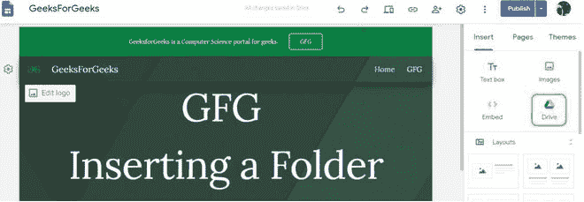
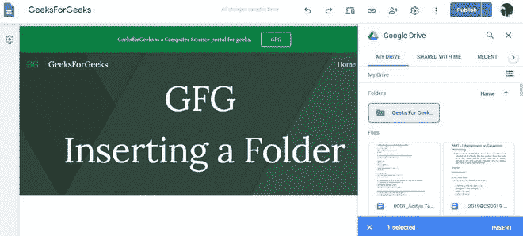
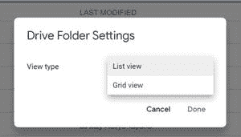
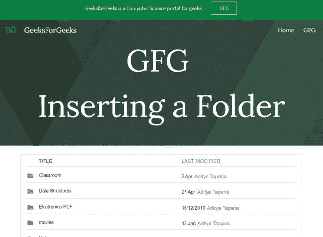

# 如何在新谷歌网站中插入整个文件夹？

> 原文:[https://www . geeksforgeeks . org/如何在新的谷歌网站中插入整个文件夹/](https://www.geeksforgeeks.org/how-to-insert-a-whole-folder-in-new-google-sites/)

有时，如果你正在制作一个网站来与你的同事协调，那么你将有时间与他们共享某个文件夹。这可以通过谷歌网站来实现。为此，请遵循本文:

*   从“插入”面板中选择“驱动”选项。

*   选择需要的文件夹，然后点击**插入**将文件夹插入页面。

*   插入完成后，您可能会看到显示文件夹内容的窗口。您可能需要调整插入窗口的部分大小。

**属性:**只有一个属性，即**视图类型**。只有两个视图选项，它们是:

1.  列表视图
2.  gridview

完成所有这些后，网站将看起来像:

