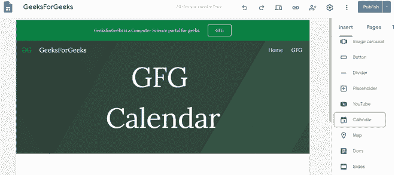
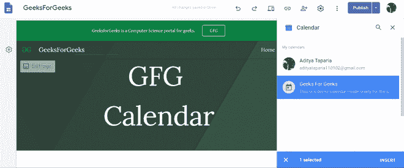
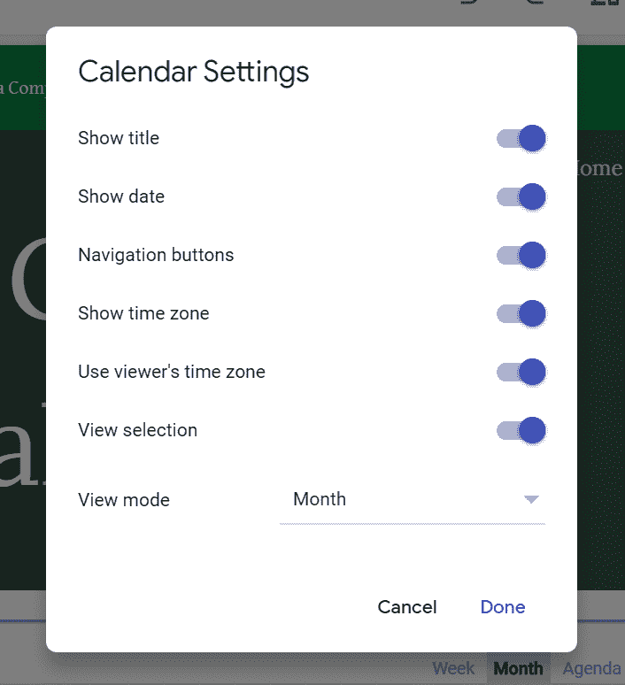
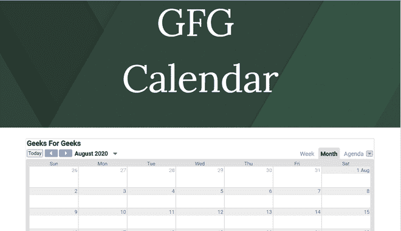

# 如何在谷歌新网站中插入日历？

> 原文:[https://www . geesforgeks . org/如何在新谷歌网站中插入日历/](https://www.geeksforgeeks.org/how-to-insert-calendars-in-new-google-sites/)

要在网站中添加日历，请按照以下步骤操作:

*   打开右侧的“插入”面板，选择“日历”选项以插入日历。

*   选择要插入的日历，然后使用右侧面板底部的“插入”按钮。一旦插入，适当地移动和调整大小，并根据您的需要放置它。

*   使用设置编辑日历显示。

设置所需设置后，您可以在页面上看到日历。

#### 限制:

*   日历不会随着父日历的更改而更新，因此每次您必须重新插入日历时。
*   无法为插入的多个日历选择不同的颜色或标题。