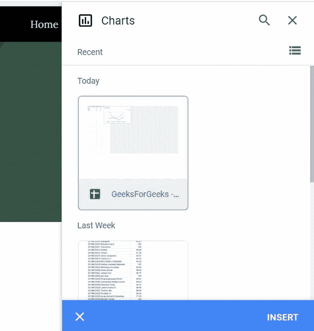
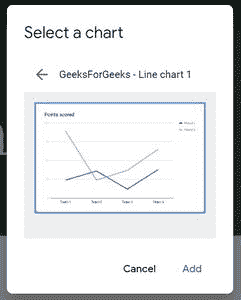
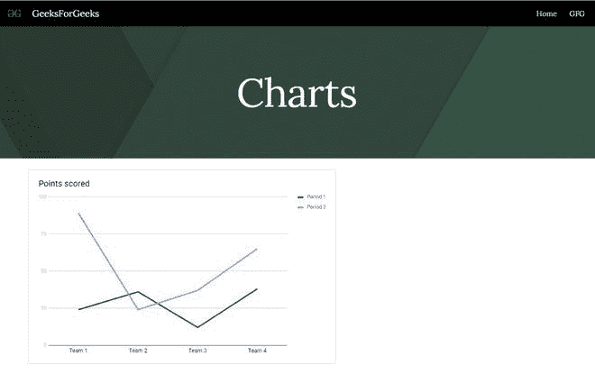

# 如何在谷歌新网站中插入图表？

> 原文:[https://www . geesforgeks . org/如何在新谷歌网站中插入图表/](https://www.geeksforgeeks.org/how-to-insert-charts-in-new-google-sites/)

有时，你想在你的网站上添加你已经创建的图表，以使你的网站更具互动性，这可以在谷歌网站的帮助下完成。谷歌网站允许创建者在网站中嵌入在谷歌表单上制作的图表。要将图表嵌入网站，请执行以下步骤:

*   转到网站页面右侧插入面板中的图表选项。

*   现在选择包含图表的工作表来嵌入它。

*   选择表单后，谷歌网站会找到其中的图表，并显示搜索结果，这样您就可以选择要嵌入到网站中的图表。

之后，您的图表将被插入页面，看起来像:

> **注:**
> 
> *   图表会有反应，所以在小屏幕上你可以点击图表以全屏方式打开它。
> *   图表将在工作表更新时自动更新。