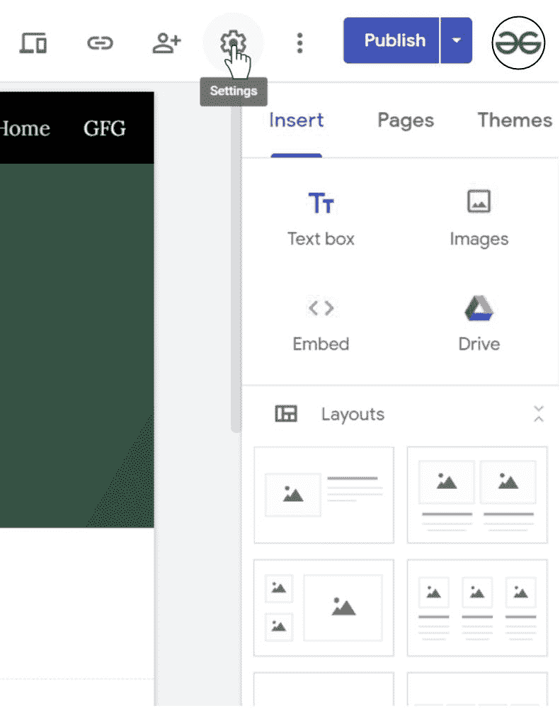
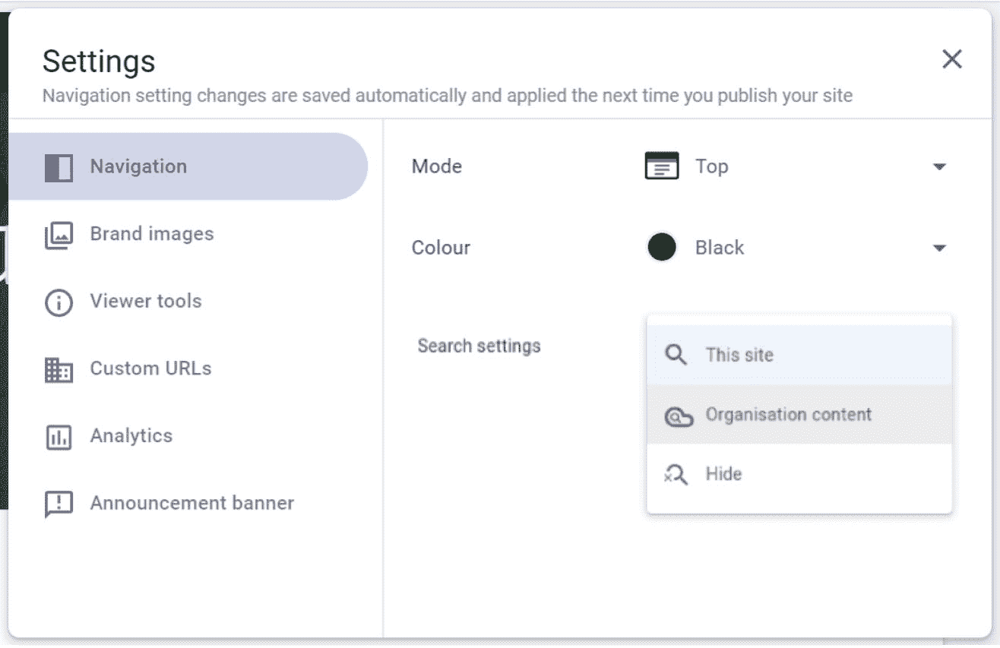

# 如何在新的谷歌网站中插入云搜索选项和小工具？

> 原文:[https://www . geesforgeks . org/如何插入-云-搜索-选项-新的小工具-谷歌-网站/](https://www.geeksforgeeks.org/how-to-insert-cloud-search-option-and-gadget-in-new-google-sites/)

每个网站都需要一个搜索栏，用户可以通过它在该页面上搜索他们关注的内容。一个好的网站需要一个搜索栏。从头开始创建自己的搜索引擎可能是一项困难的任务，但在谷歌的帮助下，这项任务可以跳过。谷歌网站有一个嵌入云搜索选项的选项。本文添加云搜索选项。

*   转到设置。

*   然后转到导航选项。

*   在“搜索设置”选项中，选择您想要的网站类型。你有三个选项:这个网站，组织内容，隐藏。

最终的网站将有如下所示的搜索栏

**注:**

此功能仅适用于西装革履和企业用户。