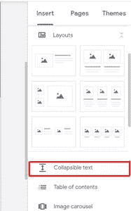
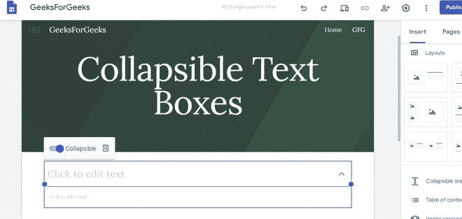
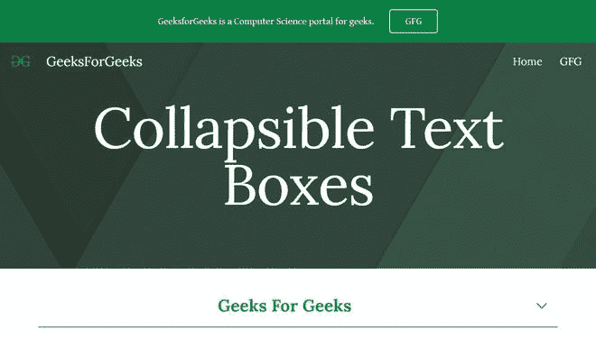

# 如何在谷歌新网站中插入可折叠文本框？

> 原文:[https://www . geeksforgeeks . org/如何插入可折叠文本框-在新的谷歌网站中/](https://www.geeksforgeeks.org/how-to-insert-collapsible-text-boxes-in-new-google-sites/)

要在您的 google 站点页面中插入可折叠文本框，请执行以下步骤:

*   转到“插入”面板，单击“可折叠文本标签”以添加可折叠文本部分。

*   如图所示，可折叠文本框将出现一个标题框和一个普通文本框。

*   现在，在上方的标题文本框中添加您希望在页面上始终可见的文本，并在下方的框中添加其描述。您可以设置该文本的格式，设置多行、格式和垂直分组文本框。

通过这种方式，人们可以在谷歌网站上添加可折叠的文本框。