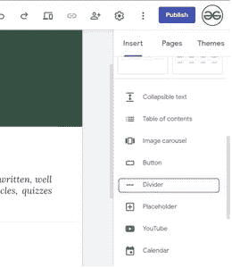
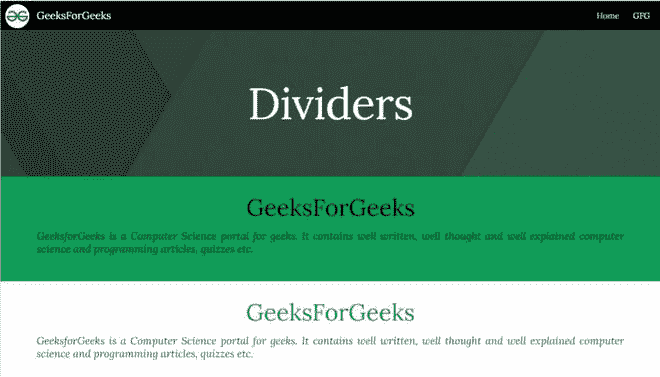

# 如何在新的谷歌网站中插入分隔线？

> 原文:[https://www . geesforgeks . org/如何在新谷歌网站中插入分隔符/](https://www.geeksforgeeks.org/how-to-insert-dividers-in-new-google-sites/)

有时候我们的网站上有很多内容，我们想把它们分开，更系统地展示出来。分割器有助于在视觉上将屏幕内容分成组。谷歌网站支持分隔线的功能，可以帮助你分离内容，更充分地展示它们。要在您的网站伙伴中添加分隔线，请执行以下步骤:

*   转到设计平面右侧的“插入”面板，并搜索“分隔线”选项。

*   点击按钮在页面中插入分隔线。点击后你会注意到页面上出现一行。该网站将看起来像下面显示的。

> **注:**
> 
> 您不能更改分隔线的背景颜色。但是，它将采用它上面的当前分割的背景颜色，如果它是标题，那么它将默认采用标准背景。