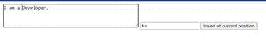
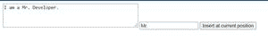

# 如何在当前光标位置的文本区域插入文本？

> 原文:[https://www . geesforgeks . org/如何在当前光标位置的文本区域插入文本/](https://www.geeksforgeeks.org/how-to-insert-text-into-the-textarea-at-the-current-cursor-position/)

要在当前光标位置将文本插入 textarea/inputbox，我们需要获取光标的当前位置。这是获取光标当前位置的方法。

*   首先，借助 textarea/inputbox 上名为 selectionStart 的属性获取光标的当前位置。
*   为了在给定的位置插入文本，我们将使用 slice 函数将字符串分成两部分，然后将这两部分都附加到文本的前面和后面(text_to_insert)。

**语法:**

```html
// will give the current position of the cursor
document.getElementById("id").selectionStart; 

// will get the value of the text area
let x= $('#text1').val();

// will get the value of the input box
let text_to_insert=$('#insert').val();

// setting the updated value in the text area
$('#text1').val(x.slice(0,curPos)+text_to_insert+x.slice(curPos));
```

**例:**

## java 描述语言

```html
<!DOCTYPE html>
<html lang="en">
    <head>
        <meta charset="UTF-8" />
        <meta name="viewport"
              content="width=device-width,
                       initial-scale=1.0" />
        <script src=
"https://code.jquery.com/jquery-3.5.1.min.js"
                integrity=
"sha256-9/aliU8dGd2tb6OSsuzixeV4y/faTqgFtohetphbbj0="
                crossorigin="anonymous">
      </script>
        <title>Document</title>
    </head>
    <body>
        <textarea rows="4"
                  id="text1"
                  cols="50">
      </textarea>
        <input type="text"
               id="insert" />
        <button onclick="setTextToCurrentPos()">
          Insert at current position
      </button>
        <script>
            function setTextToCurrentPos() {
                var curPos =
                    document.getElementById("text1").selectionStart;
                console.log(curPos);
                let x = $("#text1").val();
                let text_to_insert = $("#insert").val();
                $("#text1").val(
x.slice(0, curPos) + text_to_insert + x.slice(curPos));
            }
        </script>
    </body>
</html>
```

**输出:**



产出:1



点击在当前位置插入按钮后

**解释:**

这里，有一个名为**setextto current pos 的书面方法。**点击**在当前位置**插入，调用该方法。

```html
//document.getElementById('text1').selectionStart;
```

这一行给出了光标的当前位置/开始位置。

示例:**我是开发者**

如果我们的光标正好放在开发人员的前面。那么它将返回 7。因此，如使用 slice 方法的代码所示，我们可以在当前光标位置插入文本。

> 让 x= $('#text1 ')。val()；//将获取文本区域的值
> 
> 让 text_to_insert=$('#insert ')。val()；//将获取输入框的值
> 
> $('#text1 ')。val(x.slice(0，CurPoS)+text _ to _ insert+x . slice(CurPoS))；//在文本区域设置更新值