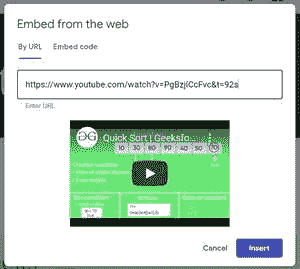
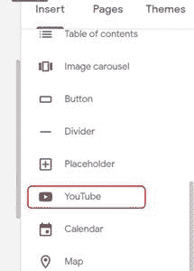
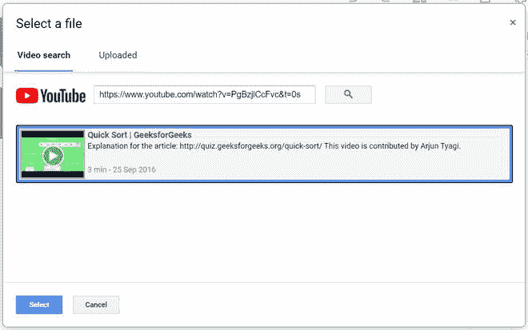
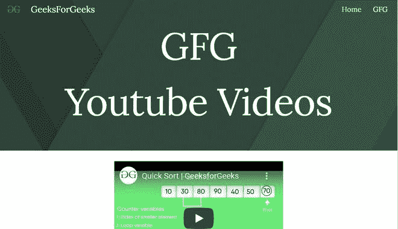

# 如何在谷歌新站插入 YouTube 视频？

> 原文:[https://www . geesforgeks . org/如何插入-YouTube-新视频-google-sites/](https://www.geeksforgeeks.org/how-to-insert-youtube-video-in-new-google-sites/)

有两种方法可以将 YouTube 视频嵌入到你的谷歌网站中。

*   使用嵌入选项
*   使用 YouTube 选项

在这两种情况下，您都需要视频网址才能将其嵌入网站。要获取网址，您必须复制显示在 Omnibox 或地址栏中的文本。

突出显示的文本是网址

**方法 1:**

*   复制网址后，点击插入面板中的**嵌入**选项。
*   将出现一个对话框，要求输入网址。

*   粘贴网址后，它将搜索视频，如果它存在，那么它将显示视频。您也可以添加播放列表或频道的网址，结果会相应地改变。

*   然后点击插入添加视频。

**方法二:**

*   从插入菜单中选择 YouTube 选项。

*   之后，将会打开一个窗口，您必须借助之前复制的网址搜索要嵌入的视频。

*   之后点击**选择**添加视频。

在这两种方法之后，输出屏幕将如下所示:

**属性:**如果一个人去设置，他/她会发现三个属性，即:

*   **隐藏控件:**这些属性允许您设置进度条的视图。您可以将它设置为淡出或滑出或保持原样。
*   **进度条颜色:**可以从白色和红色中选择其颜色。
*   **允许全屏:**可以根据自己的意愿设置启用或设置禁用。