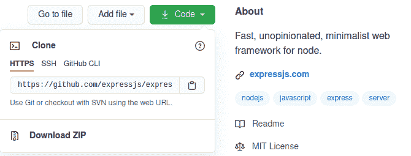
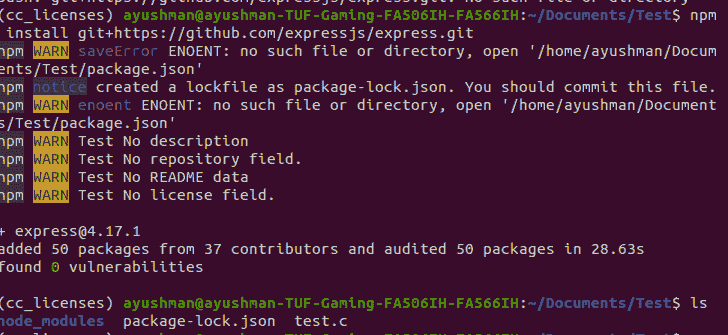

# 如何直接从 GitHub 安装 npm 包？

> 原文:[https://www . geesforgeks . org/如何直接从 github 安装 npm 包/](https://www.geeksforgeeks.org/how-to-install-an-npm-package-directly-from-github/)

[NPM(节点包管理器)](https://www.geeksforgeeks.org/node-js-npm-node-package-manager/)是 Node.js 的默认包管理器，完全用 Javascript 编写。由艾萨克·施吕特开发，最初于 2010 年 1 月 12 日发布。npm 管理 Node.js 的所有包和模块，并由命令行客户端 NPM 组成。它通过安装 Node.js 安装到系统中。Node 项目中所需的包和模块是使用 NPM 安装的。
一个包包含一个模块所需的所有文件，模块是可以根据项目的需求包含在 Node 项目中的 JavaScript 库。

要直接从 **GitHub** 安装一个 NPM 包，我们需要遵循以下步骤:

1.  转到包的 https://github.com/expressjs/express. GitHub 存储库

2.  复制克隆链接。

    

    快递. js Github

3.  转到您的终端或 git bash 并键入:

    ```
    npm install git+{copied_url} 
    ```

    **示例:**在你的终端运行下面的命令，直接从 GitHub 安装一个 npm 包。

    ```
    npm install git+https://github.com/expressjs/express.git
    ```

    