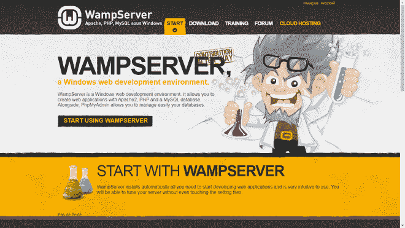
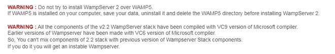
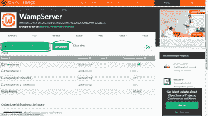
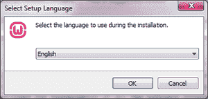
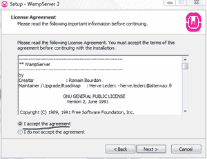
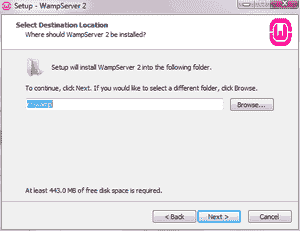
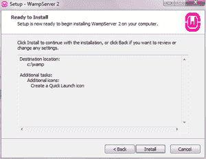
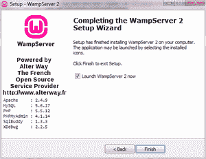

# 如何安装和设置 WAMP 服务器？

> 原文:[https://www . geesforgeks . org/如何安装和设置-a-wamp-server/](https://www.geeksforgeeks.org/how-to-install-and-set-up-a-wamp-server/)

**Windows、Apache、MySQL 和 PHP** 一般缩写为 **WAMP。**有些人可能会和 **LAMP** 混淆，但两者唯一的区别就是操作系统。在 LAMP 的情况下，L 代表 Linux。设置服务器包括安装缩写中列出的所有软件。另一个版本是 **MAMP，**是给苹果的。

**为什么要设置 WAMP 服务器？**

缩写中列出的所有内容都可以单独下载，但配置每一项都需要时间。就 WAMP 而言，实现这一目标所需的时间远远少于一揽子计划。它被用于 web 开发，以获得测试特性的安全体验。

**设置服务器的步骤:**

主网站

**1。下载:**前往 https://www.wampserver.com/en/，安装适合您系统的版本。安装后，运行安装程序。在此过程中，如果需要，您可以更改默认浏览器。您可以继续使用默认选项，也可以根据自己的喜好添加更多选项。如果您想在多台机器上使用它，将它安装在闪存驱动器上就可以了。

下载部分

运行安装程序时，您需要完成几个小步骤:

下载你需要的版本

选择您的语言

选择语言后，它会向您显示许可协议。看完之后，点击 ***我接受协议*** 并按**下一步** ***。***

协议

选择安装位置。虽然建议使用默认值，但您可以选择更合适的值。

选址

选择文件夹后，您可以选择更多选项。选项包括是否要添加桌面和快速启动图标。选择后，将要求您在安装前确认您的选择。

确认

安装过程将需要一段时间，但应该会在几分钟内完成。

安装

恭喜你！您已经成功安装了一台 **WAMP** 服务器。如果需要，可以启动应用程序或通过快速启动菜单启动它。

***注:*** 最新版本是 WAMP 服务器 3。我安装了 WAMP 服务器 2，因为我的设备与最新的不兼容。

**2。配置:**现在，我们必须配置我们安装的 WAMP 内容。一旦安装完毕，你将会收到来自防火墙的通知，询问新安装的软件是否可以使用你的网络。给它权限，然后在隐藏的任务栏图标或 windows 开始菜单中找到该选项。符号的颜色对应于服务器的状态:

*   **红色-** 可能表示 WAMP 服务器暂时停用，或者有某种阻碍使其无法工作
*   **橙色-** 可以表示闲置，或者像红色一样，有东西没有正确安装。
*   **绿色-** 服务器处于活动状态，可以使用。

活动状态

转到您选择的浏览器(安装过程中选择的浏览器)，并键入 **http://localhost。**如果正常，您已经正确完成了安装，但是如果不正常，检查**端口**会有帮助。

现在你可以走了！继续创建您的第一个 WAMP 服务器项目。(注意:您可能需要为其安装 WordPress。请确保将其放在与服务器相同的目录中。)