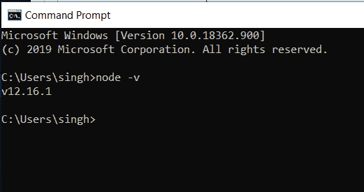

# 如何在项目中安装和使用精简服务器？

> 原文:[https://www . geesforgeks . org/如何在您的项目中安装和使用 lite-server/](https://www.geeksforgeeks.org/how-to-install-and-use-lite-server-in-your-project/)

**Lite-server** 是一个轻量级的开发服务器，服务于一个 web 应用程序，在浏览器中打开它，并在对源代码进行 HTML 或 JavaScript 更改时刷新页面。这有助于在开发过程中节省时间，因为用户不必在每次进行更改时都手动刷新页面。安装和使用 lite-server 必须遵循以下步骤:

**1。安装 Node.js:**
Node.js 管理 npm 库和依赖项，以便在加载特定页面时支持某些浏览器。它还服务于本地主机(本地机器)上的运行时环境。

*   Node.js 可以从他们的[官网](https://nodejs.org/en/download/)下载。
*   按照安装向导中的说明安装下载的安装程序。
*   After installation, the Node version can be checked using the following command.

    ```
    node -v
    ```

    

**2。创建超文本标记语言文件(可选)**

*   下面给出了服务器将显示的 HTML 文件。这个步骤是可选的，任何文件都可以作为服务器显示的起点。

    ## 超文本标记语言

```
<!DOCTYPE html>
<html lang="en">
<head>
    <meta charset="UTF-8">
    <meta name="viewport" 
          content="width=device-width,
                   initial-scale=1.0">
    <title>Document</title>
</head>
<body>
    <h1>GeeksforGeeks</h1>
    lite-server example
</body>
</html>
```