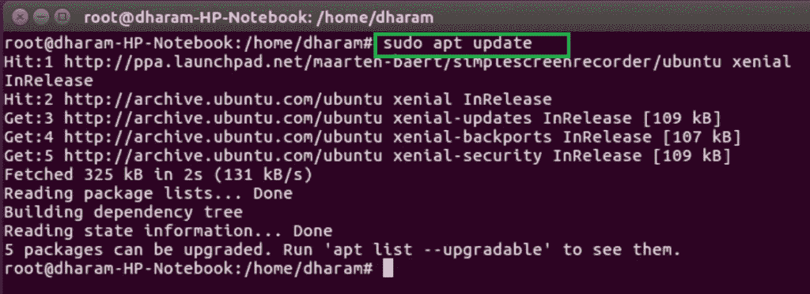
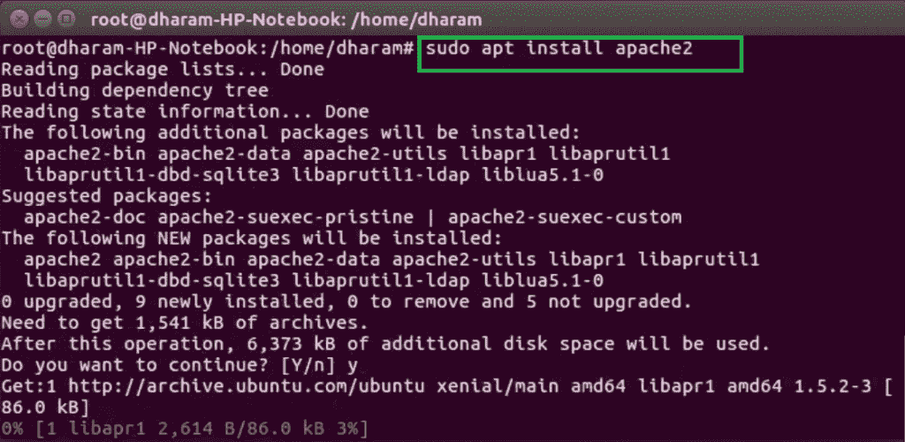
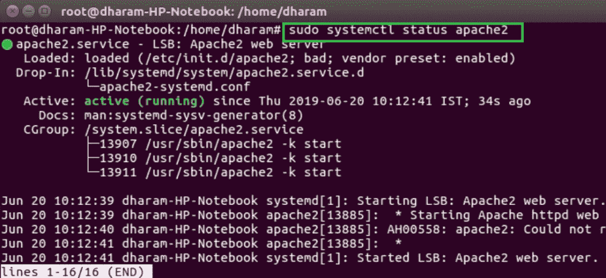
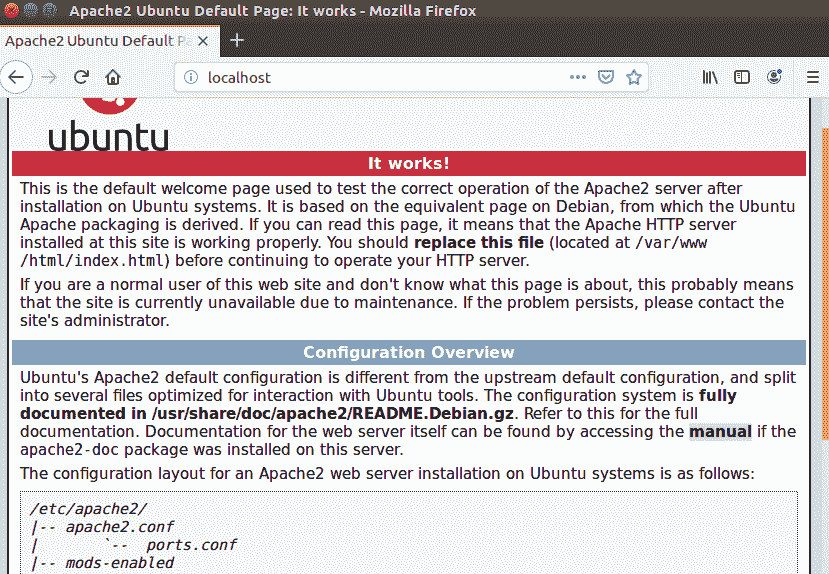

# 如何在 Ubuntu 中安装 Apache 服务器？

> 原文:[https://www . geesforgeks . org/how-install-Apache-server-in-Ubuntu/](https://www.geeksforgeeks.org/how-to-install-apache-server-in-ubuntu/)

Apache 是由 Apache 软件基金会创建和维护的开源 web 服务器软件。因为它是开源的，所以可以自由使用。它是一个网络服务器，用于一个或多个基于 HTTP 的网站。它被网络托管公司广泛用于提供共享和虚拟托管。

**安装 Apache 服务器的步骤:**

*   **Make Superuser:** Open terminal and use following command to make yourself superuser.

    ```
    sudo su
    ```

    

*   **Update Ubuntu package:** Use the following command to update the Ubuntu package list.

    ```
    sudo apt update
    ```

    

*   **Install Apache:** After installing the Ubuntu package list, use the following command to install apache server.

    ```
    sudo apt install apache2
    ```

    

*   After completion of the installation process, the Apache server automatically start. The status of the Apache server can be checked by using the following command.

    ```
    sudo systemctl status apache2
    ```

    

*   打开浏览器，在地址栏中键入 localhost 或 127.0.0.1。它将显示 Apache 服务器的默认页面。
    