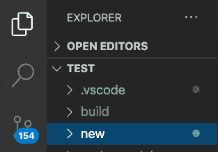
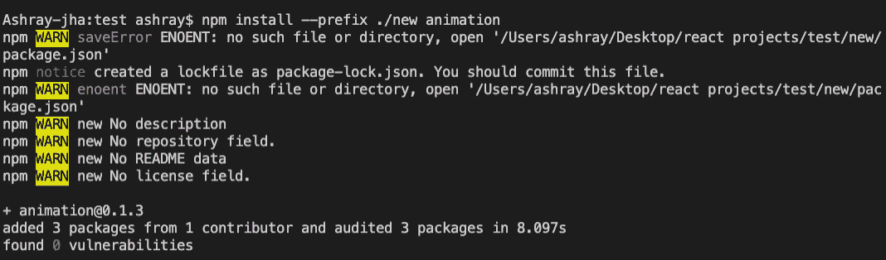
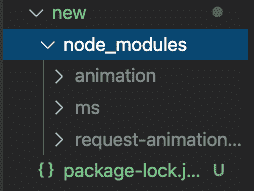

# 如何使用 npm 安装指定目录？

> 原文:[https://www . geesforgeks . org/如何使用 npm 安装指定目录/](https://www.geeksforgeeks.org/how-to-install-specified-directory-using-npm/)

[节点。js](https://www.geeksforgeeks.org/nodejs-tutorials/) 是一个基于 Chrome 的 JavaScript v8 引擎构建的平台，用于轻松构建快速且可扩展的网络应用程序，JavaScript 使用事件驱动的非阻塞 I/O 模型，使其轻量级且高效，非常适合跨分布式设备运行的数据密集型实时应用程序，也非常适合使用 Node 中的工具(或包)。js，我们需要能够安装在我们的机器中，并以一种有用的方式管理它们。这就是 npm，也就是 Node 包管理器发挥作用的地方，它包含默认包，还允许我们在项目中安装外部包。我们希望使用并提供一个用户界面与他们一起工作。

**使用** **按照以下简单步骤将 npm 安装到特定目录** :

1.  首先，检查节点是否安装在您的电脑或笔记本电脑上。要检查节点是否已预安装，请在 mac 中打开终端或在 windows 中打开命令提示符，并键入以下命令:

    ```
    node -v
    ```

    现在，如果 node 版本显示类似“**v 12 . 18 . 3”**的内容，那么您可能会得出结论，Node 是预装在 pc 或笔记本电脑上的，如果不是，那么请参考[这篇](https://www.geeksforgeeks.org/installation-of-node-js-on-windows/)文章，根据您的 PC 需求和版本安装 Node。

2.  在编辑器中打开一个 javascript 项目并决定要安装 npm 包的目录，我们也可以创建一个目录并安装我们的 npm 包，在项目目录中创建一个目录**“CD”(变更目录)**并使用 **mkdir** 命令，要创建一个新的文件夹/目录，我们可以使用 **mkdir <文件夹名称>** 并在目录/文件夹使用命令 **mkdir 内创建一个目录或子文件夹在这里，我将在我的**TEST**项目文件夹下创建一个名为**new**的目录，我将在其中安装 npm 包。因此，一旦我们在终端中的目录被设置为我们的项目目录**【TEST】**，并且我们可以在 **TEST** 主目录下看到我们的项目文件以这种方式被结构化，我将使用终端中的命令**mkdir-p new】**。**

    

3.  现在，我们安装到特定目录的最后一步是使用**–前缀**选项，这里我们将使用以下命令将我们的 npm 包安装到特定目录。

    ```
    npm install --prefix ./(folder/sub_folder_name) <package name>
    ```

    正在当前目录下安装 npm 包“**动画”**，并使用以下命令:

    ```
    npm install --prefix ./new animation
    ```

    **控制台输出:**

    

    现在，由于我们已经将所需的 npm 包安装到了我们想要的子目录中，即**“新建”、**中，我们可以通过打开它来检查我们的**“新建”**目录，我们可以看到以下包已成功安装到该目录中。

    **更新项目结构**:

    