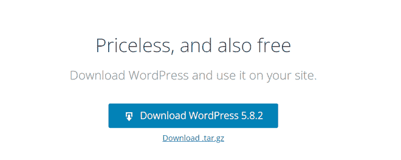
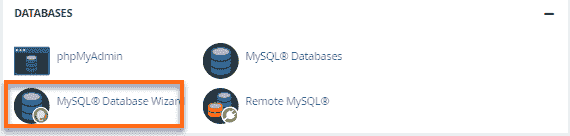
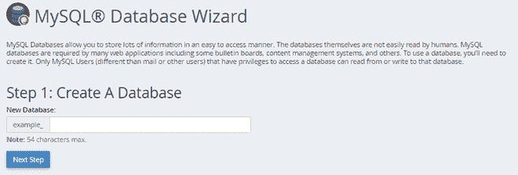
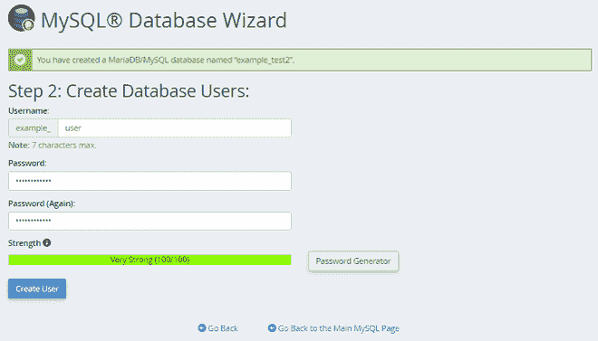
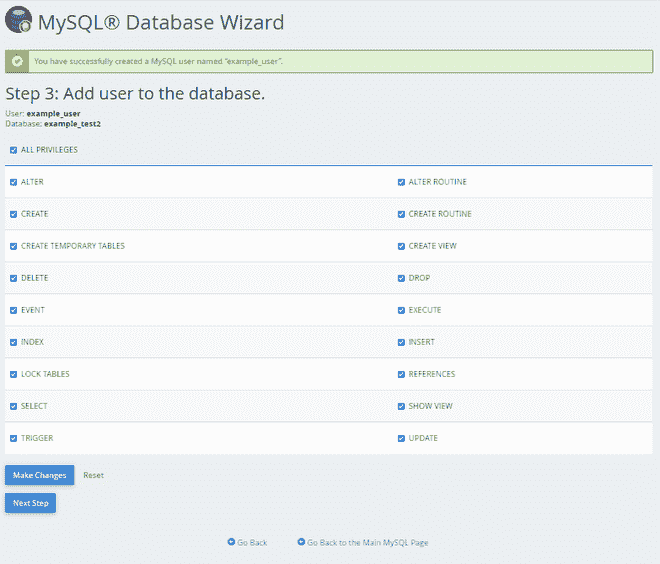
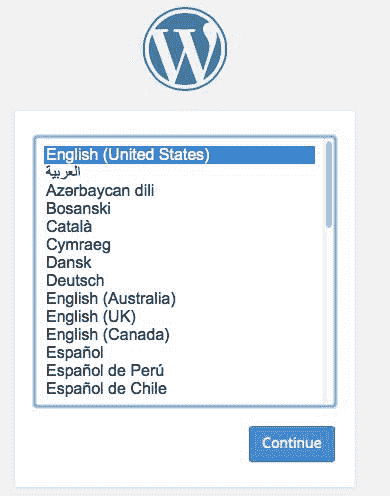
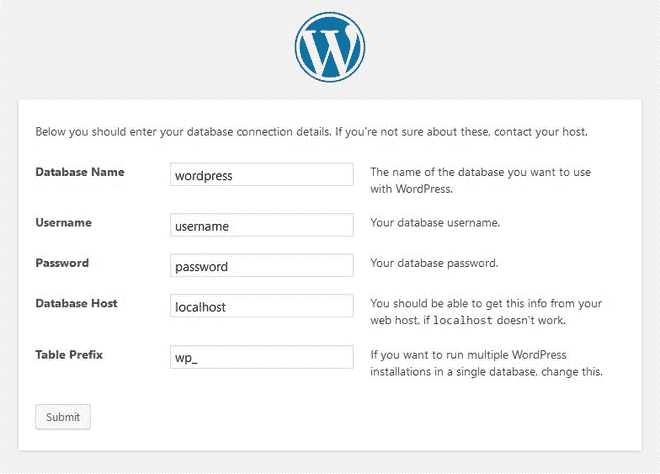
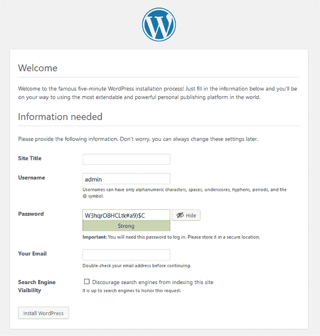

# 如何在自己的网站上安装 WordPress？

> 原文:[https://www . geesforgeks . org/如何在您的网站上安装 WordPress/](https://www.geeksforgeeks.org/how-to-install-wordpress-on-your-website/)

[WordPress](https://www.geeksforgeeks.org/introduction-wordpress/) 是一个内容管理系统，允许你托管和建立网站。WordPress 包含插件架构和模板系统，因此您可以定制任何网站来适应您的业务、博客、投资组合或在线商店。WordPress 以易于安装而闻名。

[安装 WordPress](https://www.geeksforgeeks.org/installation-of-wordpress-on-windows/) 是一个非常简单的过程，完成的时间非常少。在你的网站上安装 WordPress 有几种不同的方法。

在本文中，我们将看到两种最常用的安装 WordPress 的方法。

**方法 1:使用自动安装程序安装 WordPress。**

这个方法是安装 WordPress 最简单的方法。您的主机提供商已经为您做了一切。你只需要输入一些细节。一些主机提供商不提供这一功能，那么您将不得不手动安装 WordPress，如方法 2 所示。

大多数 cPanel 都带有 WordPress 自动安装程序。当你登录到你的 cPanel 仪表板时，你可以看到会有一个自动安装程序。自动安装程序基本上自动化了整个 WordPress 安装过程。你只需要输入一些基本信息，点击一个按钮，自动安装程序就会为你安装 WordPress。

首先，在 cPanel 中找到 WordPress 自动安装程序的链接并安装它。接下来，您需要输入您的网站的详细信息，如域名，用户 id，密码。之后，WordPress 将安装在您的网站上。

**方法二:手动安装 WordPress】**

通过这种方法，我们将知道如何在您的网站上手动安装 WordPress。这种方法可以在任何地方使用。

**第一步:下载 WordPress**

从[WordPress.org](https://wordpress.org/download/)下载 WordPress 到你的电脑，然后解压下载的文件。

**第二步:上传 WordPress 到你的主机**

有多个选项可以将 WordPress 上传到您的托管帐户。当你解压 WordPress 文件时，你会得到一个名为 WordPress 的文件夹，将该文件的内容上传到你的托管文件管理器。

**第三步:** [**创建一个 MySQL 数据库**](https://www.geeksforgeeks.org/php-mysql-creating-database/) **和一个用户**

WordPress 将其信息存储在数据库中。因此，需要创建一个数据库。数据库可以被认为是访问者在您的网站上查看的所有内容的存储库。它存储文本文件、主题、插件等。

*   登录到您的 cPanel。
*   点击**数据库**部分下的 **MySQL 数据库向导**。

*   创建数据库并输入数据库名称。点击**下一步**。

*   **创建数据库用户**并输入用户名和密码。点击**创建用户**。

*   **将用户添加到数据库**，点击**所有权限**复选框，点击**下一步**。

*   记下上面提到的细节，包括数据库名称、用户名和密码，保存在一个单独的文本文件中，以备将来使用。

**步骤 4:运行安装**

一旦完成了前面的步骤，就该运行脚本来完成 WordPress 的安装了。首先，导航至“*yourdomain.com/wp-admin/install.php”*，将占位符域替换为您网站的占位符域。你会看到一个提示，要求你为你的 WordPress 安装选择一种语言，你应该在点击**继续**按钮之前选择。

**第五步:用 WordPress 连接你的数据库**

在**第 4 步**中，只要点击**继续**按钮，它就会询问连接数据库的必要细节。输入您之前创建的**数据库名称**。正确填写所有细节并提交。

**第六步:完成安装**

您现在应该会看到一个欢迎页面，上面写着“*欢迎来到著名的五分钟 WordPress 安装过程！*”在**所需信息**部分，您需要填写以下字段:您的**网站标题**、**用户名**、**密码**、**您的电子邮件、**和**搜索引擎可见性**。填写这些并点击安装 WordPress。最后一个屏幕，上面写着，“WordPress 已经安装好了。谢谢，好好享受！”会出现。它将显示您选择的用户名和密码。

如果您成功安装 WordPress，将显示登录提示。登录你的网站并开始建设它。