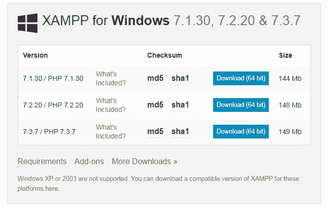
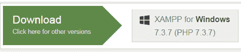
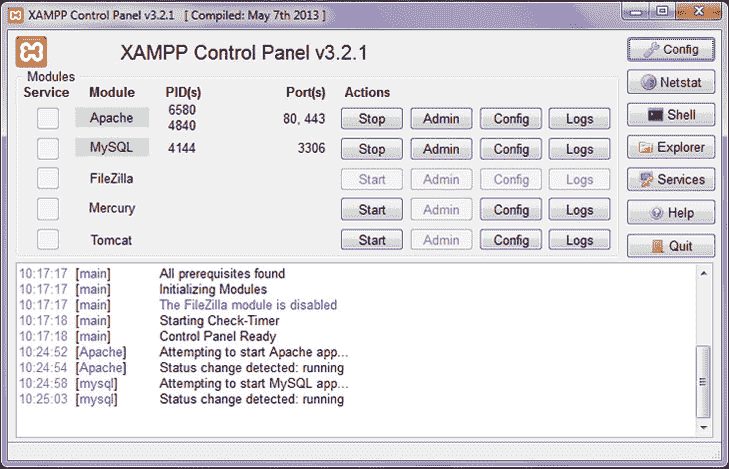
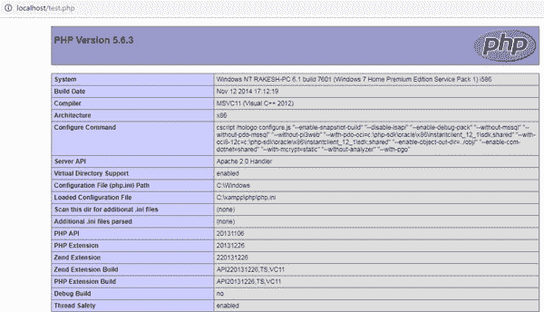

# 如何在 Windows 上安装 XAMPP？

> 原文:[https://www . geesforgeks . org/how-install-xampp-on-windows/](https://www.geeksforgeeks.org/how-to-install-xampp-on-windows/)

**XAMPP** 是最流行的软件包，通过提供所有需要的软件组件来为 web 服务建立一个 PHP 开发环境。在软件部署过程中，大部分 web 服务器使用几乎相似的组件，因此使用 **XAMPP** 提供了从本地服务器到实时服务器的轻松过渡。 **XAMPP** 是一个 **AMP** 栈，代表 Cross platform， **A** pache， **M** ySQL， **P** HP， **p** erl 带有一些额外的管理软件工具，如 PHPMyAdmin(用于数据库访问)、FileZilla FTP 服务器、Mercury mail 服务器和 JSP Tomcat 服务器。
像 XAMPP 这样的其他常用软件包还有 WAMP、LAMP 等。
XAMPP 服务器用于测试 PHP 页面。它作为本地服务器工作。它包含一个 MySQL 数据库，用于管理或保存本地服务器上的数据。
**XAMPP 优势:**

*   它是免费的，易于使用，并且很容易在 Windows、Linux 和 Mac OS 上获得。
*   这是一个初学者友好的全栈 web 开发解决方案包。
*   这是一个**开源**软件包，提供了一个简单的安装体验。
*   创建用于开发、测试和部署的设置非常简单且**轻量级**。
*   这是一种节省时间的方法，并提供了几种管理配置更改的方法。
*   它处理许多管理任务，如检查状态和安全性。

**XAMPP 的软件组件:**

*   **Apache** 起处理 HTTP 请求的作用。它是实际的默认 web 服务器应用程序。它是由 Apache 软件基金会维护的最受欢迎的网络服务器。
*   **MySQL**XAMPP 数据库管理系统的角色由 MySQL 扮演。它有助于非常高效地存储和管理收集的数据。它是开源的，也是最受欢迎的。
*   **PHP** 是服务器端脚本语言，代表超文本预处理器。它嵌入了与网络服务器交互的 HTML 代码。它是一个开源软件，可以很好地与 MySQL 配合使用，已经成为网络开发人员的普遍选择。
*   **Perl** 是为文本编辑而设计的高级编程语言，服务于 web 开发和网络编程等目的。

**在 Windows 上安装 XAMPP 的步骤:**

*   在网页浏览器中，访问 [Apache Friends](https://www.apachefriends.org/index.html) 并下载 XAMPP 安装程序。



*   在安装过程中，选择所需的组件，如 MySQL、FileZilla ftp 服务器、PHP、phpMyAdmin 或保留默认选项，然后单击**下一步**按钮。



*   取消选中**了解更多关于 bitnami** 选项，点击**下一步**按钮。
*   选择根目录路径为我们的应用程序设置 *htdocs* 文件夹。例如*‘C:\ xampp’。*
*   单击**允许访问**按钮，允许从 Windows 防火墙访问 XAMPP 模块。
*   安装完成后，点击 XAMPP 设置向导的**完成**按钮。
*   现在，XAMPP 图标在开始菜单的右侧清晰可见。通过点击图标，可以使用控制面板设置显示或隐藏。
*   要启动 Apache 和 MySql，只需点击控制面板上的**启动**按钮。



**注意:**假设阿帕奇没有启动，这意味着其他一些服务正在港口 **80 运行。**这种情况下，暂时停止其他服务，重新启动。
**发出服务器请求:**打开你的网络浏览器，检查 XAMPP 服务是否安装正确。输入网址: **http://localhost** 。如果您能够看到 XAMPP 的默认页面，那么您已经成功安装了 XAMPP 服务器。
**检查 PHP 是否工作:**所有网站相关文件都组织在名为 *htdocs* 的文件夹中，然后使用**http://localhost/index . PHP**或 **http://localhost** 运行 index.php 文件。
**注意:**对于每个新的网站或应用程序，最好在 *htdocs* 中创建一个不同的文件夹，以保持其组织性并避免混乱。
例如，如果我们创建一个文件夹 *geeksforgeeks* ，然后创建一个名为*‘hello world . PHP’的文件。*与其相关的所有内容都放在文件夹*“极客文件夹”中。*所以网站的根‘URL’会是**‘http://localhost/geeksforgeeks/’。**所以任何主页都是通过在浏览器中键入根 URL 来访问的。要查看输出，只需键入**' http://localhost/geeksforgeeks/hello world . PHP '。**
一般网页服务器在网站文件夹的根目录下寻找索引文件(登陆页)即**index.html**或**index.php**。转到 **/xampp/htdocs/** 文件夹，用**创建一个文件。php** 扩展(test.php)，输入或复制下面的代码并保存。

## 服务器端编程语言（Professional Hypertext Preprocessor 的缩写）

```
<?php
phpinfo(); 
?>
```

现在打开你的浏览器，进入**“http://localhost/test . php”**如果你看到
页面和下面一样，那么 PHP 已经成功安装了。



**注:**在 XAMPP，Apache、MySQL、PHP 的配置文件位于**C:\ Program file \ xampp。**对于任何配置文件的更改，都需要重启 Apache 和 MySQL。