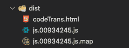

# 如何将编译后的文件保存在单独的目录中？

> 原文:[https://www . geesforgeks . org/如何将编译后的文件保存在单独的目录中/](https://www.geeksforgeeks.org/how-to-keep-compiled-files-in-a-separate-directory/)

包含 HTML、CSS、JavaScript、图像和视频文件的网络项目。任务是确保项目的所有文件都被编译并直接捆绑到一个单独的文件中。在我们继续之前，我想给大家简单介绍一下**包裹捆扎机**。

**packet-bundler:**它是一个帮助将我们的 ES6+语法转录成所有浏览器引擎都可读的传统 JavaScript 的模块。此外，它有助于将我们的 HTML 文件、CSS 文件和 JavaScript 文件打包到一个名为**“dist”**的目录中。所以我们将使用它来把编译后的文件放入一个文件夹中。

在**包裹捆扎机**的帮助下，我们可以通过简单地将**包裹捆扎机**模块安装到我们的项目中来实现这一点。下面解释的步骤将引导您将编译后的文件保存在单独的目录中。

**前提:**需要 node.js，[在 Windows 上安装 node . js](https://www.geeksforgeeks.org/installation-of-node-js-on-windows/)或者[在 Linux 上安装 node . js](https://www.geeksforgeeks.org/installation-of-node-js-on-linux/)。

*   **步骤 01:** 在您的项目中初始化 npm。

    ```html
    npm init
    ```

*   **步骤 02:** 从节点注册表

    ```html
    npm install parcel-bundler
    ```

    安装**包裹捆扎机**
*   **Step 03:** Open your **package.json** file and make the below changes to your scripts object(add the below code to your script object).

    ```html
    "scripts":{
        "dev": "parcel index.html",
        "build": "parcel build index.html",
        "watch": "parcel watch index.html"
        }
    ```

    **index.html**是 HTML 文件，HTML 文件的路径取决于你的代码结构**，例如/src/tem/index.html** ，它包含了我们想要转录和编译到一个目录的外部 JS 和外部 CSS。如果有多个 HTML 文件，只需将**index.html**替换为 ***。html** 。 **dev** 键通常用于在项目仍处于开发阶段时运行项目，脚本对象内的 **build** 键:build 键借助于靠近 phase 关键字的 build 关键字帮助构建项目用于生产。当您不断更改代码时，**手表**键有助于将您的项目保持在自动转录&绑定状态。

*   **步骤 04:** 在开发阶段运行您的项目。

    ```html
    npm run dev
    ```

*   **第 05 步:**保持你的项目在开发阶段持续关注任何变化

    ```html
    npm run watch
    ```

*   **步骤 06:** 运行您的项目进行生产。

    ```html
    npm run build
    ```

*   **输出:**在构建您的项目后，您应该会看到一个名为**“dist”**的新文件夹，该文件夹包含了现在可以用于生产的所有编译文件。

下面的例子说明了整个步骤:
**例子:**

*   **步骤 01:** 创建一个名为**【GFG】**的文件夹。
*   **步骤 02:** 在你想要的 IDLE 或 IDE 中打开文件夹。
*   **步骤 03:** 在文件夹里面创建一个名为**“codetrans . html”**的 html 文件，并将下面的 html 代码插入到 html 文件中。

    ```html
    <!DOCTYPE html>
    <html lang="en">

    <head>
        <meta charset="UTF-8" />
        <meta name="viewport" 
              content="width=device-width, initial-scale=1.0" />
        <meta http-equiv="X-UA-Compatible" content="ie=edge" />
        <title>GeeksforGeeks | Transcribed JS to dir</title>
    </head>

    <body>
        <div class="container">
            <h1>GeeksforGeeks</h1>
            <p>
                With geeksforgeeks, we wish to keep
                changing the difficulties in tech 
                into berry-pies ?
            </p>
            <button>Click me</button>
        </div>
        <script src="./js.js"></script>
    </body>

    </html>
    ```

*   **步骤 04:** 在“GFG”文件夹内创建一个 JavaSCript 文件，并将其命名为“js.js”。将下面的代码添加到 javascript 文件中。

    ```html
    const geeks = () =>{
        const btn = document.querySelector('button');
          const para = document.querySelector('p');
          btn.addEventListener('click', () => {
            para.textContent +=
              '.GeeksforGeeks A Computer Science Portal';
          });
    }
    geeks();
    ```

*   **步骤 04:** 去你 **package.json** 文件和脚本对象里面，添加下面的代码。

    ```html
    "dev": "parcel index.html",
    "build": "parcel build codeTrans.html",
    "watch": "parcel watch codeTrans.html"
    ```

*   **步骤 05:** 要将编译后的文件放入一个目录，请打开您的 IDE 终端并运行以下代码。

    ```html
    npm run build
    ```

*   **输出:**一个名为**“dist”**的新文件夹，保存编译后的文件。
    