# 如何使用亚马逊 EC2 服务器推出 WordPress 网站？

> 原文:[https://www . geesforgeks . org/如何启动-a-WordPress-网站-使用-amazon-ec2-server/](https://www.geeksforgeeks.org/how-to-launch-a-wordpress-website-using-amazon-ec2-server/)

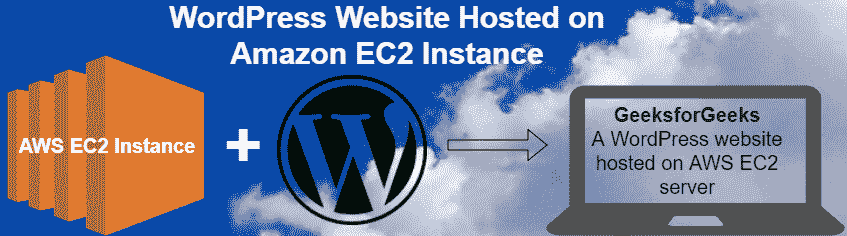

**什么是亚马逊网络服务(AWS)？**
它是一个安全的云服务平台。它提供计算能力、数据库存储、内容交付和其他功能等服务，帮助企业扩展和增长。

**什么是亚马逊 EC2？**
亚马逊弹性计算云(EC2)是一种[基于云的服务](https://www.geeksforgeeks.org/cloud-based-services/) IaaS(基础设施即服务)类型的云服务，可在云中提供安全、可调整大小的计算能力。

**使用 EC2 实例建立 WordPress 网站:**
**1。启动 EC2 实例:**

*   转到您的 [AWS 控制台](https://console.aws.amazon.com/console/home)并使用您的凭据登录。
*   After login to the AWS account, select the EC2 service from the list of all services.

    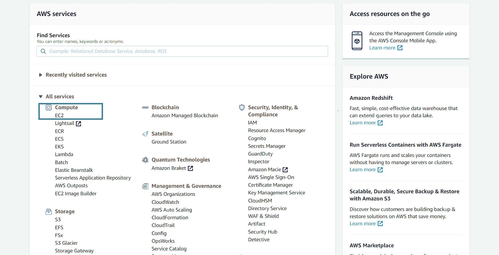

*   单击**启动实例**按钮创建实例。
    T3】

**2。配置 EC2 实例:**

*   Search for **WordPress** in the **marketplace** tab (left side) in the dashboard and select the instance named as `WordPress Certified by Bitnami and Automattic`.

    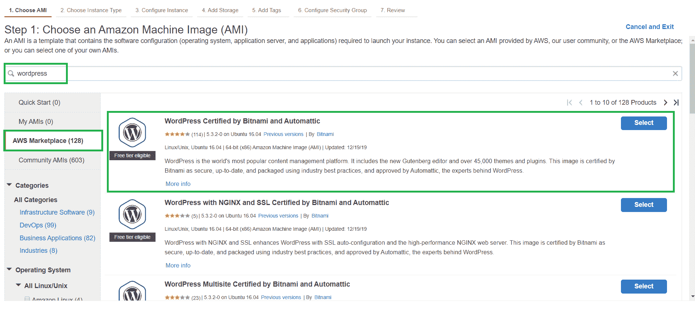

*   现在，您将看到定价详细信息，您必须单击继续。
    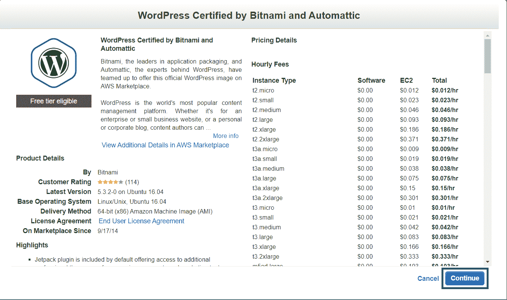
*   Now you’ll be redirected to the choose the instance configurations, we will be using a free-tier eligible **t2.micro instance**. Click on t2.micro in the Type column and click **Review and Launch**. Since here we are using free-tier we will just use the default freely available configurations for storage and skip the **Add Storage** step.

    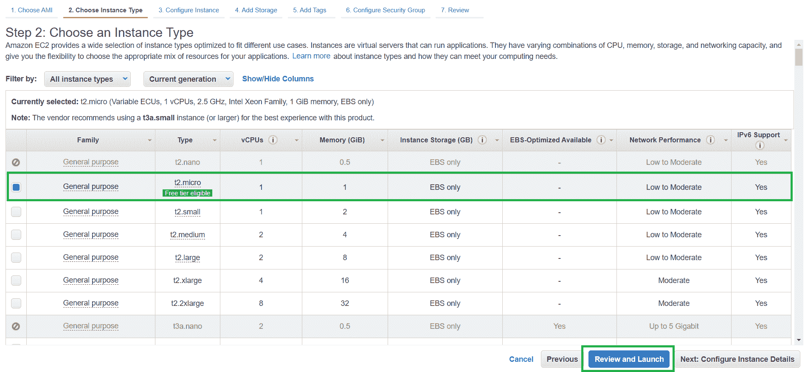

*   You can now review the configurations of your instance. After reviewing you can now click **Launch** button at the bottom right.

    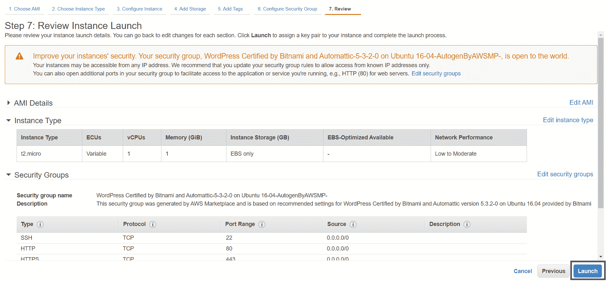

*   Now the next screen will allow you to generate **key-pairs** which is used to connect to your instance using **SSH**. Since we are developing a WordPress website, we don’t really need to care about connecting via SSH, so we can skip generating the key pair. Select **Proceed without a key-pair** from the option and check the box acknowledging that you know you need this key to access your EC2 instance. Click the **Launch instances** button.

    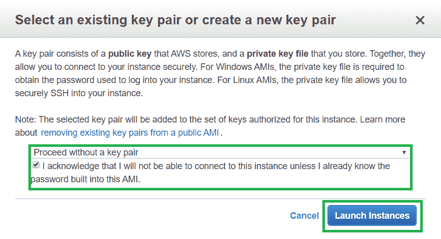

*   单击页面右下角的**查看实例**。
*   Now click at the WordPress instance we have just created from the list of instances and copy the **public IPv4 address** shown in the column.

    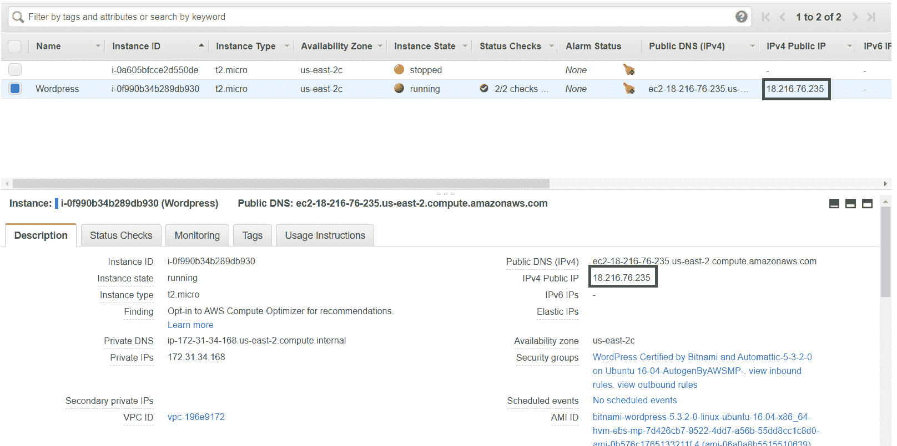

    将复制的 IPv4 粘贴到浏览器中，您将在那里看到如下所示的 WordPress 主页:

    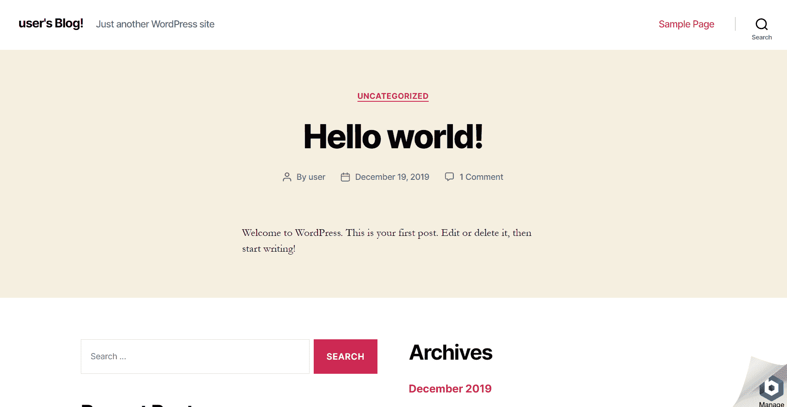

    WordPress 主页可以根据 WordPress 的版本而有所不同。

**3。编辑网站(访问 WordPress 后端/仪表板):**

*   In order to get the password of the admin panel, go to your instance dashboard and right-click on the instance and select **Instance settings** and then **Get system logs**.

    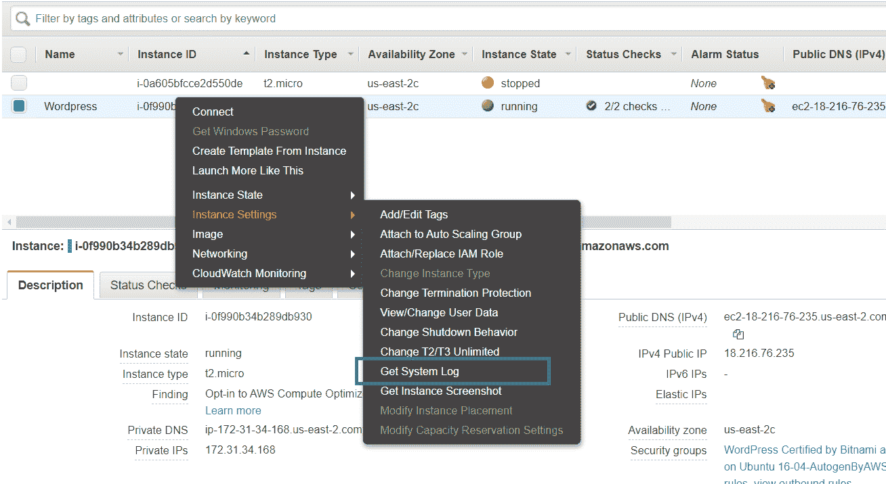

*   Scroll to the bottom and find a password surrounded by hash.

    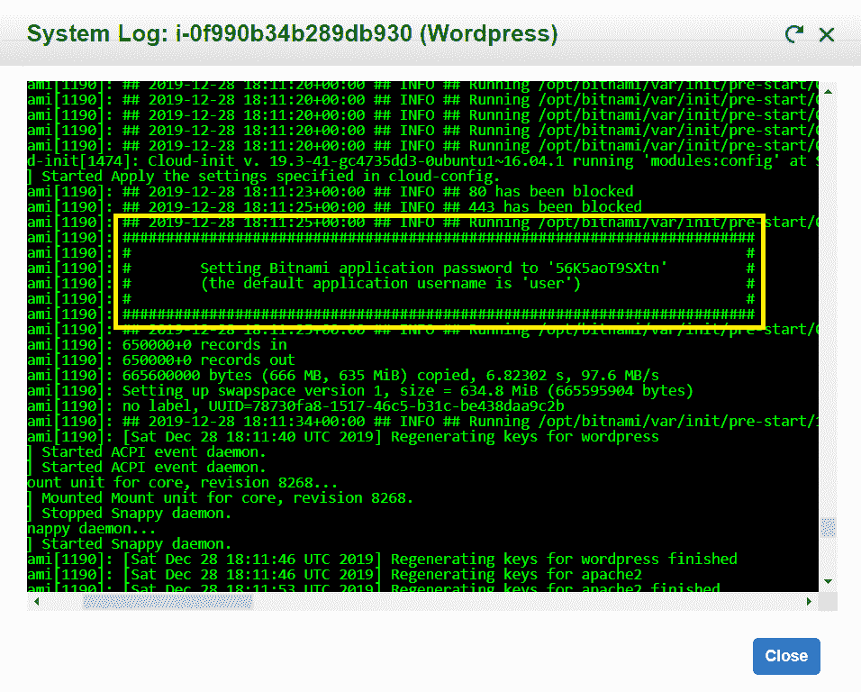

*   Now go to `{your-public-IPv4}/admin`(like 52.214.23.123/admin) and enter username as **user** and password as what you have found in the system logs.

    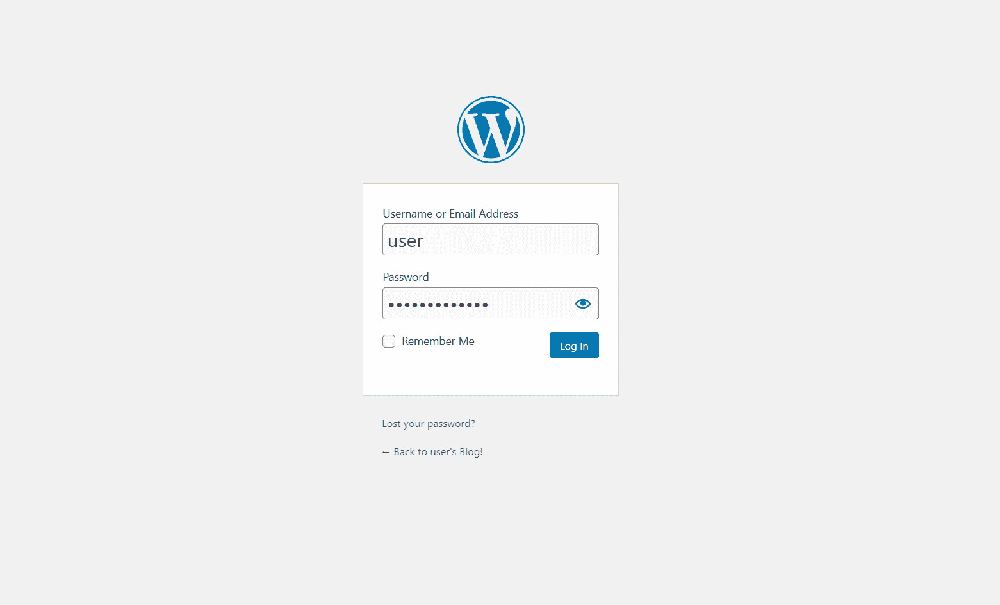

    现在你可以进入管理面板，并可以改变你的 WordPress 网站的外观。

    **参考:**[https://AWS . Amazon . com/入门/教程/推出-a-WordPress-网站/](https://aws.amazon.com/getting-started/tutorials/launch-a-wordpress-website/)