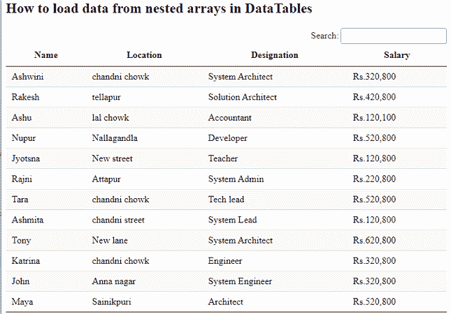
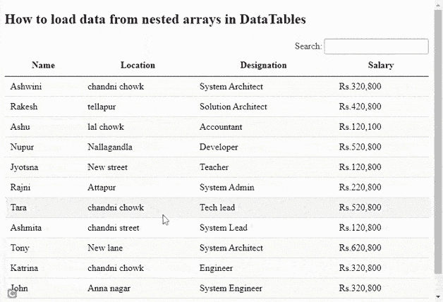

# 如何从 DataTables 中的嵌套数组加载数据？

> 原文:[https://www . geesforgeks . org/如何从数据表中的嵌套数组加载数据/](https://www.geeksforgeeks.org/how-to-load-data-from-nested-arrays-in-datatables/)

**数据表**是一个现代的 jQuery 插件，用于为网页的 HTML 表格添加交互式和高级控件。这是一个非常简单易用的插件，有多种选项供开发者根据应用需求进行自定义更改。该插件的功能包括分页、排序、搜索和多列排序。

在本文中，我们将学习使用**数据表**插件从嵌套数组中读取每个员工的信息。

**方法:**数据表插件的*列.数据*选项用于使用点符号从数组中提取数据。点(。)用于访问*列的数组或子数组。下面的实现显示了数组的读取。*

需要实现的预编译文件有

CSS:

```htmlhtml
https://cdn.datatables.net/1.10.22/css/jquery.dataTables.min.css
```

**JavaScript:**

```htmlhtml
https://code.jquery.com/jquery-3.5.1.js
https://cdn.datatables.net/1.10.22/js/jquery.dataTables.min.js
```

**嵌套数组的结构:**以下结构保存一个员工的数据。“姓名”键保存*的值，第一个是*和*的姓*，而“详细信息”键保存*名称*和*工资*的值，随后是带有各自值的“地点”和“城市”键。


行数据

**示例:**以下代码使用 DataTable 插件在 HTML 表格中显示所有员工的数据。以下代码的 JavaScript 部分从“*nested shubarlays . txt*”文件中提取数据。在下面的例子中*详细信息。0* 帮助获得 D *签名*和*详细信息。1* 帮助获得每个员工的工资。类似地*“数据”:“位置”*获取该特定员工的位置。

## 超文本标记语言

```htmlhtml
<!DOCTYPE html>
<html>

<head>
    <meta content="initial-scale=1, maximum-scale=1, 
        user-scalable=0" name="viewport" />
    <meta name="viewport" content="width=device-width" />

    <!--Datatable plugin CSS file -->
    <link rel="stylesheet" href=
"https://cdn.datatables.net/1.10.22/css/jquery.dataTables.min.css" />

    <!--jQuery library file -->
    <script type="text/javascript" 
        src="https://code.jquery.com/jquery-3.5.1.js">
    </script>

    <!--Datatable plugin JS library file -->
    <script type="text/javascript" src=
"https://cdn.datatables.net/1.10.22/js/jquery.dataTables.min.js">
    </script>
</head>

<body>
    <h2>
        How to load data from nested 
        arrays in DataTables
    </h2>

    <!--HTML table with employee data-->
    <table id="tableID" class="display" 
        style="width:100%">

        <thead>
            <!--Required column headers 
                for employee -->
            <tr>
                <th>Name</th>
                <th>Location</th>
                <th>Designation</th>
                <th>Salary</th>
            </tr>
        </thead>
    </table>

    <script>
        $(document).ready(function () {

            /* Initialization of datatable 
            by table ID */
            $('#tableID').DataTable({
                "processing": true,

                /* Disabled features for not 
                showing extra info */
                "info": false,
                "ordering": false,
                "paging": false,
                "ajax": 'nestedSubarrays.txt',
                "columns": [
                    // 0th index value of name 
                    // to show firstname                       
                    { "data": "name.0" },
                    { "data": "location" },

                    // 0th index value of details 
                    // to show designation                                
                    { "data": "details.0" },

                    // 1st index value of details 
                    // to show salary                                
                    { "data": "details.1" }
                ]
            });
        });
    </script>
</body>

</html>
```

**nested shubarlays . txt:**以下是“nested shubarlays . txt”文件中所有员工的数据内容。

```htmlhtml
{
  "data": [
    {
      "name": [
        "Ashwini",
        "Sharma"
      ],
      "details": [
        "System Architect",
        "Rs.320,800"        
      ],
      "location": "chandni chowk",
      "city": "Delhi"
    },
     {
      "name": [
        "Rakesh",
        "Trivedi"
      ],
      "details": [
        "Solution Architect",
        "Rs.420,800"        
      ],
      "location": "tellapur",
      "city": "Hyderabad"
    },
     {
      "name": [
        "Ashu",
        "Rana"
      ],
      "details": [
        "Accountant",
        "Rs.120,100"        
      ],
      "location": "lal chowk",
      "city": "Punjab"
    },
     {
      "name": [
        "Nupur",
        "Joshi"
      ],
      "details": [
        "Developer",
        "Rs.520,800"        
      ],
      "location": "Nallagandla",
      "city": "Bangalore"
    },
     {
      "name": [
        "Jyotsna",
        "Sharma"
      ],
      "details": [
        "Teacher",
        "Rs.120,800"        
      ],
      "location": "New street",
      "city": "Delhi"
    },
     {
      "name": [
        "Rajni",
        "Singh"
      ],
      "details": [
        "System Admin",
        "Rs.220,800"        
      ],
      "location": "Attapur",
      "city": "Nagpur"
    },
     {
      "name": [
        "Tara",
        "Sharma"
      ],
      "details": [
        "Tech lead",
        "Rs.520,800"        
      ],
      "location": "chandni chowk",
      "city": "Pune"
    },
     {
      "name": [
        "Ashmita",
        "Sahoo"
      ],
      "details": [
        "System Lead",
        "Rs.120,800"        
      ],
      "location": "chandni street",
      "city": "Rajasthan"
    },
     {
      "name": [
        "Tony",
        "Blair"
      ],
      "details": [
        "System Architect",
        "Rs.620,800"        
      ],
      "location": "New lane",
      "city": "Dharmshala"
    },
     {
      "name": [
        "Katrina",
        "Kaif"
      ],
      "details": [
        "Engineer",
        "Rs.320,800"        
      ],
      "location": "chandni chowk",
      "city": "Mumbai"
    },
     {
      "name": [
        "John",
        "Doe"
      ],
      "details": [
        "System Engineer",
        "Rs.320,800"        
      ],
      "location": "Anna nagar",
      "city": "Delhi"
    },
     {
      "name": [
        "Maya",
        "Sharma"
      ],
      "details": [
        "Architect",
        "Rs.520,800"        
      ],
      "location": "Sainikpuri",
      "city": "Hyderabad"
    }
 ]
}
```

**注意:**假设上面的文件数据模式不是按照正确的 JSON 格式，那么它抛出一个 DataTable 插件的警告如下。

```htmlhtml
warning: table id={id-of-html-table} - Invalid JSON response.
```

**输出:**

*   **执行前:**



*   **执行后:** 下面的输出显示了表，该表显示了对具有“系统”前缀的员工的“搜索”操作，如“系统架构师”、“系统主管”等。



指定搜索